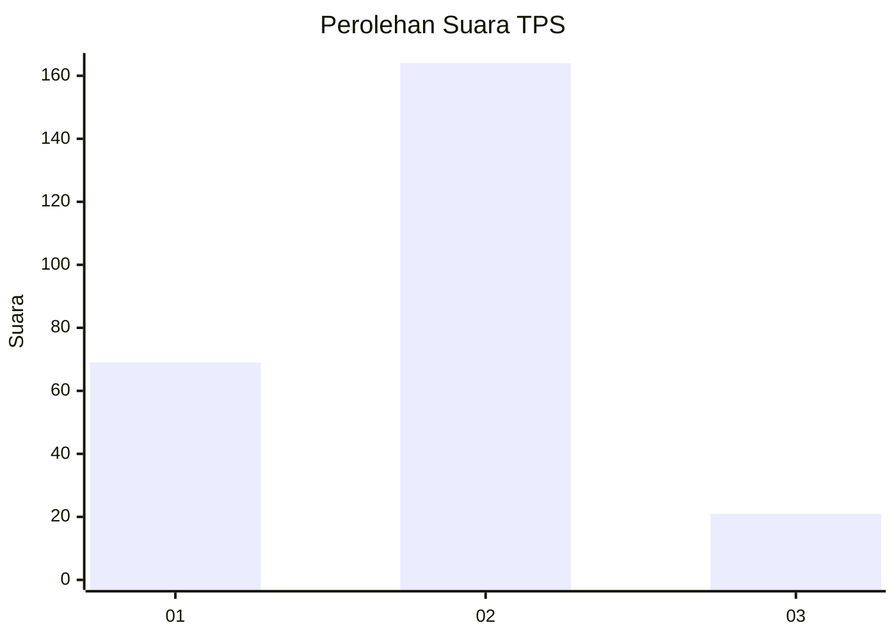
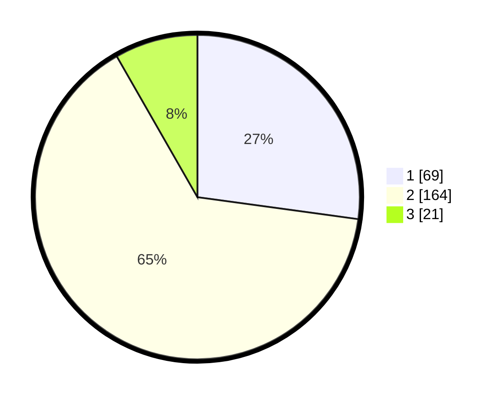

# Hasil

## Grafik

## Tabel

| No. | Nama Paslon    | Suara | Suara (raw) | Persentase |
|:--- |:-------------- | -----:| -----------:| ----------:|
| 1   | ANIES MUHAIMIN | 69    | [69][p-1]   | 27,17      |
| 2   | PRABOWO GIBRAN | 164   | [164][p-2]  | 64,57      |
| 3   | GANJAR MAHFUD  | 21    | [21][p-3]   | 8,27       |

[p-1]: https://github.com/gigit-pemilu/pemilu-2024/blob/main/pilpres/hitung-suara/sub/32-jawa-barat/sub/16-bekasi/sub/12-kedung-waringin/sub/2001-karangsambung/sub/009-tps/sub/paslon-1.txt
[p-2]: https://github.com/gigit-pemilu/pemilu-2024/blob/main/pilpres/hitung-suara/sub/32-jawa-barat/sub/16-bekasi/sub/12-kedung-waringin/sub/2001-karangsambung/sub/009-tps/sub/paslon-2.txt
[p-3]: https://github.com/gigit-pemilu/pemilu-2024/blob/main/pilpres/hitung-suara/sub/32-jawa-barat/sub/16-bekasi/sub/12-kedung-waringin/sub/2001-karangsambung/sub/009-tps/sub/paslon-3.txt

## Foto C Plano

https://sirekap-obj-formc.kpu.go.id/aa30/pemilu/ppwp/32/16/12/20/01/3216122001009-20240214-221251--f47110dd-36e2-44cc-8fd0-44d5743c9e34.jpg

https://sirekap-obj-formc.kpu.go.id/aa30/pemilu/ppwp/32/16/12/20/01/3216122001009-20240214-221602--af9e6357-f8a7-43ab-9e85-f79f18678ed3.jpg

https://sirekap-obj-formc.kpu.go.id/aa30/pemilu/ppwp/32/16/12/20/01/3216122001009-20240214-221724--fe6077c3-67ee-4778-9939-fa3ffda351d5.jpg

## Metadata

| Key        | Value               |
| ---------- | ------------------- |
| Time Stamp | 2024-02-26 19:00:00 |

