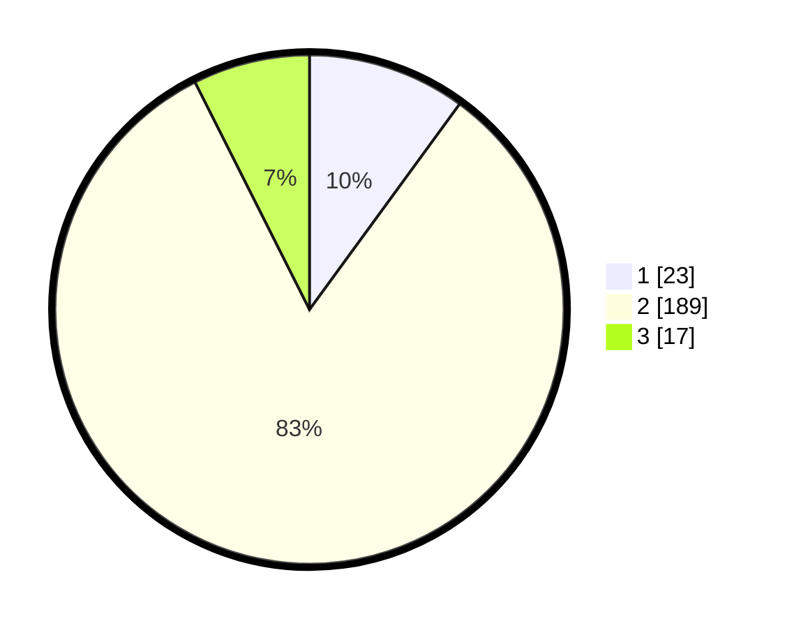

# Hasil

## Grafik

## Tabel

| No. | Nama Paslon    | Suara | Suara (raw) | Persentase |
|:--- |:-------------- | -----:| -----------:| ----------:|
| 1   | ANIES MUHAIMIN | 23    | [23][p-1]   | 10,04      |
| 2   | PRABOWO GIBRAN | 189   | [189][p-2]  | 82,53      |
| 3   | GANJAR MAHFUD  | 17    | [17][p-3]   | 7,42       |

[p-1]: https://github.com/gigit-pemilu/pemilu-2024/blob/main/pilpres/hitung-suara/sub/32-jawa-barat/sub/16-bekasi/sub/12-kedung-waringin/sub/2003-karangmekar/sub/017-tps/sub/paslon-1.txt
[p-2]: https://github.com/gigit-pemilu/pemilu-2024/blob/main/pilpres/hitung-suara/sub/32-jawa-barat/sub/16-bekasi/sub/12-kedung-waringin/sub/2003-karangmekar/sub/017-tps/sub/paslon-2.txt
[p-3]: https://github.com/gigit-pemilu/pemilu-2024/blob/main/pilpres/hitung-suara/sub/32-jawa-barat/sub/16-bekasi/sub/12-kedung-waringin/sub/2003-karangmekar/sub/017-tps/sub/paslon-3.txt

## Foto C Plano

https://sirekap-obj-formc.kpu.go.id/c17e/pemilu/ppwp/32/16/12/20/03/3216122003017-20240214-193908--cb77da0b-f810-46d7-b7b2-9c84b94a6733.jpg

https://sirekap-obj-formc.kpu.go.id/c17e/pemilu/ppwp/32/16/12/20/03/3216122003017-20240214-193718--ef6b85cd-770b-4747-9f98-7a526c9620ab.jpg

https://sirekap-obj-formc.kpu.go.id/c17e/pemilu/ppwp/32/16/12/20/03/3216122003017-20240214-193947--d07c280d-7c61-4284-aeec-bd1a2886d5da.jpg

## Metadata

| Key        | Value               |
| ---------- | ------------------- |
| Time Stamp | 2024-02-15 00:41:44 |

## DATA PEMILIH TETAP

Jumlah pemilih dalam DPT: **284**.
 * L: **133**.
 * P: **442**.

## DATA PENGGUNA HAK PILIH

Jumlah pengguna hak pilih dalam DPT: **239**.
 * L: **113**.
 * P: **172**.

Jumlah pengguna hak pilih dalam DPTb: **888**.
 * L: **808**.
 * P: **83**.

Jumlah pengguna hak pilih dalam DPK: **888**.
 * L: **888**.
 * P: **88**.

Jumlah pengguna hak pilih: **239**.
 * L: **113**.
 * P: **173**.

## JUMLAH SUARA SAH DAN TIDAK SAH

JUMLAH SELURUH SUARA SAH: **229**.

JUMLAH SUARA TIDAK SAH: **10**.

JUMLAH SELURUH SUARA SAH DAN SUARA TIDAK SAH: **239**.

