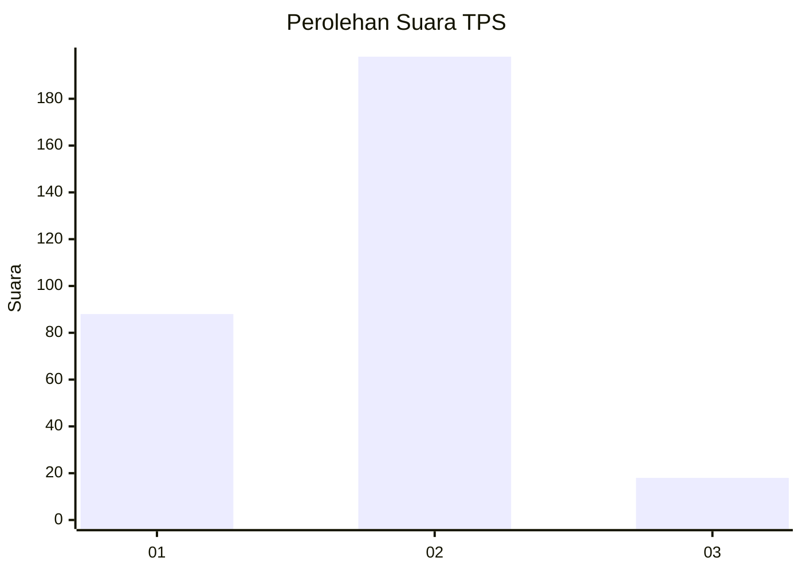
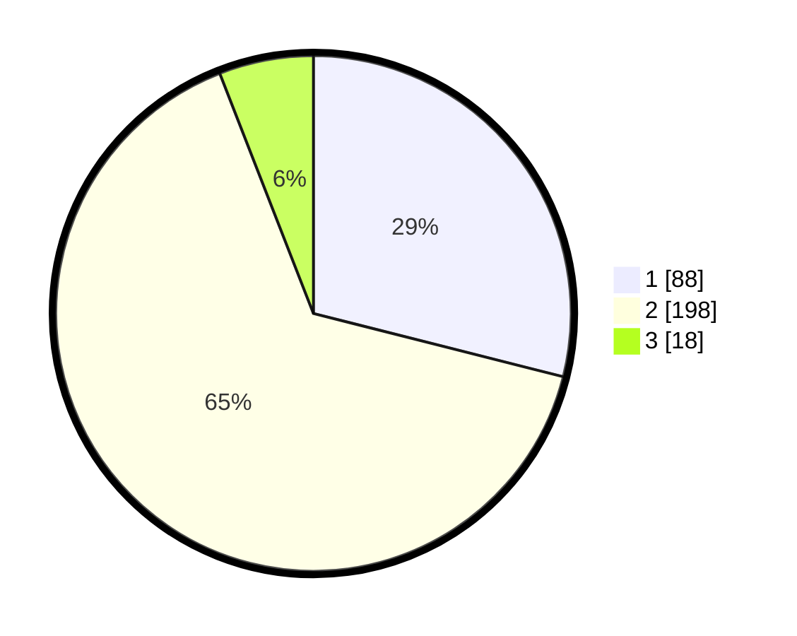

# Hasil

## Grafik

## Tabel

| No. | Nama Paslon    | Suara | Suara (raw) | Persentase |
|:--- |:-------------- | -----:| -----------:| ----------:|
| 1   | ANIES MUHAIMIN | 88    | [88][p-1]   | 28,95      |
| 2   | PRABOWO GIBRAN | 198   | [198][p-2]  | 65,13      |
| 3   | GANJAR MAHFUD  | 18    | [18][p-3]   | 5,92       |

[p-1]: https://github.com/gigit-pemilu/pemilu-2024-32-jawa-barat/blob/main/pilpres/hitung-suara/sub/32-jawa-barat/sub/16-bekasi/sub/12-kedung-waringin/sub/2007-kedungwaringin/sub/039-tps/sub/paslon-1.txt
[p-2]: https://github.com/gigit-pemilu/pemilu-2024-32-jawa-barat/blob/main/pilpres/hitung-suara/sub/32-jawa-barat/sub/16-bekasi/sub/12-kedung-waringin/sub/2007-kedungwaringin/sub/039-tps/sub/paslon-2.txt
[p-3]: https://github.com/gigit-pemilu/pemilu-2024-32-jawa-barat/blob/main/pilpres/hitung-suara/sub/32-jawa-barat/sub/16-bekasi/sub/12-kedung-waringin/sub/2007-kedungwaringin/sub/039-tps/sub/paslon-3.txt

## Foto C Plano

https://sirekap-obj-formc.kpu.go.id/4e85/pemilu/ppwp/32/16/12/20/07/3216122007039-20240214-215036--5b466ae7-e44d-4ca5-a831-b0f9838c8bed.jpg

https://sirekap-obj-formc.kpu.go.id/4e85/pemilu/ppwp/32/16/12/20/07/3216122007039-20240214-215245--9a5e9807-c381-464a-bef2-4c2d86075e12.jpg

https://sirekap-obj-formc.kpu.go.id/4e85/pemilu/ppwp/32/16/12/20/07/3216122007039-20240214-215350--44667e61-1190-4e6f-8f45-07a10387b959.jpg

## Metadata

| Key        | Value               |
| ---------- | ------------------- |
| Time Stamp | 2024-02-25 13:00:00 |

