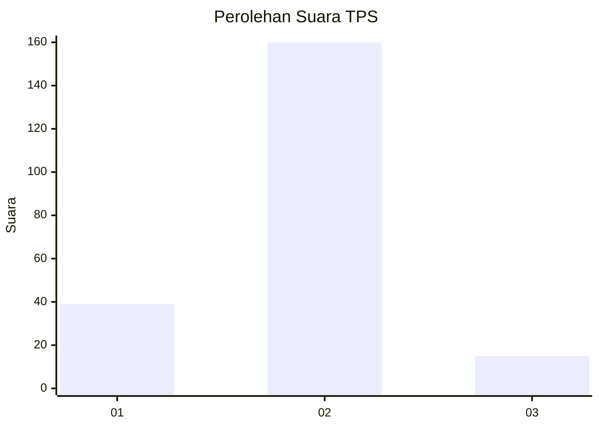
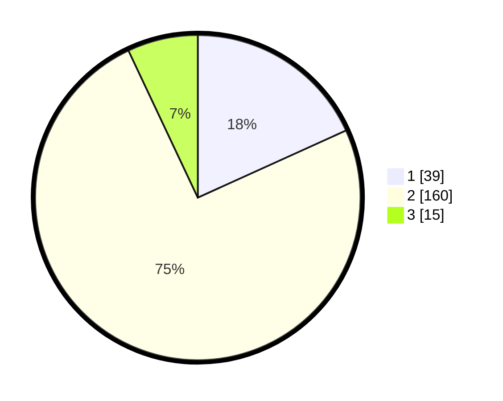

# Hasil

## Grafik

## Tabel

| No. | Nama Paslon    | Suara | Suara (raw) | Persentase |
|:--- |:-------------- | -----:| -----------:| ----------:|
| 1   | ANIES MUHAIMIN | 39    | [39][p-1]   | 18,22      |
| 2   | PRABOWO GIBRAN | 160   | [160][p-2]  | 74,77      |
| 3   | GANJAR MAHFUD  | 15    | [15][p-3]   | 7,01       |

[p-1]: https://github.com/gigit-pemilu/pemilu-2024-32-jawa-barat/blob/main/pilpres/hitung-suara/sub/32-jawa-barat/sub/16-bekasi/sub/13-pebayuran/sub/1011-kertasari/sub/004-tps/sub/paslon-1.txt
[p-2]: https://github.com/gigit-pemilu/pemilu-2024-32-jawa-barat/blob/main/pilpres/hitung-suara/sub/32-jawa-barat/sub/16-bekasi/sub/13-pebayuran/sub/1011-kertasari/sub/004-tps/sub/paslon-2.txt
[p-3]: https://github.com/gigit-pemilu/pemilu-2024-32-jawa-barat/blob/main/pilpres/hitung-suara/sub/32-jawa-barat/sub/16-bekasi/sub/13-pebayuran/sub/1011-kertasari/sub/004-tps/sub/paslon-3.txt

## Foto C Plano

https://sirekap-obj-formc.kpu.go.id/3c9c/pemilu/ppwp/32/16/13/10/11/3216131011004-20240214-204949--4364b067-87c1-4ac0-b9d0-683754bc1f8d.jpg

https://sirekap-obj-formc.kpu.go.id/3c9c/pemilu/ppwp/32/16/13/10/11/3216131011004-20240214-204946--cdf763d8-7c19-4bf2-b9ff-3149d9b285d3.jpg

https://sirekap-obj-formc.kpu.go.id/3c9c/pemilu/ppwp/32/16/13/10/11/3216131011004-20240214-204941--725bff0f-10d2-4b52-bd4d-c4a7e1d9ac33.jpg

## Metadata

| Key        | Value               |
| ---------- | ------------------- |
| Time Stamp | 2024-02-24 22:31:28 |

