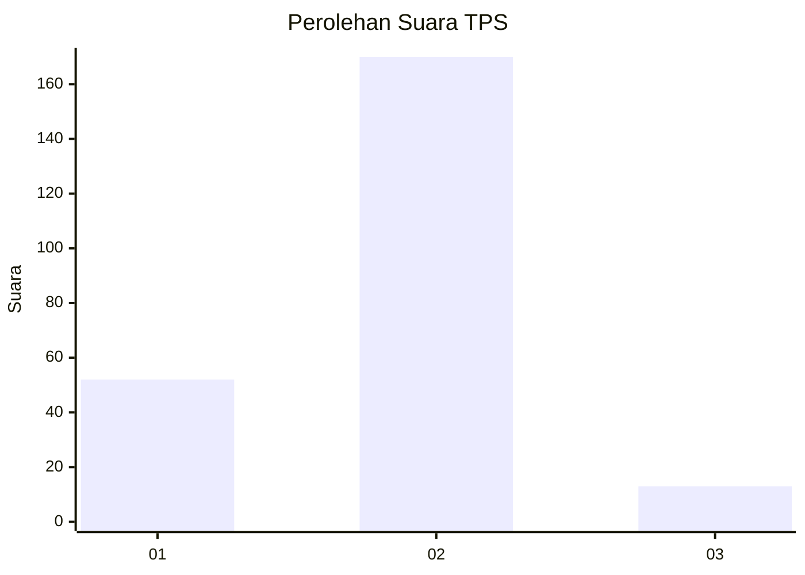
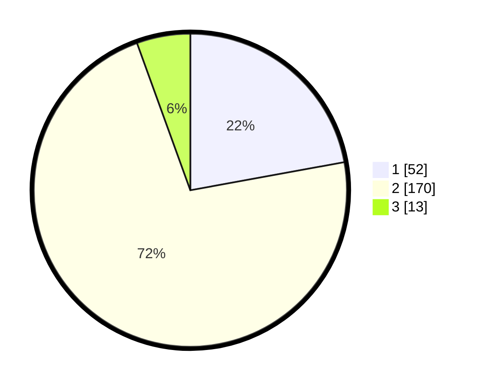

# Hasil

## Grafik

## Tabel

| No. | Nama Paslon    | Suara | Suara (raw) | Persentase |
|:--- |:-------------- | -----:| -----------:| ----------:|
| 1   | ANIES MUHAIMIN | 52    | [52][p-1]   | 22,13      |
| 2   | PRABOWO GIBRAN | 170   | [170][p-2]  | 72,34      |
| 3   | GANJAR MAHFUD  | 13    | [13][p-3]   | 5,53       |

[p-1]: https://github.com/gigit-pemilu/pemilu-2024-32-jawa-barat/blob/main/pilpres/hitung-suara/sub/32-jawa-barat/sub/16-bekasi/sub/13-pebayuran/sub/1011-kertasari/sub/006-tps/sub/paslon-1.txt
[p-2]: https://github.com/gigit-pemilu/pemilu-2024-32-jawa-barat/blob/main/pilpres/hitung-suara/sub/32-jawa-barat/sub/16-bekasi/sub/13-pebayuran/sub/1011-kertasari/sub/006-tps/sub/paslon-2.txt
[p-3]: https://github.com/gigit-pemilu/pemilu-2024-32-jawa-barat/blob/main/pilpres/hitung-suara/sub/32-jawa-barat/sub/16-bekasi/sub/13-pebayuran/sub/1011-kertasari/sub/006-tps/sub/paslon-3.txt

## Foto C Plano

https://sirekap-obj-formc.kpu.go.id/05a7/pemilu/ppwp/32/16/13/10/11/3216131011006-20240214-193716--247780fe-bd30-46ef-ae04-d1e4b0c90ee7.jpg

https://sirekap-obj-formc.kpu.go.id/05a7/pemilu/ppwp/32/16/13/10/11/3216131011006-20240214-194050--57d9debb-1c45-4594-b8cc-858fc5c26acf.jpg

https://sirekap-obj-formc.kpu.go.id/05a7/pemilu/ppwp/32/16/13/10/11/3216131011006-20240214-194348--cbb38756-bb85-4bb3-b5fc-508c27c10a85.jpg

## Metadata

| Key        | Value               |
| ---------- | ------------------- |
| Time Stamp | 2024-02-24 22:31:28 |

