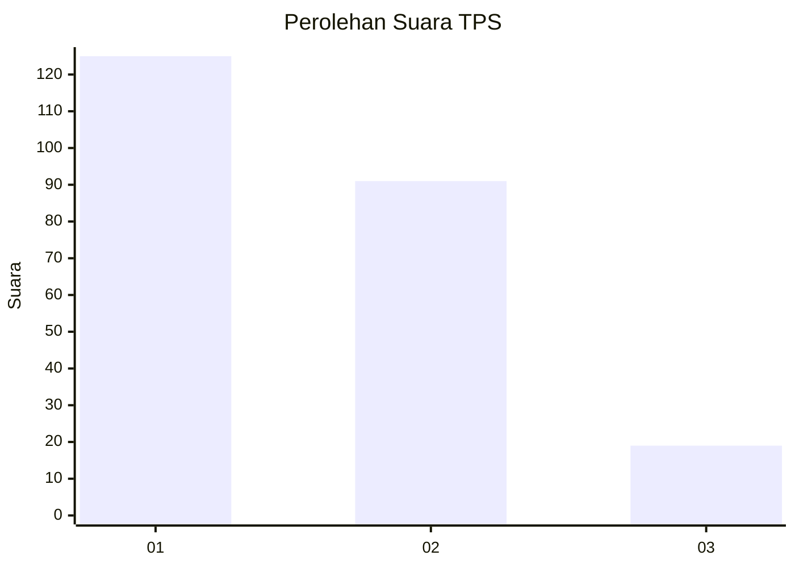
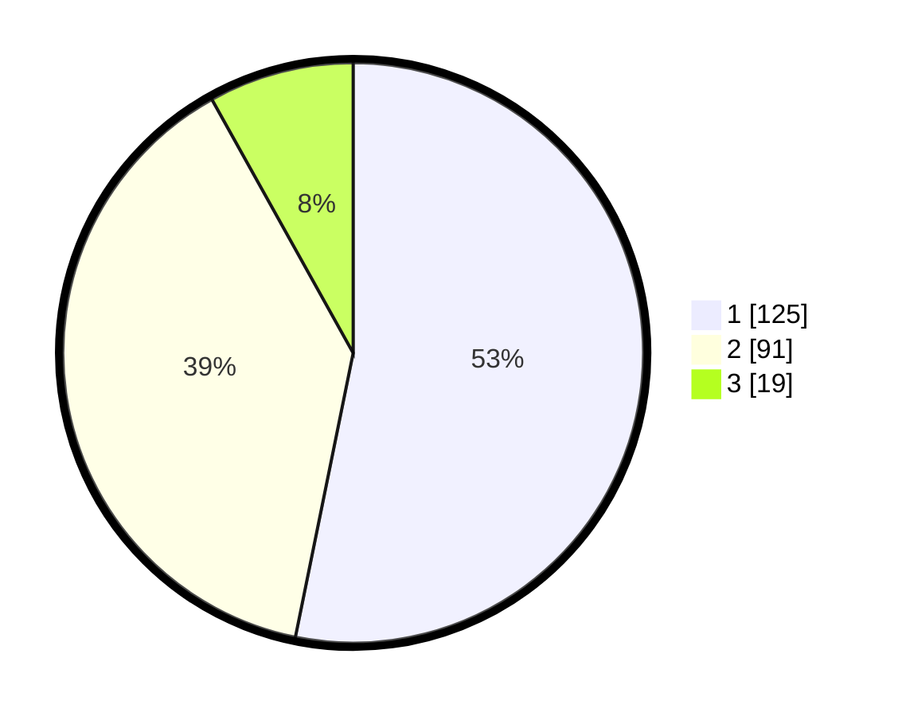

# Hasil

## Grafik

## Tabel

| No. | Nama Paslon    | Suara | Suara (raw) | Persentase |
|:--- |:-------------- | -----:| -----------:| ----------:|
| 1   | ANIES MUHAIMIN | 125   | [125][p-1]  | 53,19      |
| 2   | PRABOWO GIBRAN | 91    | [91][p-2]   | 38,72      |
| 3   | GANJAR MAHFUD  | 19    | [19][p-3]   | 8,09       |

[p-1]: https://github.com/gigit-pemilu/pemilu-2024/blob/main/pilpres/hitung-suara/sub/32-jawa-barat/sub/16-bekasi/sub/14-sukakarya/sub/2001-sukamurni/sub/013-tps/sub/paslon-1.txt
[p-2]: https://github.com/gigit-pemilu/pemilu-2024/blob/main/pilpres/hitung-suara/sub/32-jawa-barat/sub/16-bekasi/sub/14-sukakarya/sub/2001-sukamurni/sub/013-tps/sub/paslon-2.txt
[p-3]: https://github.com/gigit-pemilu/pemilu-2024/blob/main/pilpres/hitung-suara/sub/32-jawa-barat/sub/16-bekasi/sub/14-sukakarya/sub/2001-sukamurni/sub/013-tps/sub/paslon-3.txt

## Foto C Plano

https://sirekap-obj-formc.kpu.go.id/2872/pemilu/ppwp/32/16/14/20/01/3216142001013-20240214-155604--77e0bb76-4b6a-44ef-98c3-d30b8ca93559.jpg

https://sirekap-obj-formc.kpu.go.id/2872/pemilu/ppwp/32/16/14/20/01/3216142001013-20240214-155200--1e9ee76d-9d45-4d0d-a891-64aeaf3f26e7.jpg

https://sirekap-obj-formc.kpu.go.id/2872/pemilu/ppwp/32/16/14/20/01/3216142001013-20240214-155716--813f1471-1790-43cc-ad8c-42a81cdbfb95.jpg

## Metadata

| Key        | Value               |
| ---------- | ------------------- |
| Time Stamp | 2024-02-24 22:31:28 |

