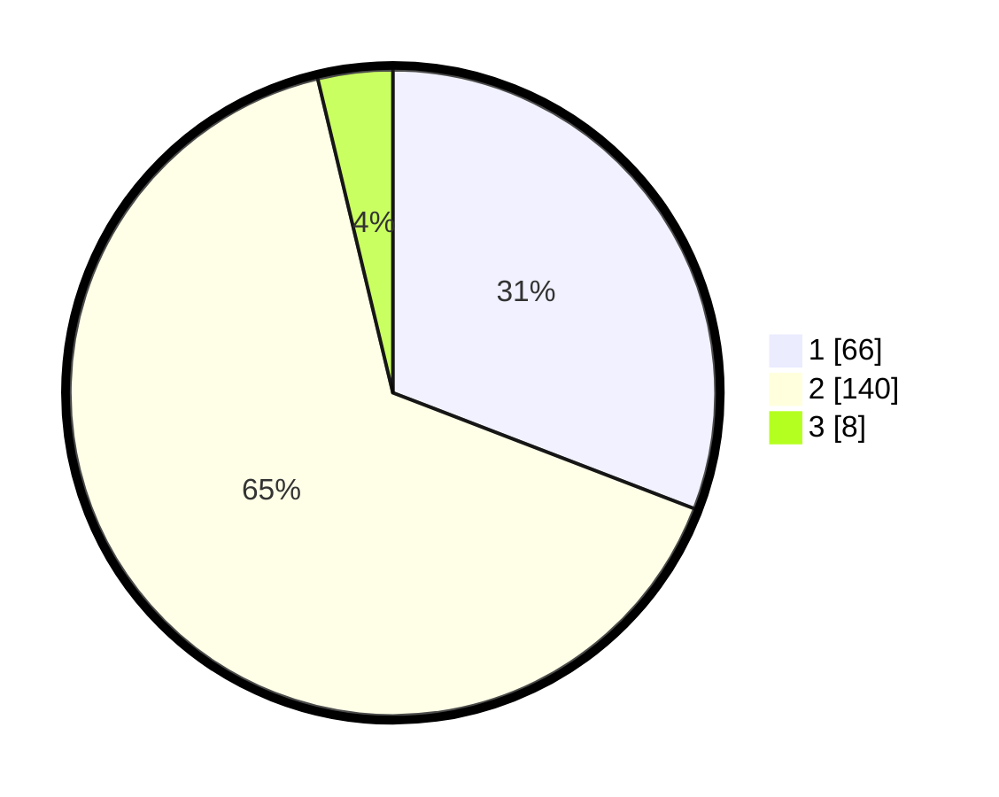

# Hasil

## Grafik

## Tabel

| No. | Nama Paslon    | Suara | Suara (raw) | Persentase |
|:--- |:-------------- | -----:| -----------:| ----------:|
| 1   | ANIES MUHAIMIN | 66    | [66][p-1]   | 30,84      |
| 2   | PRABOWO GIBRAN | 140   | [140][p-2]  | 65,42      |
| 3   | GANJAR MAHFUD  | 8     | [8][p-3]    | 3,74       |

[p-1]: https://github.com/gigit-pemilu/pemilu-2024/blob/main/pilpres/hitung-suara/sub/32-jawa-barat/sub/16-bekasi/sub/14-sukakarya/sub/2002-sukaindah/sub/017-tps/sub/paslon-1.txt
[p-2]: https://github.com/gigit-pemilu/pemilu-2024/blob/main/pilpres/hitung-suara/sub/32-jawa-barat/sub/16-bekasi/sub/14-sukakarya/sub/2002-sukaindah/sub/017-tps/sub/paslon-2.txt
[p-3]: https://github.com/gigit-pemilu/pemilu-2024/blob/main/pilpres/hitung-suara/sub/32-jawa-barat/sub/16-bekasi/sub/14-sukakarya/sub/2002-sukaindah/sub/017-tps/sub/paslon-3.txt

## Foto C Plano

https://sirekap-obj-formc.kpu.go.id/2789/pemilu/ppwp/32/16/14/20/02/3216142002017-20240214-162228--de291501-294a-49f4-9b97-8615910ba14a.jpg

https://sirekap-obj-formc.kpu.go.id/2789/pemilu/ppwp/32/16/14/20/02/3216142002017-20240214-162233--b20fc167-2d88-4cf1-a400-9034d7437fbc.jpg

https://sirekap-obj-formc.kpu.go.id/2789/pemilu/ppwp/32/16/14/20/02/3216142002017-20240214-155024--5df10cfe-e400-4da0-9ac0-b875f546fb70.jpg

## Metadata

| Key        | Value               |
| ---------- | ------------------- |
| Time Stamp | 2024-02-24 22:31:28 |

