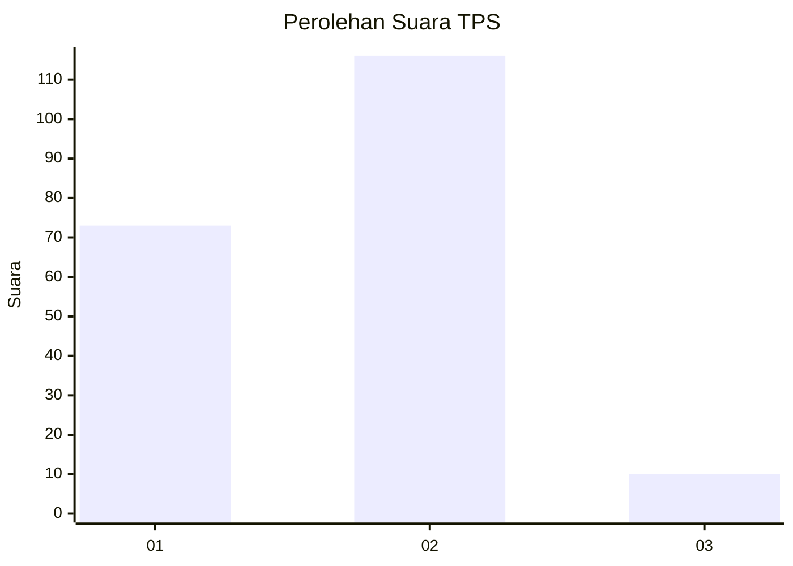
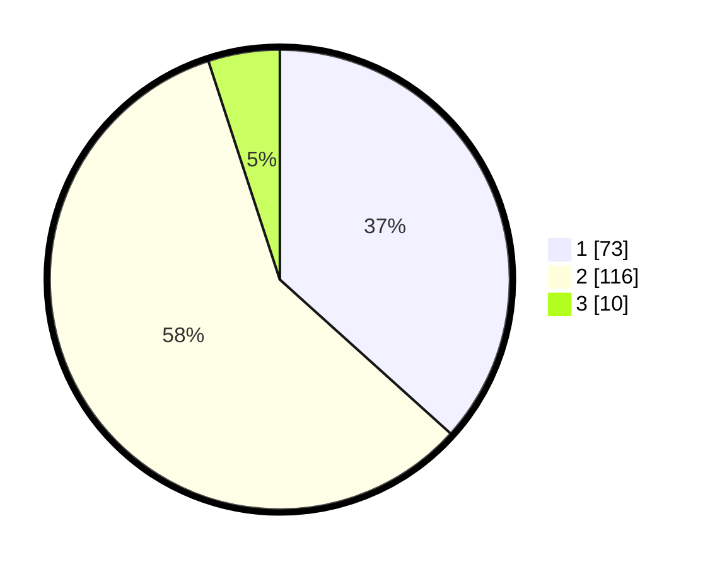

# Hasil

## Grafik

## Tabel

| No. | Nama Paslon    | Suara | Suara (raw) | Persentase |
|:--- |:-------------- | -----:| -----------:| ----------:|
| 1   | ANIES MUHAIMIN | 73    | [73][p-1]   | 36,68      |
| 2   | PRABOWO GIBRAN | 116   | [116][p-2]  | 58,29      |
| 3   | GANJAR MAHFUD  | 10    | [10][p-3]   | 5,03       |

[p-1]: https://github.com/gigit-pemilu/pemilu-2024/blob/main/pilpres/hitung-suara/sub/32-jawa-barat/sub/16-bekasi/sub/15-sukatani/sub/2001-sukamulya/sub/003-tps/sub/paslon-1.txt
[p-2]: https://github.com/gigit-pemilu/pemilu-2024/blob/main/pilpres/hitung-suara/sub/32-jawa-barat/sub/16-bekasi/sub/15-sukatani/sub/2001-sukamulya/sub/003-tps/sub/paslon-2.txt
[p-3]: https://github.com/gigit-pemilu/pemilu-2024/blob/main/pilpres/hitung-suara/sub/32-jawa-barat/sub/16-bekasi/sub/15-sukatani/sub/2001-sukamulya/sub/003-tps/sub/paslon-3.txt

## Foto C Plano

https://sirekap-obj-formc.kpu.go.id/c635/pemilu/ppwp/32/16/15/20/01/3216152001003-20240214-193139--3cd6cf99-4433-4b51-bef1-8472c274bd5f.jpg

https://sirekap-obj-formc.kpu.go.id/c635/pemilu/ppwp/32/16/15/20/01/3216152001003-20240214-193144--dcba0239-8bcd-4f5b-a56b-98ceba5f00fd.jpg

https://sirekap-obj-formc.kpu.go.id/c635/pemilu/ppwp/32/16/15/20/01/3216152001003-20240214-193148--2a68de77-deee-4f66-8f8c-0095756e911d.jpg

## Metadata

| Key        | Value               |
| ---------- | ------------------- |
| Time Stamp | 2024-02-24 22:31:28 |

