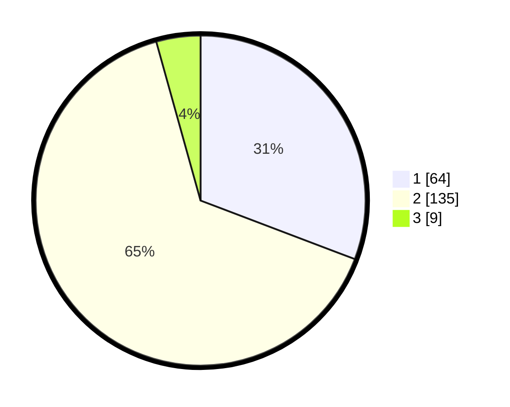

# Hasil

## Grafik

## Tabel

| No. | Nama Paslon    | Suara | Suara (raw) | Persentase |
|:--- |:-------------- | -----:| -----------:| ----------:|
| 1   | ANIES MUHAIMIN | 64    | [64][p-1]   | 30,77      |
| 2   | PRABOWO GIBRAN | 135   | [135][p-2]  | 64,90      |
| 3   | GANJAR MAHFUD  | 9     | [9][p-3]    | 4,33       |

[p-1]: https://github.com/gigit-pemilu/pemilu-2024/blob/main/pilpres/hitung-suara/sub/32-jawa-barat/sub/16-bekasi/sub/15-sukatani/sub/2001-sukamulya/sub/014-tps/sub/paslon-1.txt
[p-2]: https://github.com/gigit-pemilu/pemilu-2024/blob/main/pilpres/hitung-suara/sub/32-jawa-barat/sub/16-bekasi/sub/15-sukatani/sub/2001-sukamulya/sub/014-tps/sub/paslon-2.txt
[p-3]: https://github.com/gigit-pemilu/pemilu-2024/blob/main/pilpres/hitung-suara/sub/32-jawa-barat/sub/16-bekasi/sub/15-sukatani/sub/2001-sukamulya/sub/014-tps/sub/paslon-3.txt

## Foto C Plano

https://sirekap-obj-formc.kpu.go.id/cb5c/pemilu/ppwp/32/16/15/20/01/3216152001014-20240215-205039--4b05c977-5c94-4110-8f9e-a8e2ea88c432.jpg

https://sirekap-obj-formc.kpu.go.id/cb5c/pemilu/ppwp/32/16/15/20/01/3216152001014-20240215-202938--28c8a32e-090a-49ee-bc36-2a8c50d97b4c.jpg

https://sirekap-obj-formc.kpu.go.id/cb5c/pemilu/ppwp/32/16/15/20/01/3216152001014-20240215-203406--f89cba45-e4b8-45d8-aeb0-fb77a18514b2.jpg

## Metadata

| Key        | Value               |
| ---------- | ------------------- |
| Time Stamp | 2024-02-25 11:00:00 |

