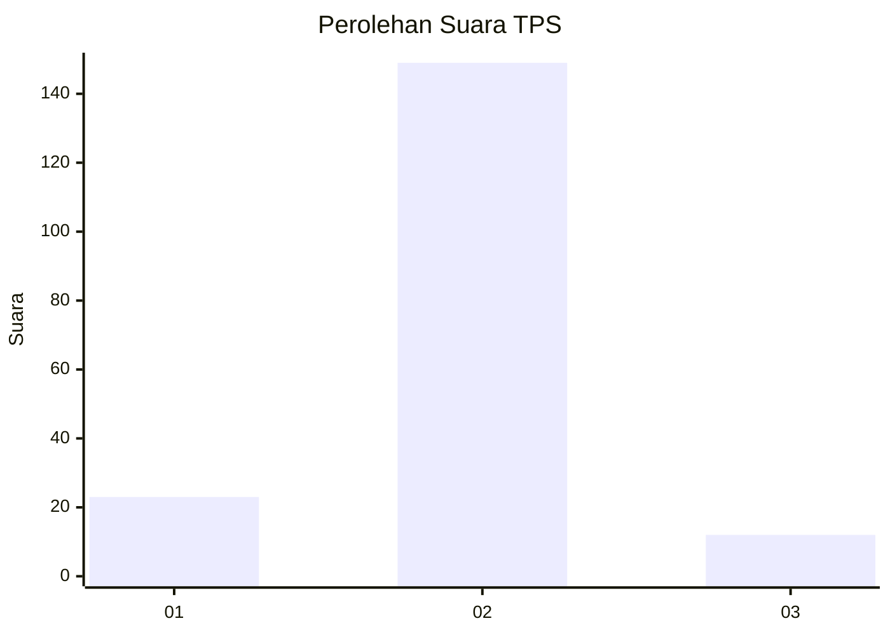
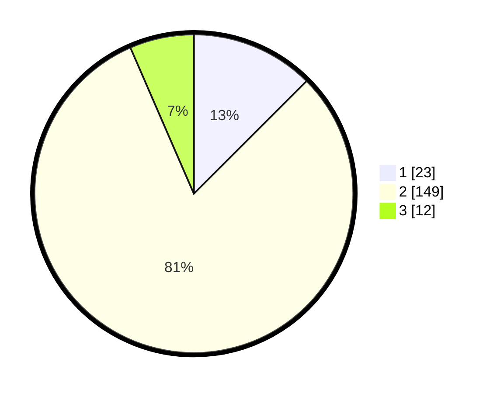

# Hasil

## Grafik

## Tabel

| No. | Nama Paslon    | Suara | Suara (raw) | Persentase |
|:--- |:-------------- | -----:| -----------:| ----------:|
| 1   | ANIES MUHAIMIN | 23    | [23][p-1]   | 12,50      |
| 2   | PRABOWO GIBRAN | 149   | [149][p-2]  | 80,98      |
| 3   | GANJAR MAHFUD  | 12    | [12][p-3]   | 6,52       |

[p-1]: https://github.com/gigit-pemilu/pemilu-2024-32-jawa-barat/blob/main/pilpres/hitung-suara/sub/32-jawa-barat/sub/16-bekasi/sub/16-cabangbungin/sub/2001-jayabakti/sub/002-tps/sub/paslon-1.txt
[p-2]: https://github.com/gigit-pemilu/pemilu-2024-32-jawa-barat/blob/main/pilpres/hitung-suara/sub/32-jawa-barat/sub/16-bekasi/sub/16-cabangbungin/sub/2001-jayabakti/sub/002-tps/sub/paslon-2.txt
[p-3]: https://github.com/gigit-pemilu/pemilu-2024-32-jawa-barat/blob/main/pilpres/hitung-suara/sub/32-jawa-barat/sub/16-bekasi/sub/16-cabangbungin/sub/2001-jayabakti/sub/002-tps/sub/paslon-3.txt

## Foto C Plano

https://sirekap-obj-formc.kpu.go.id/6f36/pemilu/ppwp/32/16/16/20/01/3216162001002-20240215-071554--f04b078a-1e0b-42f0-8833-6c425ad6bc4a.jpg

https://sirekap-obj-formc.kpu.go.id/6f36/pemilu/ppwp/32/16/16/20/01/3216162001002-20240215-004444--6fafb3a3-9957-4119-89ea-10ce95bda83d.jpg

https://sirekap-obj-formc.kpu.go.id/6f36/pemilu/ppwp/32/16/16/20/01/3216162001002-20240215-004541--1730e74e-b258-4254-a622-8737d13e5f3c.jpg

## Metadata

| Key        | Value               |
| ---------- | ------------------- |
| Time Stamp | 2024-02-26 13:00:00 |

