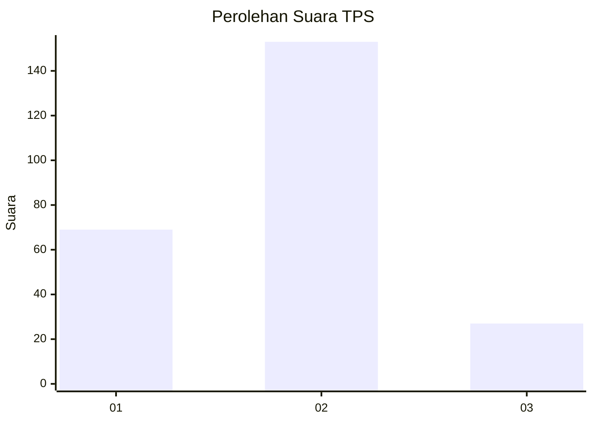
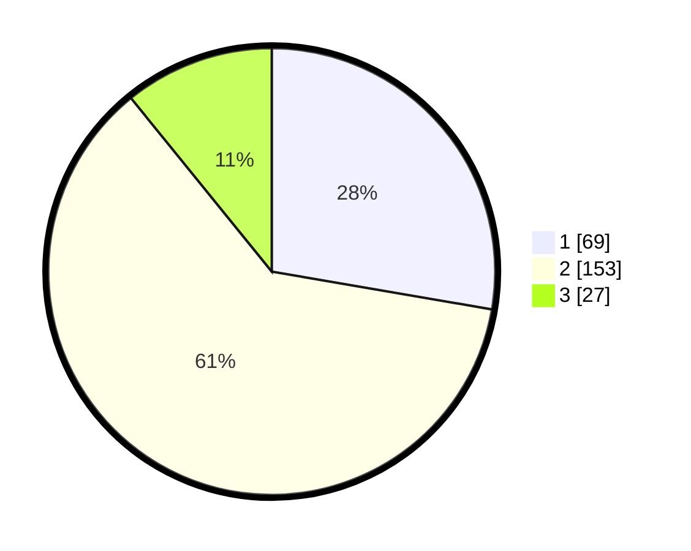

# Hasil

## Grafik

## Tabel

| No. | Nama Paslon    | Suara | Suara (raw) | Persentase |
|:--- |:-------------- | -----:| -----------:| ----------:|
| 1   | ANIES MUHAIMIN | 69    | [69][p-1]   | 27,71      |
| 2   | PRABOWO GIBRAN | 153   | [153][p-2]  | 61,45      |
| 3   | GANJAR MAHFUD  | 27    | [27][p-3]   | 10,84      |

[p-1]: https://github.com/gigit-pemilu/pemilu-2024-32-jawa-barat/blob/main/pilpres/hitung-suara/sub/32-jawa-barat/sub/16-bekasi/sub/16-cabangbungin/sub/2001-jayabakti/sub/003-tps/sub/paslon-1.txt
[p-2]: https://github.com/gigit-pemilu/pemilu-2024-32-jawa-barat/blob/main/pilpres/hitung-suara/sub/32-jawa-barat/sub/16-bekasi/sub/16-cabangbungin/sub/2001-jayabakti/sub/003-tps/sub/paslon-2.txt
[p-3]: https://github.com/gigit-pemilu/pemilu-2024-32-jawa-barat/blob/main/pilpres/hitung-suara/sub/32-jawa-barat/sub/16-bekasi/sub/16-cabangbungin/sub/2001-jayabakti/sub/003-tps/sub/paslon-3.txt

## Foto C Plano

https://sirekap-obj-formc.kpu.go.id/2c5e/pemilu/ppwp/32/16/16/20/01/3216162001003-20240215-012845--8b00e221-fdb8-48f1-879d-00fca882e2b8.jpg

https://sirekap-obj-formc.kpu.go.id/2c5e/pemilu/ppwp/32/16/16/20/01/3216162001003-20240215-012110--41192e6e-a0a0-488d-87e3-19f60ecd1788.jpg

https://sirekap-obj-formc.kpu.go.id/2c5e/pemilu/ppwp/32/16/16/20/01/3216162001003-20240215-012440--e49b2820-e460-429e-91dd-f63f85f617e2.jpg

## Metadata

| Key        | Value               |
| ---------- | ------------------- |
| Time Stamp | 2024-02-25 21:00:00 |

