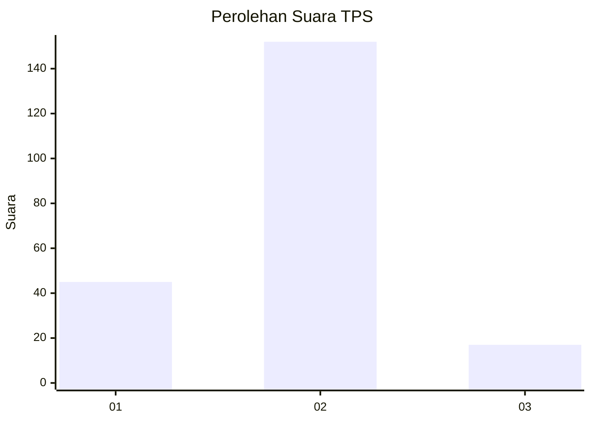
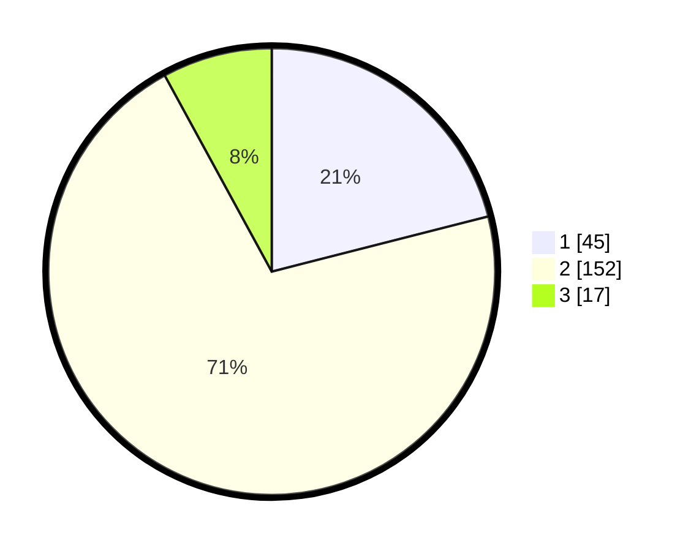

# Hasil

## Grafik

## Tabel

| No. | Nama Paslon    | Suara | Suara (raw) | Persentase |
|:--- |:-------------- | -----:| -----------:| ----------:|
| 1   | ANIES MUHAIMIN | 45    | [45][p-1]   | 21,03      |
| 2   | PRABOWO GIBRAN | 152   | [152][p-2]  | 71,03      |
| 3   | GANJAR MAHFUD  | 17    | [17][p-3]   | 7,94       |

[p-1]: https://github.com/gigit-pemilu/pemilu-2024-32-jawa-barat/blob/main/pilpres/hitung-suara/sub/32-jawa-barat/sub/16-bekasi/sub/16-cabangbungin/sub/2001-jayabakti/sub/006-tps/sub/paslon-1.txt
[p-2]: https://github.com/gigit-pemilu/pemilu-2024-32-jawa-barat/blob/main/pilpres/hitung-suara/sub/32-jawa-barat/sub/16-bekasi/sub/16-cabangbungin/sub/2001-jayabakti/sub/006-tps/sub/paslon-2.txt
[p-3]: https://github.com/gigit-pemilu/pemilu-2024-32-jawa-barat/blob/main/pilpres/hitung-suara/sub/32-jawa-barat/sub/16-bekasi/sub/16-cabangbungin/sub/2001-jayabakti/sub/006-tps/sub/paslon-3.txt

## Foto C Plano

https://sirekap-obj-formc.kpu.go.id/1653/pemilu/ppwp/32/16/16/20/01/3216162001006-20240215-055032--0632a5ab-ff5b-4f26-92ab-ec5b3afce348.jpg

https://sirekap-obj-formc.kpu.go.id/1653/pemilu/ppwp/32/16/16/20/01/3216162001006-20240215-055158--24170f39-3a38-4d3c-9f21-aa9330808338.jpg

https://sirekap-obj-formc.kpu.go.id/1653/pemilu/ppwp/32/16/16/20/01/3216162001006-20240215-055401--7e7f6819-a1ac-4000-9122-d058e31c06fa.jpg

## Metadata

| Key        | Value               |
| ---------- | ------------------- |
| Time Stamp | 2024-02-24 22:31:28 |

