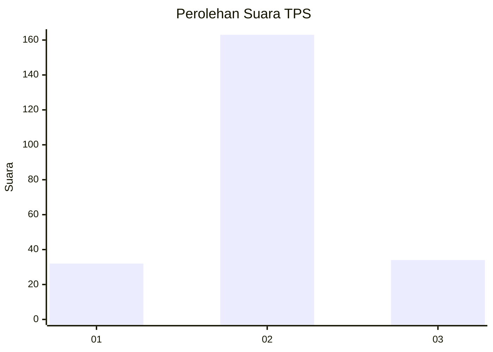

# Hasil

## Grafik

## Tabel

| No. | Nama Paslon    | Suara | Suara (raw) | Persentase |
|:--- |:-------------- | -----:| -----------:| ----------:|
| 1   | ANIES MUHAIMIN | 32    | [32][p-1]   | 13,97      |
| 2   | PRABOWO GIBRAN | 163   | [163][p-2]  | 71,18      |
| 3   | GANJAR MAHFUD  | 34    | [34][p-3]   | 14,85      |

[p-1]: https://github.com/gigit-pemilu/pemilu-2024/blob/main/pilpres/hitung-suara/sub/32-jawa-barat/sub/16-bekasi/sub/16-cabangbungin/sub/2001-jayabakti/sub/007-tps/sub/paslon-1.txt
[p-2]: https://github.com/gigit-pemilu/pemilu-2024/blob/main/pilpres/hitung-suara/sub/32-jawa-barat/sub/16-bekasi/sub/16-cabangbungin/sub/2001-jayabakti/sub/007-tps/sub/paslon-2.txt
[p-3]: https://github.com/gigit-pemilu/pemilu-2024/blob/main/pilpres/hitung-suara/sub/32-jawa-barat/sub/16-bekasi/sub/16-cabangbungin/sub/2001-jayabakti/sub/007-tps/sub/paslon-3.txt

## Foto C Plano

https://sirekap-obj-formc.kpu.go.id/2d89/pemilu/ppwp/32/16/16/20/01/3216162001007-20240215-004604--5f20d91c-48cd-4fb6-835a-01865fedc89a.jpg

https://sirekap-obj-formc.kpu.go.id/2d89/pemilu/ppwp/32/16/16/20/01/3216162001007-20240215-010510--b4661211-8c2c-4801-b941-8fc9b0b0354c.jpg

https://sirekap-obj-formc.kpu.go.id/2d89/pemilu/ppwp/32/16/16/20/01/3216162001007-20240215-010609--fb19728f-baa1-46b9-8bb8-e533335cda2c.jpg

## Metadata

| Key        | Value               |
| ---------- | ------------------- |
| Time Stamp | 2024-02-25 11:00:00 |

