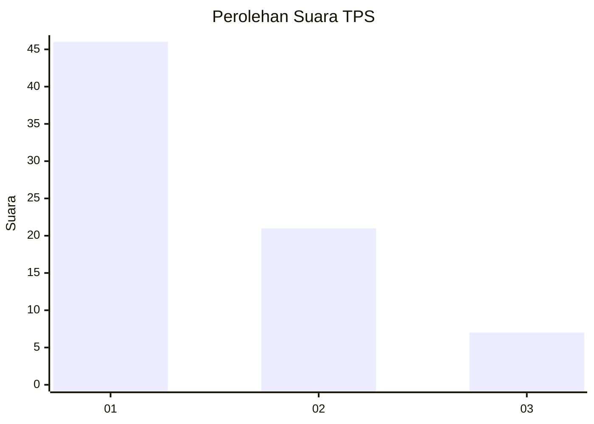
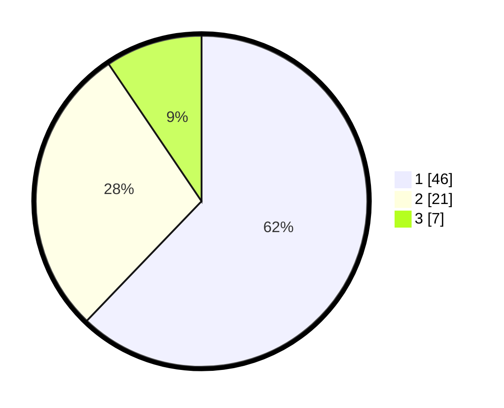

# Hasil

## Grafik

## Tabel

| No. | Nama Paslon    | Suara | Suara (raw) | Persentase |
|:--- |:-------------- | -----:| -----------:| ----------:|
| 1   | ANIES MUHAIMIN | 46    | [46][p-1]   | 62,16      |
| 2   | PRABOWO GIBRAN | 21    | [21][p-2]   | 28,38      |
| 3   | GANJAR MAHFUD  | 7     | [7][p-3]    | 9,46       |

[p-1]: https://github.com/gigit-pemilu/pemilu-2024/blob/main/pilpres/hitung-suara/sub/32-jawa-barat/sub/16-bekasi/sub/16-cabangbungin/sub/2007-lenggahjaya/sub/015-tps/sub/paslon-1.txt
[p-2]: https://github.com/gigit-pemilu/pemilu-2024/blob/main/pilpres/hitung-suara/sub/32-jawa-barat/sub/16-bekasi/sub/16-cabangbungin/sub/2007-lenggahjaya/sub/015-tps/sub/paslon-2.txt
[p-3]: https://github.com/gigit-pemilu/pemilu-2024/blob/main/pilpres/hitung-suara/sub/32-jawa-barat/sub/16-bekasi/sub/16-cabangbungin/sub/2007-lenggahjaya/sub/015-tps/sub/paslon-3.txt

## Foto C Plano

https://sirekap-obj-formc.kpu.go.id/ec86/pemilu/ppwp/32/16/16/20/07/3216162007015-20240214-231623--14ec1666-0a7d-4a84-af3b-32405c5031b5.jpg

https://sirekap-obj-formc.kpu.go.id/ec86/pemilu/ppwp/32/16/16/20/07/3216162007015-20240214-231816--b33e085f-97b9-48d3-86e3-e6b04a40c8e2.jpg

https://sirekap-obj-formc.kpu.go.id/ec86/pemilu/ppwp/32/16/16/20/07/3216162007015-20240214-231929--063130e4-a332-4251-90fd-f2789c04ef44.jpg

## Metadata

| Key        | Value               |
| ---------- | ------------------- |
| Time Stamp | 2024-02-24 22:31:28 |

