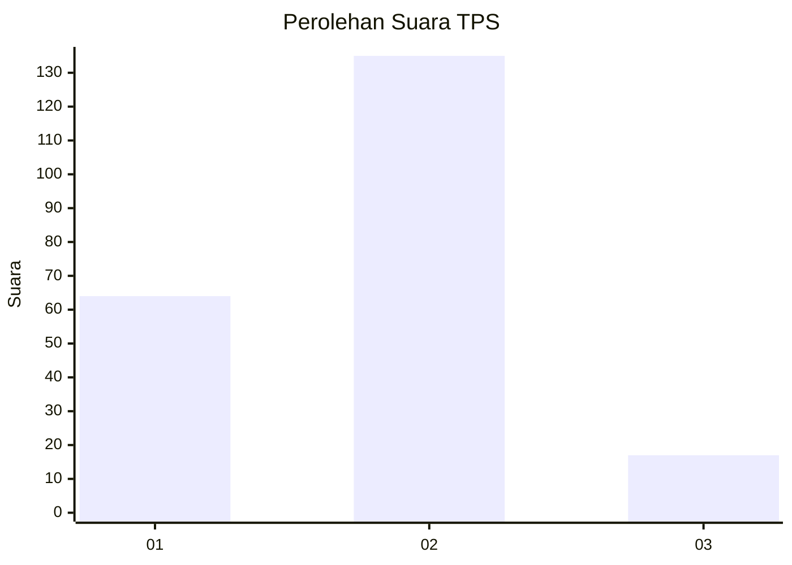
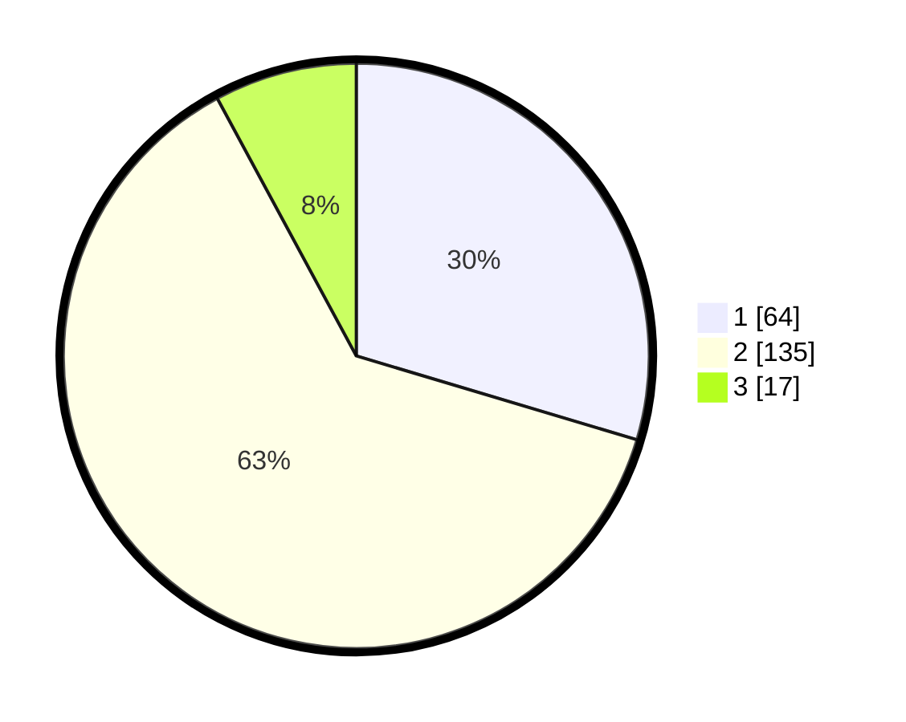

# Hasil

## Grafik

## Tabel

| No. | Nama Paslon    | Suara | Suara (raw) | Persentase |
|:--- |:-------------- | -----:| -----------:| ----------:|
| 1   | ANIES MUHAIMIN | 64    | [64][p-1]   | 29,63      |
| 2   | PRABOWO GIBRAN | 135   | [135][p-2]  | 62,50      |
| 3   | GANJAR MAHFUD  | 17    | [17][p-3]   | 7,87       |

[p-1]: https://github.com/gigit-pemilu/pemilu-2024/blob/main/pilpres/hitung-suara/sub/32-jawa-barat/sub/16-bekasi/sub/17-muaragembong/sub/2001-pantai-mekar/sub/005-tps/sub/paslon-1.txt
[p-2]: https://github.com/gigit-pemilu/pemilu-2024/blob/main/pilpres/hitung-suara/sub/32-jawa-barat/sub/16-bekasi/sub/17-muaragembong/sub/2001-pantai-mekar/sub/005-tps/sub/paslon-2.txt
[p-3]: https://github.com/gigit-pemilu/pemilu-2024/blob/main/pilpres/hitung-suara/sub/32-jawa-barat/sub/16-bekasi/sub/17-muaragembong/sub/2001-pantai-mekar/sub/005-tps/sub/paslon-3.txt

## Foto C Plano

https://sirekap-obj-formc.kpu.go.id/9429/pemilu/ppwp/32/16/17/20/01/3216172001005-20240215-023301--e510278b-9e84-46ba-8075-115f666780c5.jpg

https://sirekap-obj-formc.kpu.go.id/9429/pemilu/ppwp/32/16/17/20/01/3216172001005-20240215-023650--cf5bc088-b746-466a-ba9c-d4988af93f3f.jpg

https://sirekap-obj-formc.kpu.go.id/9429/pemilu/ppwp/32/16/17/20/01/3216172001005-20240215-031936--80f99ebb-b68b-4b3b-ba16-bc4221337730.jpg

## Metadata

| Key        | Value               |
| ---------- | ------------------- |
| Time Stamp | 2024-02-25 11:00:00 |

