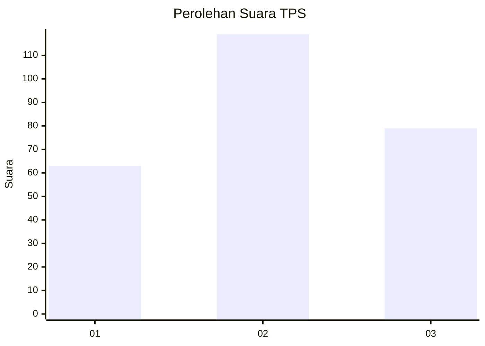
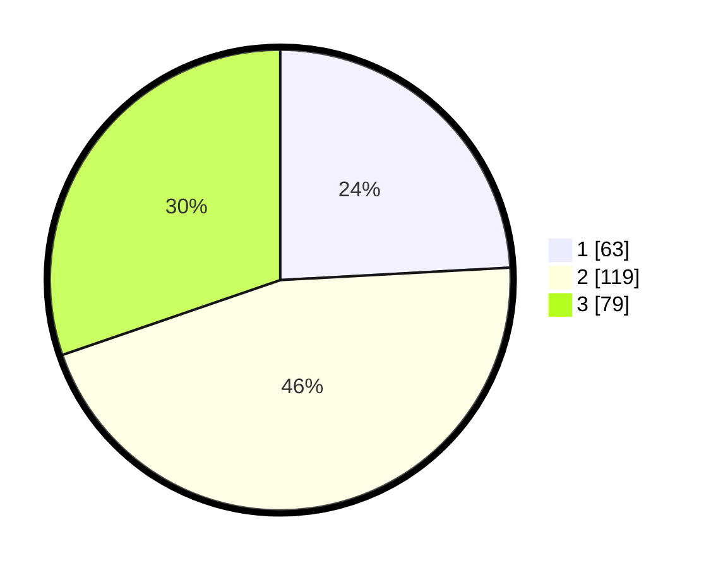

# Hasil

## Grafik

## Tabel

| No. | Nama Paslon    | Suara | Suara (raw) | Persentase |
|:--- |:-------------- | -----:| -----------:| ----------:|
| 1   | ANIES MUHAIMIN | 63    | [63][p-1]   | 24,14      |
| 2   | PRABOWO GIBRAN | 119   | [119][p-2]  | 45,59      |
| 3   | GANJAR MAHFUD  | 79    | [79][p-3]   | 30,27      |

[p-1]: https://github.com/gigit-pemilu/pemilu-2024-32-jawa-barat/blob/main/pilpres/hitung-suara/sub/32-jawa-barat/sub/16-bekasi/sub/17-muaragembong/sub/2004-pantai-harapanjaya/sub/019-tps/sub/paslon-1.txt
[p-2]: https://github.com/gigit-pemilu/pemilu-2024-32-jawa-barat/blob/main/pilpres/hitung-suara/sub/32-jawa-barat/sub/16-bekasi/sub/17-muaragembong/sub/2004-pantai-harapanjaya/sub/019-tps/sub/paslon-2.txt
[p-3]: https://github.com/gigit-pemilu/pemilu-2024-32-jawa-barat/blob/main/pilpres/hitung-suara/sub/32-jawa-barat/sub/16-bekasi/sub/17-muaragembong/sub/2004-pantai-harapanjaya/sub/019-tps/sub/paslon-3.txt

## Foto C Plano

https://sirekap-obj-formc.kpu.go.id/f96e/pemilu/ppwp/32/16/17/20/04/3216172004019-20240221-165523--f5f916c1-73c9-4b1c-88d9-4f875b7a030b.jpg

https://sirekap-obj-formc.kpu.go.id/f96e/pemilu/ppwp/32/16/17/20/04/3216172004019-20240214-185225--cfca91c7-b0fd-4ec9-bc0c-9d4d13ff206d.jpg

https://sirekap-obj-formc.kpu.go.id/f96e/pemilu/ppwp/32/16/17/20/04/3216172004019-20240214-185620--a093256b-6810-4ddf-9223-06464a921ada.jpg

## Metadata

| Key        | Value               |
| ---------- | ------------------- |
| Time Stamp | 2024-02-21 17:00:00 |

