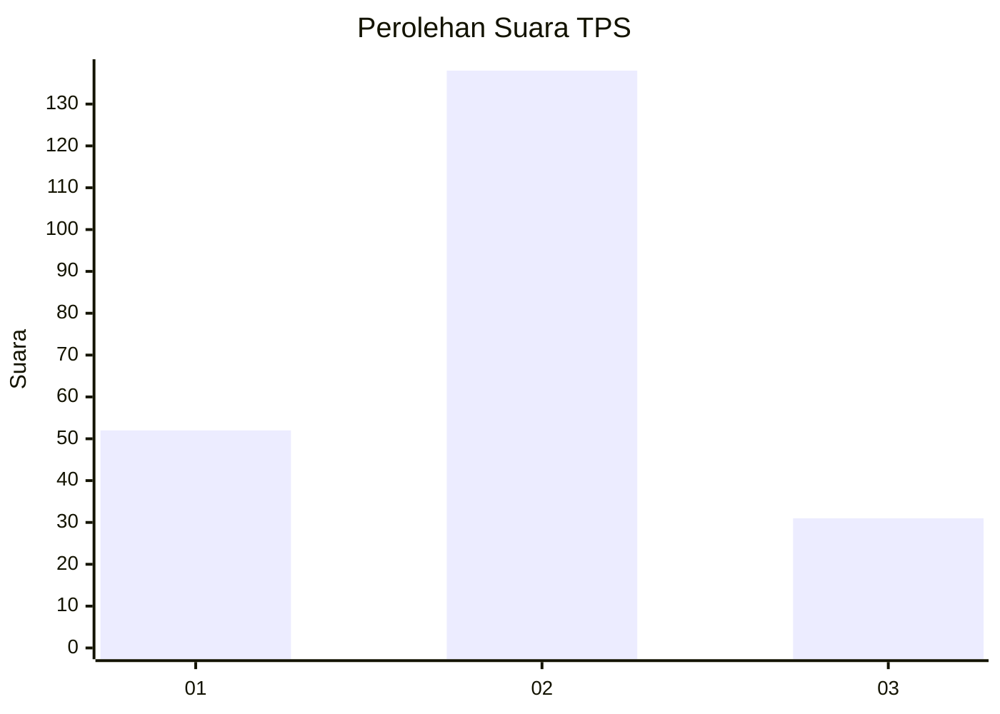
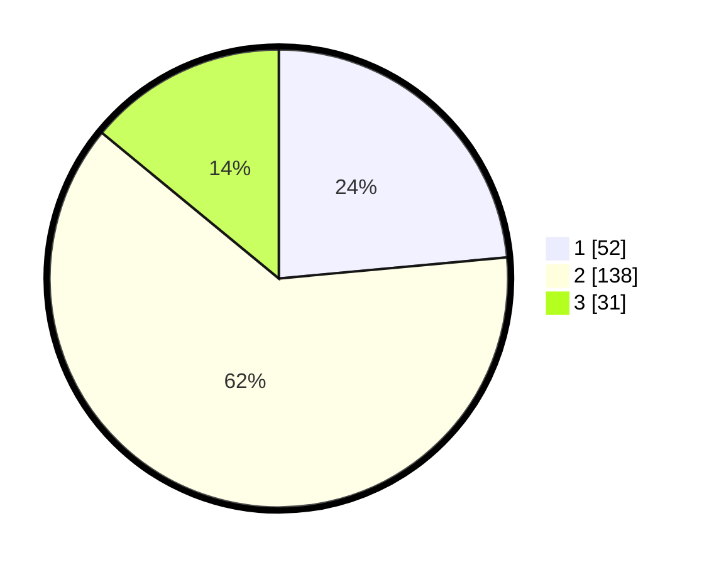

# Hasil

## Grafik

## Tabel

| No. | Nama Paslon    | Suara | Suara (raw) | Persentase |
|:--- |:-------------- | -----:| -----------:| ----------:|
| 1   | ANIES MUHAIMIN | 52    | [52][p-1]   | 23,53      |
| 2   | PRABOWO GIBRAN | 138   | [138][p-2]  | 62,44      |
| 3   | GANJAR MAHFUD  | 31    | [31][p-3]   | 14,03      |

[p-1]: https://github.com/gigit-pemilu/pemilu-2024/blob/main/pilpres/hitung-suara/sub/32-jawa-barat/sub/16-bekasi/sub/18-setu/sub/2001-cijengkol/sub/003-tps/sub/paslon-1.txt
[p-2]: https://github.com/gigit-pemilu/pemilu-2024/blob/main/pilpres/hitung-suara/sub/32-jawa-barat/sub/16-bekasi/sub/18-setu/sub/2001-cijengkol/sub/003-tps/sub/paslon-2.txt
[p-3]: https://github.com/gigit-pemilu/pemilu-2024/blob/main/pilpres/hitung-suara/sub/32-jawa-barat/sub/16-bekasi/sub/18-setu/sub/2001-cijengkol/sub/003-tps/sub/paslon-3.txt

## Foto C Plano

https://sirekap-obj-formc.kpu.go.id/37b4/pemilu/ppwp/32/16/18/20/01/3216182001003-20240215-000623--fb4576a1-4266-42c7-9620-ef881758de87.jpg

https://sirekap-obj-formc.kpu.go.id/37b4/pemilu/ppwp/32/16/18/20/01/3216182001003-20240214-193137--cf31f080-8e17-4bfc-b8da-beee9d4ae6be.jpg

https://sirekap-obj-formc.kpu.go.id/37b4/pemilu/ppwp/32/16/18/20/01/3216182001003-20240214-193142--9dcc07e8-e595-4597-ad6d-1410f07c3981.jpg

## Metadata

| Key        | Value               |
| ---------- | ------------------- |
| Time Stamp | 2024-02-15 15:00:29 |

