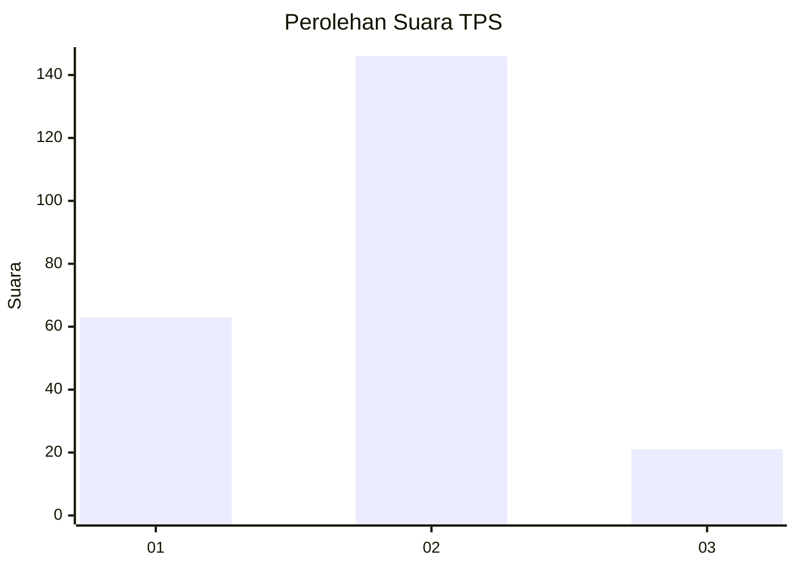
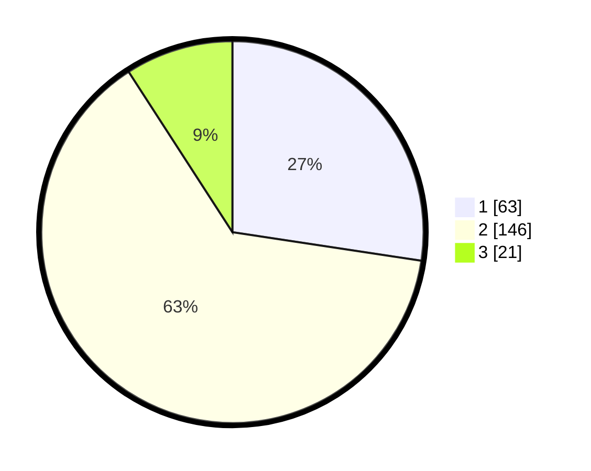

# Hasil

## Grafik

## Tabel

| No. | Nama Paslon    | Suara | Suara (raw) | Persentase |
|:--- |:-------------- | -----:| -----------:| ----------:|
| 1   | ANIES MUHAIMIN | 63    | [63][p-1]   | 27,39      |
| 2   | PRABOWO GIBRAN | 146   | [146][p-2]  | 63,48      |
| 3   | GANJAR MAHFUD  | 21    | [21][p-3]   | 9,13       |

[p-1]: https://github.com/gigit-pemilu/pemilu-2024/blob/main/pilpres/hitung-suara/sub/32-jawa-barat/sub/16-bekasi/sub/18-setu/sub/2001-cijengkol/sub/004-tps/sub/paslon-1.txt
[p-2]: https://github.com/gigit-pemilu/pemilu-2024/blob/main/pilpres/hitung-suara/sub/32-jawa-barat/sub/16-bekasi/sub/18-setu/sub/2001-cijengkol/sub/004-tps/sub/paslon-2.txt
[p-3]: https://github.com/gigit-pemilu/pemilu-2024/blob/main/pilpres/hitung-suara/sub/32-jawa-barat/sub/16-bekasi/sub/18-setu/sub/2001-cijengkol/sub/004-tps/sub/paslon-3.txt

## Foto C Plano

https://sirekap-obj-formc.kpu.go.id/efa0/pemilu/ppwp/32/16/18/20/01/3216182001004-20240214-214806--2a864fc8-45eb-4379-9f78-06544625eaa5.jpg

https://sirekap-obj-formc.kpu.go.id/efa0/pemilu/ppwp/32/16/18/20/01/3216182001004-20240214-214907--f25ef5fa-b888-4555-b054-0ead01ecc6a1.jpg

https://sirekap-obj-formc.kpu.go.id/efa0/pemilu/ppwp/32/16/18/20/01/3216182001004-20240214-215019--5000b959-963b-4e80-8ab2-e5463f101245.jpg

## Metadata

| Key        | Value               |
| ---------- | ------------------- |
| Time Stamp | 2024-02-25 11:00:00 |

