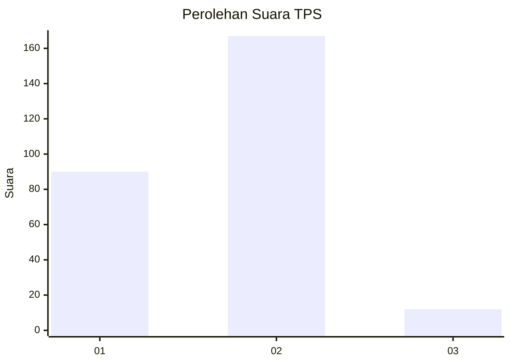
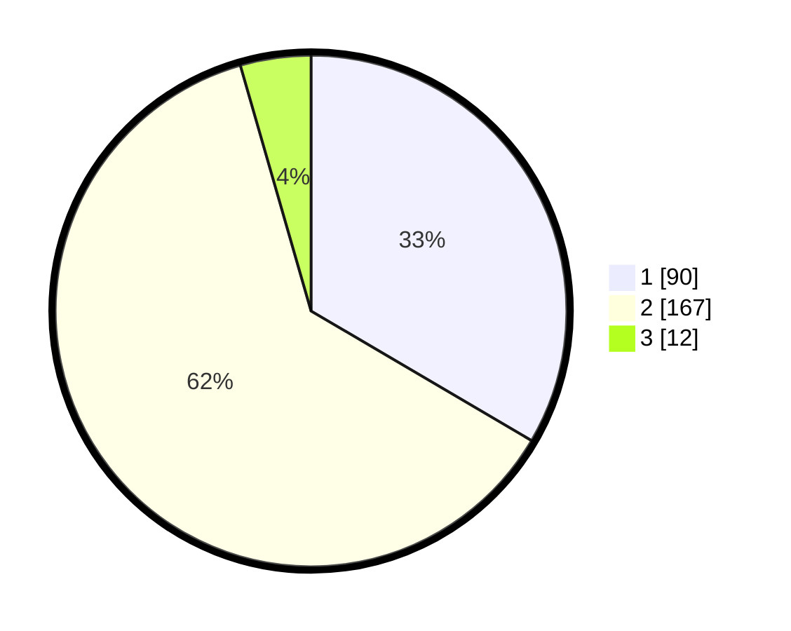

# Hasil

## Grafik

## Tabel

| No. | Nama Paslon    | Suara | Suara (raw) | Persentase |
|:--- |:-------------- | -----:| -----------:| ----------:|
| 1   | ANIES MUHAIMIN | 90    | [90][p-1]   | 33,46      |
| 2   | PRABOWO GIBRAN | 167   | [167][p-2]  | 62,08      |
| 3   | GANJAR MAHFUD  | 12    | [12][p-3]   | 4,46       |

[p-1]: https://github.com/gigit-pemilu/pemilu-2024/blob/main/pilpres/hitung-suara/sub/32-jawa-barat/sub/16-bekasi/sub/18-setu/sub/2001-cijengkol/sub/007-tps/sub/paslon-1.txt
[p-2]: https://github.com/gigit-pemilu/pemilu-2024/blob/main/pilpres/hitung-suara/sub/32-jawa-barat/sub/16-bekasi/sub/18-setu/sub/2001-cijengkol/sub/007-tps/sub/paslon-2.txt
[p-3]: https://github.com/gigit-pemilu/pemilu-2024/blob/main/pilpres/hitung-suara/sub/32-jawa-barat/sub/16-bekasi/sub/18-setu/sub/2001-cijengkol/sub/007-tps/sub/paslon-3.txt

## Foto C Plano

https://sirekap-obj-formc.kpu.go.id/6e18/pemilu/ppwp/32/16/18/20/01/3216182001007-20240214-214608--0bce3ef4-a937-479c-b784-003af67e86d3.jpg

https://sirekap-obj-formc.kpu.go.id/6e18/pemilu/ppwp/32/16/18/20/01/3216182001007-20240214-214749--d41e8435-65bd-4476-8a80-88f6aeea478e.jpg

https://sirekap-obj-formc.kpu.go.id/6e18/pemilu/ppwp/32/16/18/20/01/3216182001007-20240214-214338--7c12c6ee-db8c-4fc6-aa07-c70c5d4ece90.jpg

## Metadata

| Key        | Value               |
| ---------- | ------------------- |
| Time Stamp | 2024-02-24 22:31:28 |

