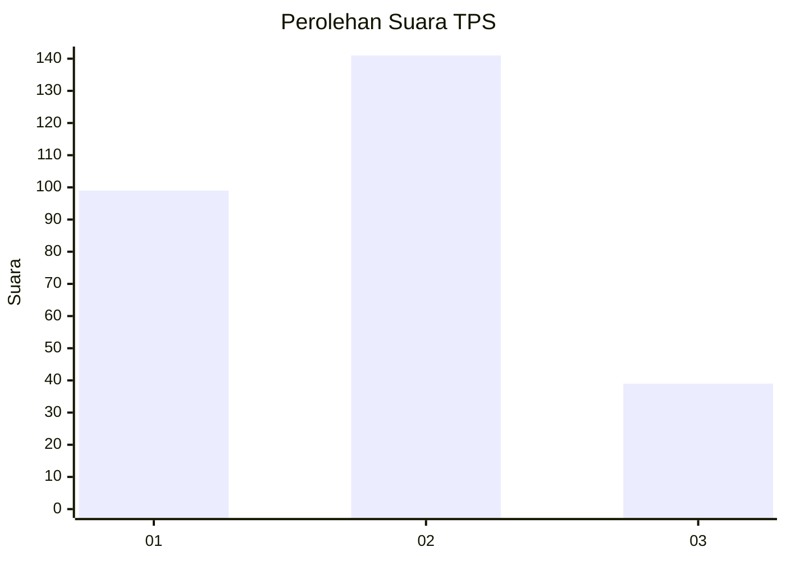
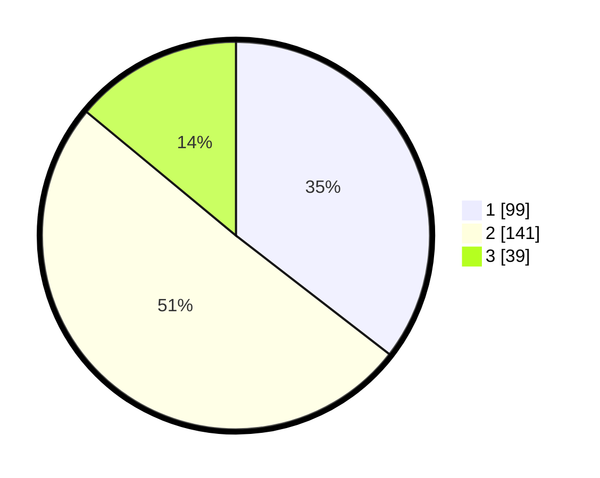

# Hasil

## Grafik

## Tabel

| No. | Nama Paslon    | Suara | Suara (raw) | Persentase |
|:--- |:-------------- | -----:| -----------:| ----------:|
| 1   | ANIES MUHAIMIN | 99    | [99][p-1]   | 35,48      |
| 2   | PRABOWO GIBRAN | 141   | [141][p-2]  | 50,54      |
| 3   | GANJAR MAHFUD  | 39    | [39][p-3]   | 13,98      |

[p-1]: https://github.com/gigit-pemilu/pemilu-2024-32-jawa-barat/blob/main/pilpres/hitung-suara/sub/32-jawa-barat/sub/16-bekasi/sub/18-setu/sub/2003-burangkeng/sub/073-tps/sub/paslon-1.txt
[p-2]: https://github.com/gigit-pemilu/pemilu-2024-32-jawa-barat/blob/main/pilpres/hitung-suara/sub/32-jawa-barat/sub/16-bekasi/sub/18-setu/sub/2003-burangkeng/sub/073-tps/sub/paslon-2.txt
[p-3]: https://github.com/gigit-pemilu/pemilu-2024-32-jawa-barat/blob/main/pilpres/hitung-suara/sub/32-jawa-barat/sub/16-bekasi/sub/18-setu/sub/2003-burangkeng/sub/073-tps/sub/paslon-3.txt

## Foto C Plano

https://sirekap-obj-formc.kpu.go.id/7e59/pemilu/ppwp/32/16/18/20/03/3216182003073-20240214-234543--1b1bcc92-e339-4472-9c34-3bbb8b322de1.jpg

https://sirekap-obj-formc.kpu.go.id/7e59/pemilu/ppwp/32/16/18/20/03/3216182003073-20240214-202453--19640666-1bb2-4b02-935f-a8d79d340cf2.jpg

https://sirekap-obj-formc.kpu.go.id/7e59/pemilu/ppwp/32/16/18/20/03/3216182003073-20240214-202539--afe34792-6b0b-4e2f-a1c4-ec01e455f409.jpg

## Metadata

| Key        | Value               |
| ---------- | ------------------- |
| Time Stamp | 2024-02-24 22:31:28 |

