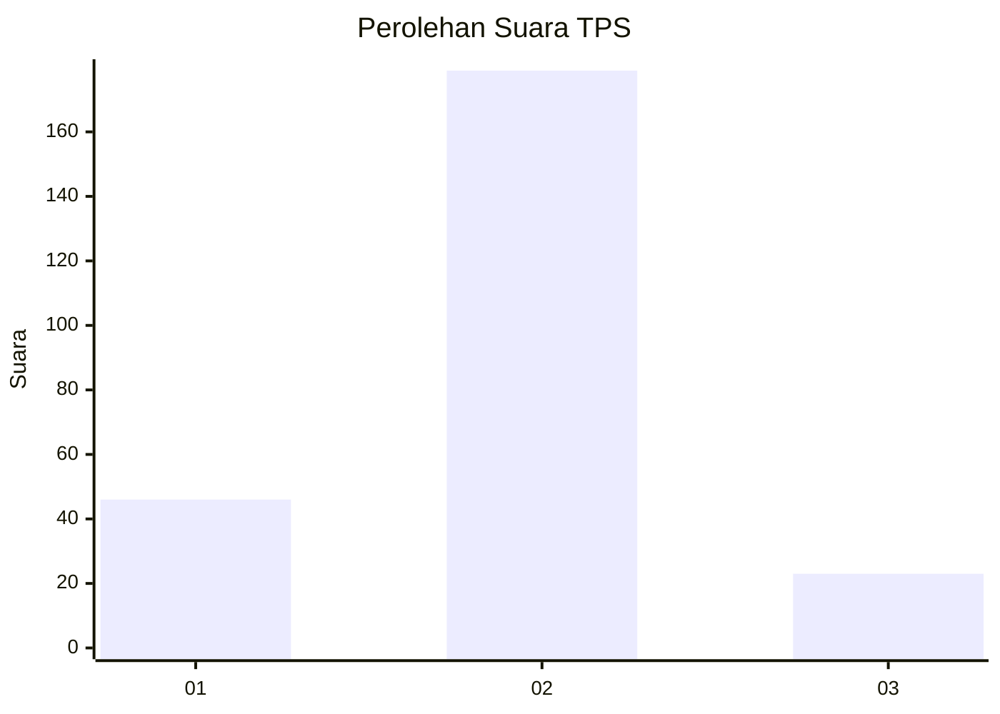
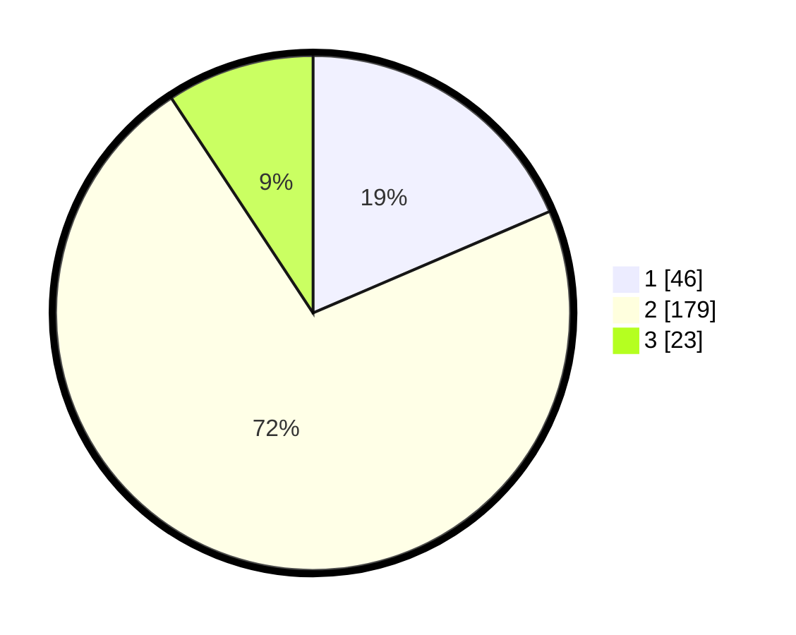

# Hasil

## Grafik

## Tabel

| No. | Nama Paslon    | Suara | Suara (raw) | Persentase |
|:--- |:-------------- | -----:| -----------:| ----------:|
| 1   | ANIES MUHAIMIN | 46    | [46][p-1]   | 18,55      |
| 2   | PRABOWO GIBRAN | 179   | [179][p-2]  | 72,18      |
| 3   | GANJAR MAHFUD  | 23    | [23][p-3]   | 9,27       |

[p-1]: https://github.com/gigit-pemilu/pemilu-2024/blob/main/pilpres/hitung-suara/sub/32-jawa-barat/sub/16-bekasi/sub/18-setu/sub/2009-ragemanunggal/sub/001-tps/sub/paslon-1.txt
[p-2]: https://github.com/gigit-pemilu/pemilu-2024/blob/main/pilpres/hitung-suara/sub/32-jawa-barat/sub/16-bekasi/sub/18-setu/sub/2009-ragemanunggal/sub/001-tps/sub/paslon-2.txt
[p-3]: https://github.com/gigit-pemilu/pemilu-2024/blob/main/pilpres/hitung-suara/sub/32-jawa-barat/sub/16-bekasi/sub/18-setu/sub/2009-ragemanunggal/sub/001-tps/sub/paslon-3.txt

## Foto C Plano

https://sirekap-obj-formc.kpu.go.id/2b60/pemilu/ppwp/32/16/18/20/09/3216182009001-20240214-223101--e2b79cc4-32eb-4fc3-830d-7d7bf22f4b38.jpg

https://sirekap-obj-formc.kpu.go.id/2b60/pemilu/ppwp/32/16/18/20/09/3216182009001-20240214-223240--1046fad3-f565-42bf-972c-0fe79c9d7f3a.jpg

https://sirekap-obj-formc.kpu.go.id/2b60/pemilu/ppwp/32/16/18/20/09/3216182009001-20240214-223557--32f2dc17-ca16-4f00-a97f-2fecd6d76bef.jpg

## Metadata

| Key        | Value               |
| ---------- | ------------------- |
| Time Stamp | 2024-02-24 22:31:28 |

