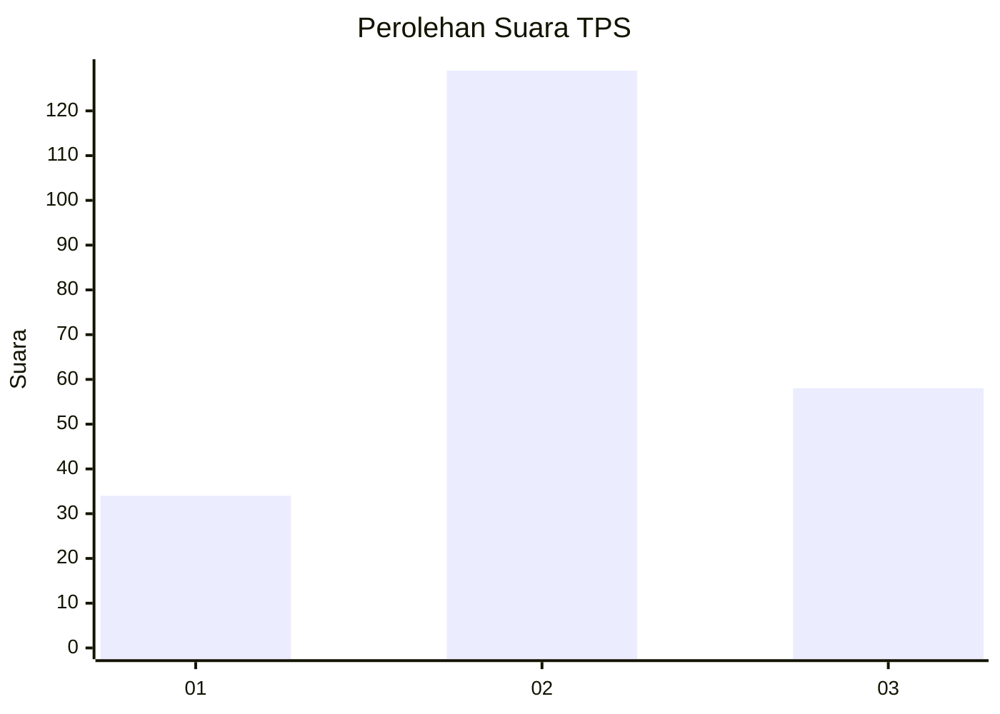
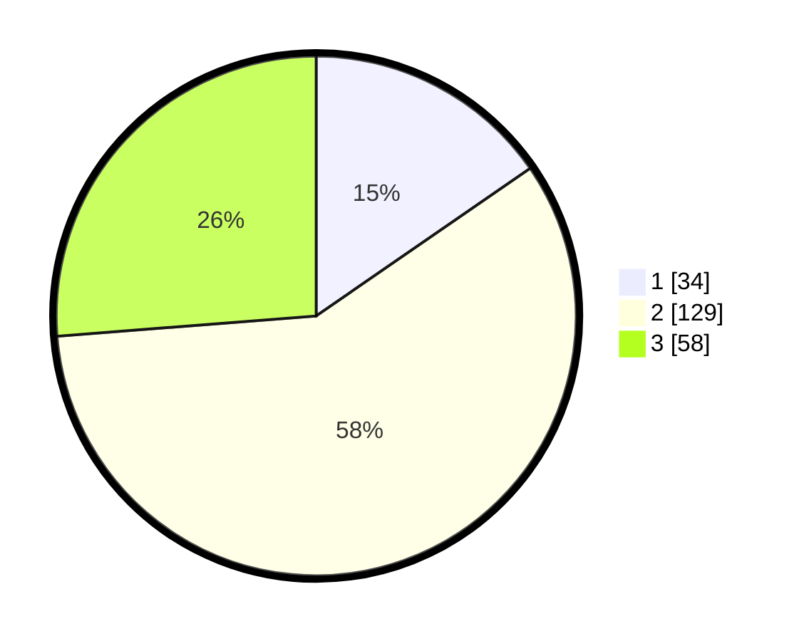

# Hasil

## Grafik

## Tabel

| No. | Nama Paslon    | Suara | Suara (raw) | Persentase |
|:--- |:-------------- | -----:| -----------:| ----------:|
| 1   | ANIES MUHAIMIN | 34    | [34][p-1]   | 15,38      |
| 2   | PRABOWO GIBRAN | 129   | [129][p-2]  | 58,37      |
| 3   | GANJAR MAHFUD  | 58    | [58][p-3]   | 26,24      |

[p-1]: https://github.com/gigit-pemilu/pemilu-2024-32-jawa-barat/blob/main/pilpres/hitung-suara/sub/32-jawa-barat/sub/16-bekasi/sub/19-cikarang-selatan/sub/2001-cibatu/sub/009-tps/sub/paslon-1.txt
[p-2]: https://github.com/gigit-pemilu/pemilu-2024-32-jawa-barat/blob/main/pilpres/hitung-suara/sub/32-jawa-barat/sub/16-bekasi/sub/19-cikarang-selatan/sub/2001-cibatu/sub/009-tps/sub/paslon-2.txt
[p-3]: https://github.com/gigit-pemilu/pemilu-2024-32-jawa-barat/blob/main/pilpres/hitung-suara/sub/32-jawa-barat/sub/16-bekasi/sub/19-cikarang-selatan/sub/2001-cibatu/sub/009-tps/sub/paslon-3.txt

## Foto C Plano

https://sirekap-obj-formc.kpu.go.id/654f/pemilu/ppwp/32/16/19/20/01/3216192001009-20240214-224905--3b1fbdc3-48f9-4956-b0fe-0fe8a29b3375.jpg

https://sirekap-obj-formc.kpu.go.id/654f/pemilu/ppwp/32/16/19/20/01/3216192001009-20240214-193803--55339563-1981-44a3-865f-5fb63907b041.jpg

https://sirekap-obj-formc.kpu.go.id/654f/pemilu/ppwp/32/16/19/20/01/3216192001009-20240214-212258--04fd4b94-9873-4b69-93b9-9dc5609dcd85.jpg

## Metadata

| Key        | Value               |
| ---------- | ------------------- |
| Time Stamp | 2024-02-15 04:00:24 |

