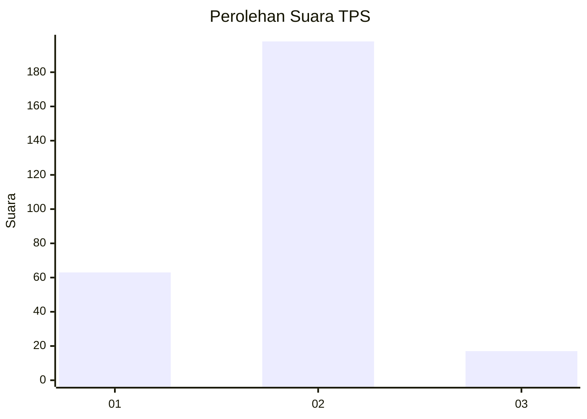

# Hasil

## Grafik

## Tabel

| No. | Nama Paslon    | Suara | Suara (raw) | Persentase |
|:--- |:-------------- | -----:| -----------:| ----------:|
| 1   | ANIES MUHAIMIN | 63    | [63][p-1]   | 22,66      |
| 2   | PRABOWO GIBRAN | 198   | [198][p-2]  | 71,22      |
| 3   | GANJAR MAHFUD  | 17    | [17][p-3]   | 6,12       |

[p-1]: https://github.com/gigit-pemilu/pemilu-2024-32-jawa-barat/blob/main/pilpres/hitung-suara/sub/32-jawa-barat/sub/16-bekasi/sub/19-cikarang-selatan/sub/2004-sukadami/sub/002-tps/sub/paslon-1.txt
[p-2]: https://github.com/gigit-pemilu/pemilu-2024-32-jawa-barat/blob/main/pilpres/hitung-suara/sub/32-jawa-barat/sub/16-bekasi/sub/19-cikarang-selatan/sub/2004-sukadami/sub/002-tps/sub/paslon-2.txt
[p-3]: https://github.com/gigit-pemilu/pemilu-2024-32-jawa-barat/blob/main/pilpres/hitung-suara/sub/32-jawa-barat/sub/16-bekasi/sub/19-cikarang-selatan/sub/2004-sukadami/sub/002-tps/sub/paslon-3.txt

## Foto C Plano

https://sirekap-obj-formc.kpu.go.id/2e87/pemilu/ppwp/32/16/19/20/04/3216192004002-20240215-032301--bedc5d16-644f-4008-a45b-5511c9304058.jpg

https://sirekap-obj-formc.kpu.go.id/2e87/pemilu/ppwp/32/16/19/20/04/3216192004002-20240215-032308--2d6e17f9-ce1a-4f05-9d43-a70cd14834d1.jpg

https://sirekap-obj-formc.kpu.go.id/2e87/pemilu/ppwp/32/16/19/20/04/3216192004002-20240215-032312--d4f7cef8-fcdf-4fce-9491-1c02fb8fa769.jpg

## Metadata

| Key        | Value               |
| ---------- | ------------------- |
| Time Stamp | 2024-02-25 10:00:00 |

