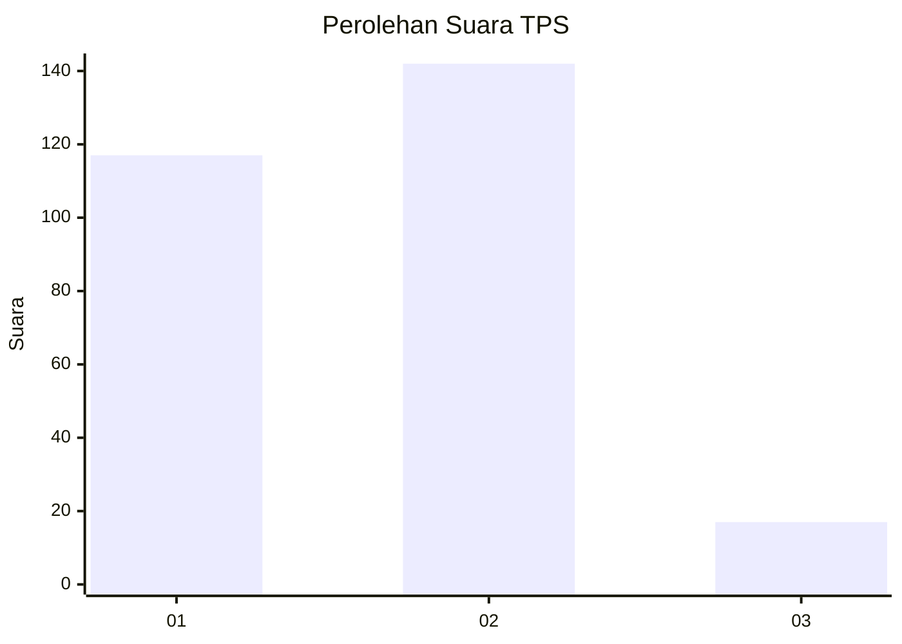

# Hasil

## Grafik

## Tabel

| No. | Nama Paslon    | Suara | Suara (raw) | Persentase |
|:--- |:-------------- | -----:| -----------:| ----------:|
| 1   | ANIES MUHAIMIN | 117   | [117][p-1]  | 42,39      |
| 2   | PRABOWO GIBRAN | 142   | [142][p-2]  | 51,45      |
| 3   | GANJAR MAHFUD  | 17    | [17][p-3]   | 6,16       |

[p-1]: https://github.com/gigit-pemilu/pemilu-2024-32-jawa-barat/blob/main/pilpres/hitung-suara/sub/32-jawa-barat/sub/16-bekasi/sub/19-cikarang-selatan/sub/2004-sukadami/sub/052-tps/sub/paslon-1.txt
[p-2]: https://github.com/gigit-pemilu/pemilu-2024-32-jawa-barat/blob/main/pilpres/hitung-suara/sub/32-jawa-barat/sub/16-bekasi/sub/19-cikarang-selatan/sub/2004-sukadami/sub/052-tps/sub/paslon-2.txt
[p-3]: https://github.com/gigit-pemilu/pemilu-2024-32-jawa-barat/blob/main/pilpres/hitung-suara/sub/32-jawa-barat/sub/16-bekasi/sub/19-cikarang-selatan/sub/2004-sukadami/sub/052-tps/sub/paslon-3.txt

## Foto C Plano

https://sirekap-obj-formc.kpu.go.id/c6c1/pemilu/ppwp/32/16/19/20/04/3216192004052-20240215-010238--f092ad77-f4c7-4094-9aba-c00bf61b1308.jpg

https://sirekap-obj-formc.kpu.go.id/c6c1/pemilu/ppwp/32/16/19/20/04/3216192004052-20240214-200757--49b2c5f8-2a41-4983-a677-c0fdd8c3534e.jpg

https://sirekap-obj-formc.kpu.go.id/c6c1/pemilu/ppwp/32/16/19/20/04/3216192004052-20240214-201028--f1815e8a-9e09-4a7a-b113-e1d67fc5c93f.jpg

## Metadata

| Key        | Value               |
| ---------- | ------------------- |
| Time Stamp | 2024-02-15 03:06:03 |

