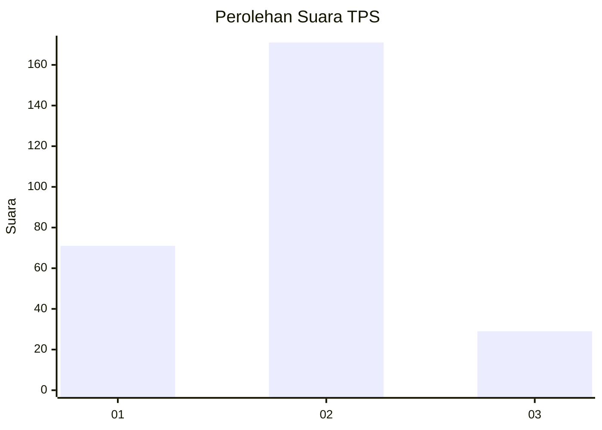
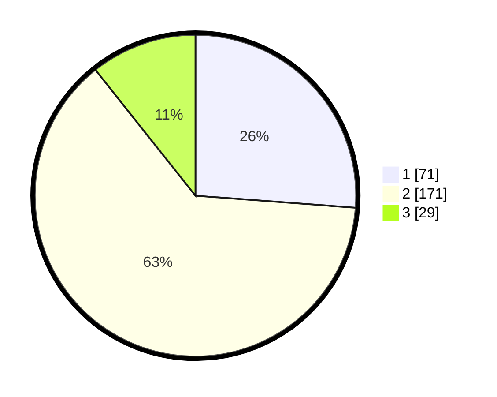

# Hasil

## Grafik

## Tabel

| No. | Nama Paslon    | Suara | Suara (raw) | Persentase |
|:--- |:-------------- | -----:| -----------:| ----------:|
| 1   | ANIES MUHAIMIN | 71    | [71][p-1]   | 26,20      |
| 2   | PRABOWO GIBRAN | 171   | [171][p-2]  | 63,10      |
| 3   | GANJAR MAHFUD  | 29    | [29][p-3]   | 10,70      |

[p-1]: https://github.com/gigit-pemilu/pemilu-2024/blob/main/pilpres/hitung-suara/sub/32-jawa-barat/sub/16-bekasi/sub/19-cikarang-selatan/sub/2004-sukadami/sub/055-tps/sub/paslon-1.txt
[p-2]: https://github.com/gigit-pemilu/pemilu-2024/blob/main/pilpres/hitung-suara/sub/32-jawa-barat/sub/16-bekasi/sub/19-cikarang-selatan/sub/2004-sukadami/sub/055-tps/sub/paslon-2.txt
[p-3]: https://github.com/gigit-pemilu/pemilu-2024/blob/main/pilpres/hitung-suara/sub/32-jawa-barat/sub/16-bekasi/sub/19-cikarang-selatan/sub/2004-sukadami/sub/055-tps/sub/paslon-3.txt

## Foto C Plano

https://sirekap-obj-formc.kpu.go.id/622b/pemilu/ppwp/32/16/19/20/04/3216192004055-20240215-012637--61115e52-dc07-4f00-b300-e16c1611ecb5.jpg

https://sirekap-obj-formc.kpu.go.id/622b/pemilu/ppwp/32/16/19/20/04/3216192004055-20240215-012550--75b50c97-e8a8-4f05-b399-183efc6f5b2a.jpg

https://sirekap-obj-formc.kpu.go.id/622b/pemilu/ppwp/32/16/19/20/04/3216192004055-20240215-012831--3c570587-dd5f-4b47-9cad-8d57cf083adc.jpg

## Metadata

| Key        | Value               |
| ---------- | ------------------- |
| Time Stamp | 2024-02-24 22:31:28 |

