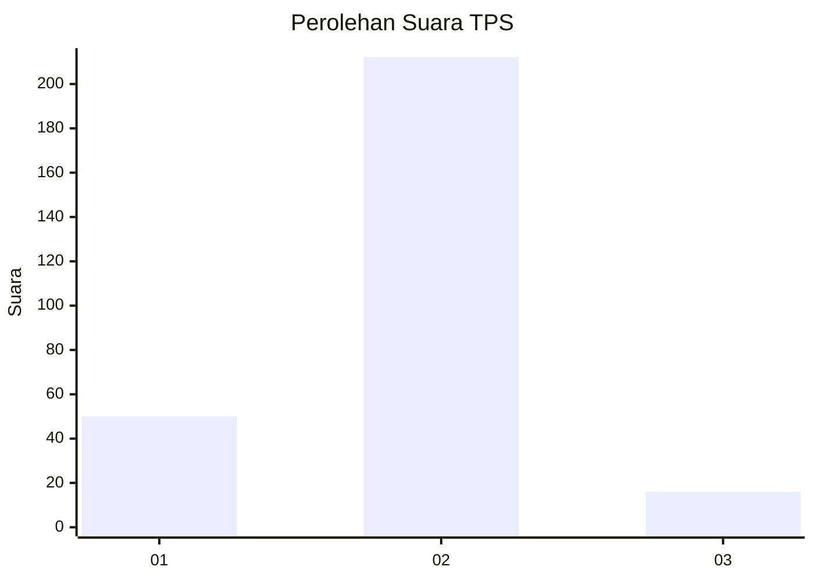
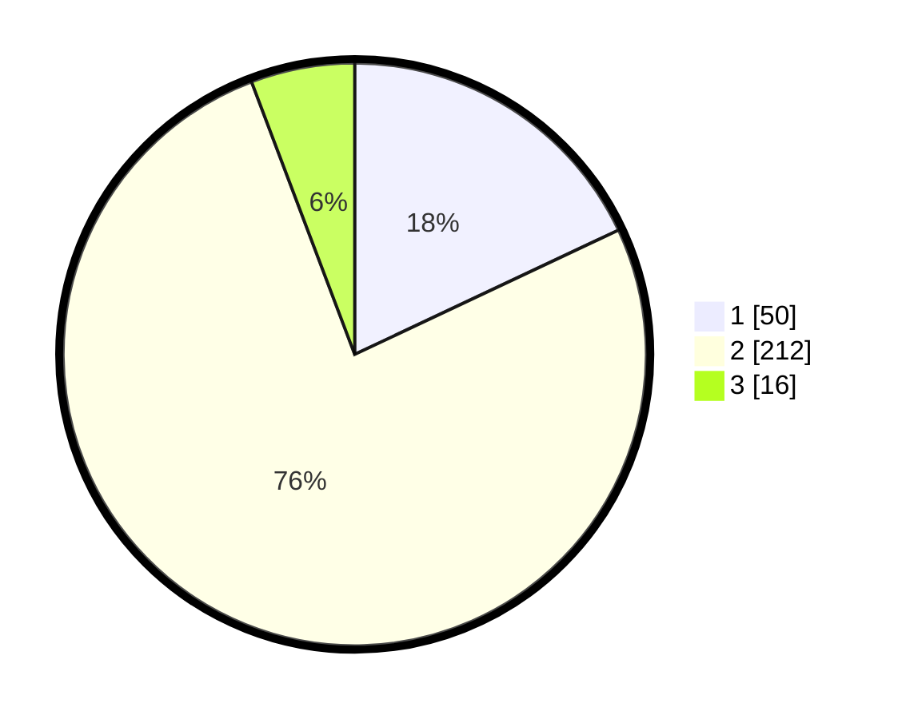

# Hasil

## Grafik

## Tabel

| No. | Nama Paslon    | Suara | Suara (raw) | Persentase |
|:--- |:-------------- | -----:| -----------:| ----------:|
| 1   | ANIES MUHAIMIN | 50    | [50][p-1]   | 17,99      |
| 2   | PRABOWO GIBRAN | 212   | [212][p-2]  | 76,26      |
| 3   | GANJAR MAHFUD  | 16    | [16][p-3]   | 5,76       |

[p-1]: https://github.com/gigit-pemilu/pemilu-2024/blob/main/pilpres/hitung-suara/sub/32-jawa-barat/sub/16-bekasi/sub/19-cikarang-selatan/sub/2004-sukadami/sub/072-tps/sub/paslon-1.txt
[p-2]: https://github.com/gigit-pemilu/pemilu-2024/blob/main/pilpres/hitung-suara/sub/32-jawa-barat/sub/16-bekasi/sub/19-cikarang-selatan/sub/2004-sukadami/sub/072-tps/sub/paslon-2.txt
[p-3]: https://github.com/gigit-pemilu/pemilu-2024/blob/main/pilpres/hitung-suara/sub/32-jawa-barat/sub/16-bekasi/sub/19-cikarang-selatan/sub/2004-sukadami/sub/072-tps/sub/paslon-3.txt

## Foto C Plano

https://sirekap-obj-formc.kpu.go.id/c65a/pemilu/ppwp/32/16/19/20/04/3216192004072-20240215-005925--b41fd064-0817-44c9-a4dd-7b9812376560.jpg

https://sirekap-obj-formc.kpu.go.id/c65a/pemilu/ppwp/32/16/19/20/04/3216192004072-20240215-010012--02351b61-0f01-433b-8171-40f405c64b56.jpg

https://sirekap-obj-formc.kpu.go.id/c65a/pemilu/ppwp/32/16/19/20/04/3216192004072-20240215-010041--3f72bdc6-7dda-4087-bc00-94ea92423698.jpg

## Metadata

| Key        | Value               |
| ---------- | ------------------- |
| Time Stamp | 2024-02-25 11:00:00 |

