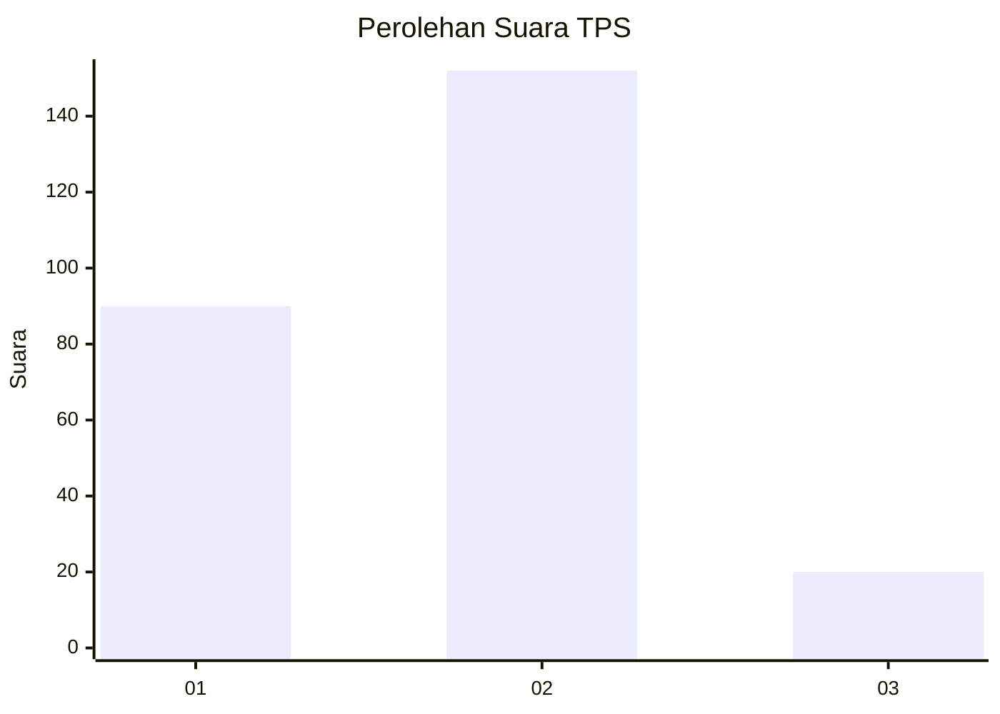
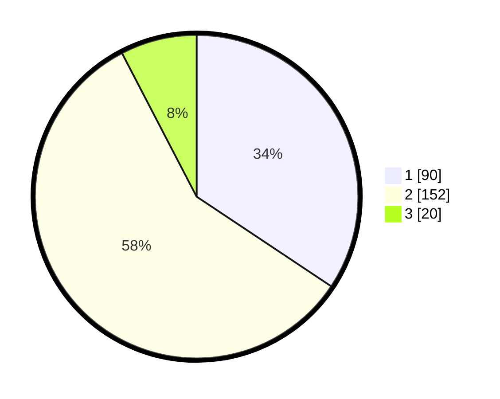

# Hasil

## Grafik

## Tabel

| No. | Nama Paslon    | Suara | Suara (raw) | Persentase |
|:--- |:-------------- | -----:| -----------:| ----------:|
| 1   | ANIES MUHAIMIN | 90    | [90][p-1]   | 34,35      |
| 2   | PRABOWO GIBRAN | 152   | [152][p-2]  | 58,02      |
| 3   | GANJAR MAHFUD  | 20    | [20][p-3]   | 7,63       |

[p-1]: https://github.com/gigit-pemilu/pemilu-2024/blob/main/pilpres/hitung-suara/sub/32-jawa-barat/sub/16-bekasi/sub/19-cikarang-selatan/sub/2006-serang/sub/020-tps/sub/paslon-1.txt
[p-2]: https://github.com/gigit-pemilu/pemilu-2024/blob/main/pilpres/hitung-suara/sub/32-jawa-barat/sub/16-bekasi/sub/19-cikarang-selatan/sub/2006-serang/sub/020-tps/sub/paslon-2.txt
[p-3]: https://github.com/gigit-pemilu/pemilu-2024/blob/main/pilpres/hitung-suara/sub/32-jawa-barat/sub/16-bekasi/sub/19-cikarang-selatan/sub/2006-serang/sub/020-tps/sub/paslon-3.txt

## Foto C Plano

https://sirekap-obj-formc.kpu.go.id/9ece/pemilu/ppwp/32/16/19/20/06/3216192006020-20240215-014517--0aa15fe0-35b0-46ca-ba78-774ea6ac47b6.jpg

https://sirekap-obj-formc.kpu.go.id/9ece/pemilu/ppwp/32/16/19/20/06/3216192006020-20240215-014900--60cdce17-3118-49a3-9d58-ada12249c8e8.jpg

https://sirekap-obj-formc.kpu.go.id/9ece/pemilu/ppwp/32/16/19/20/06/3216192006020-20240215-014932--c2034eca-2683-4777-9d88-1c2dcf72704c.jpg

## Metadata

| Key        | Value               |
| ---------- | ------------------- |
| Time Stamp | 2024-02-24 22:31:28 |

