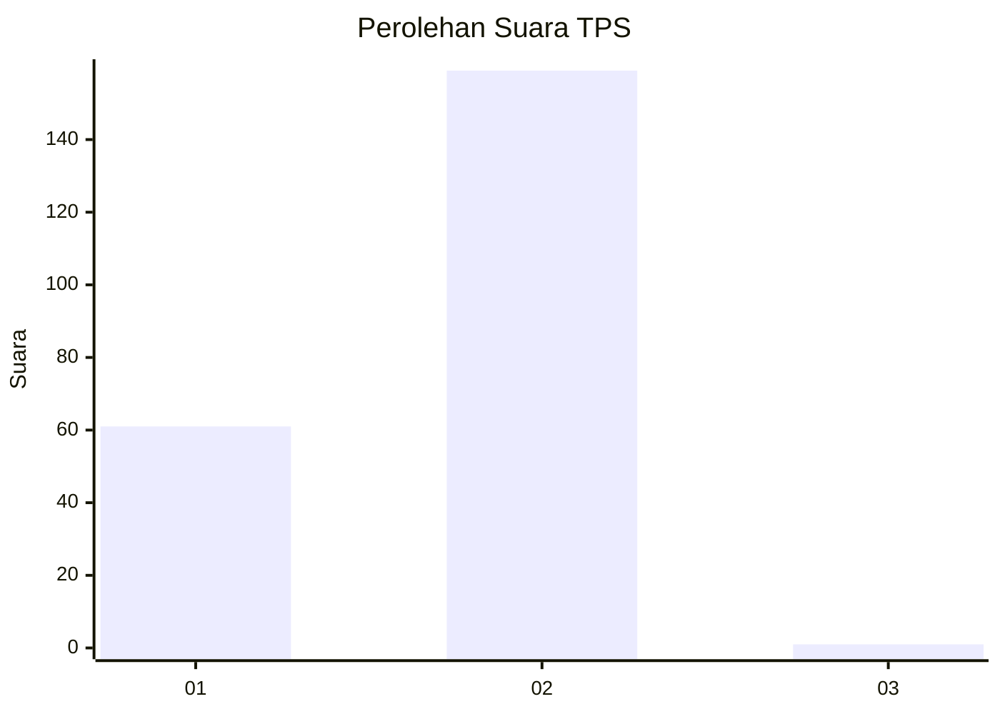
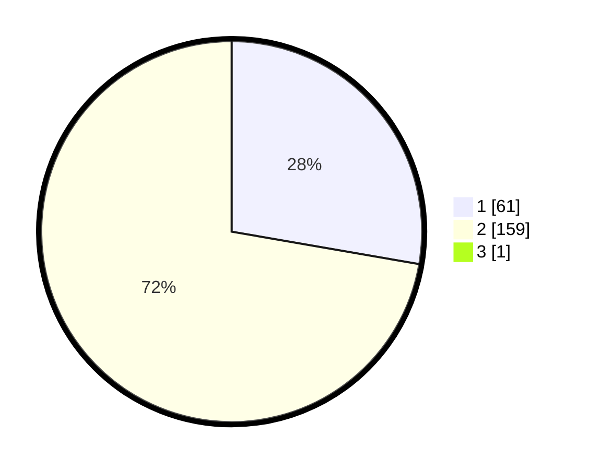

# Hasil

## Grafik

## Tabel

| No. | Nama Paslon    | Suara | Suara (raw) | Persentase |
|:--- |:-------------- | -----:| -----------:| ----------:|
| 1   | ANIES MUHAIMIN | 61    | [61][p-1]   | 27,60      |
| 2   | PRABOWO GIBRAN | 159   | [159][p-2]  | 71,95      |
| 3   | GANJAR MAHFUD  | 1     | [1][p-3]    | 0,45       |

[p-1]: https://github.com/gigit-pemilu/pemilu-2024/blob/main/pilpres/hitung-suara/sub/32-jawa-barat/sub/16-bekasi/sub/20-cikarang-pusat/sub/2001-cicau/sub/002-tps/sub/paslon-1.txt
[p-2]: https://github.com/gigit-pemilu/pemilu-2024/blob/main/pilpres/hitung-suara/sub/32-jawa-barat/sub/16-bekasi/sub/20-cikarang-pusat/sub/2001-cicau/sub/002-tps/sub/paslon-2.txt
[p-3]: https://github.com/gigit-pemilu/pemilu-2024/blob/main/pilpres/hitung-suara/sub/32-jawa-barat/sub/16-bekasi/sub/20-cikarang-pusat/sub/2001-cicau/sub/002-tps/sub/paslon-3.txt

## Foto C Plano

https://sirekap-obj-formc.kpu.go.id/2f31/pemilu/ppwp/32/16/20/20/01/3216202001002-20240214-222744--335a720a-41a1-45fc-b14f-05be8c8ea8a0.jpg

https://sirekap-obj-formc.kpu.go.id/2f31/pemilu/ppwp/32/16/20/20/01/3216202001002-20240214-222951--54542953-ed06-45a3-895c-fb6926d05502.jpg

https://sirekap-obj-formc.kpu.go.id/2f31/pemilu/ppwp/32/16/20/20/01/3216202001002-20240214-223236--0cad4694-ca44-4941-9dc7-78489e09f027.jpg

## Metadata

| Key        | Value               |
| ---------- | ------------------- |
| Time Stamp | 2024-02-24 22:31:28 |

