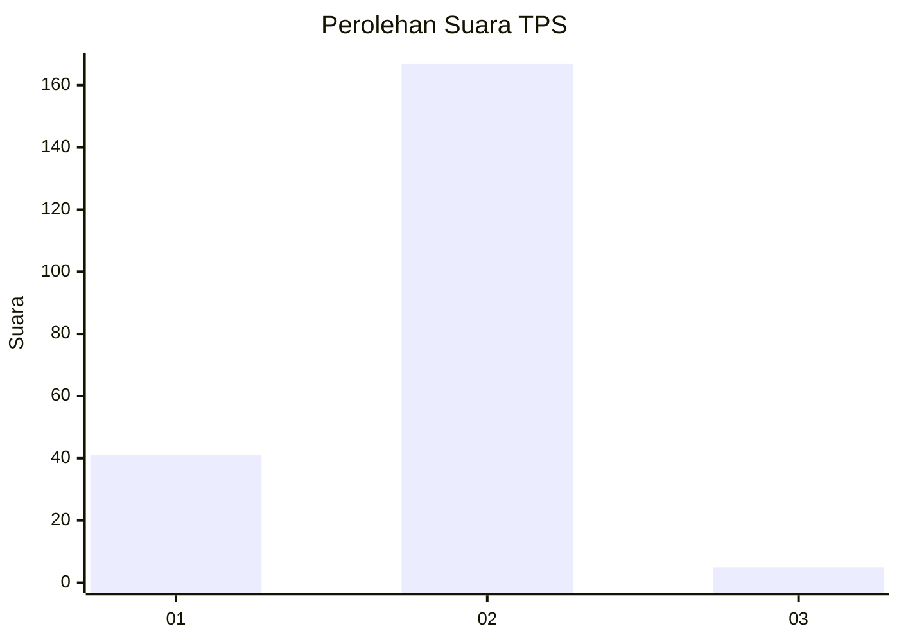
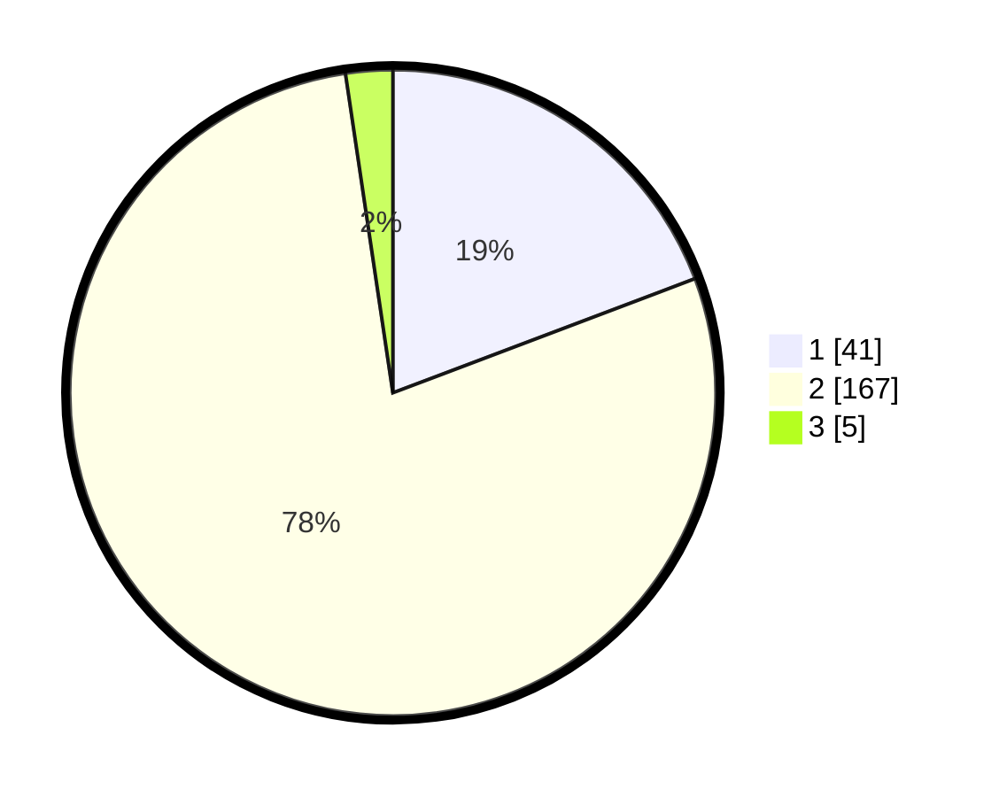

# Hasil

## Grafik

## Tabel

| No. | Nama Paslon    | Suara | Suara (raw) | Persentase |
|:--- |:-------------- | -----:| -----------:| ----------:|
| 1   | ANIES MUHAIMIN | 41    | [41][p-1]   | 19,25      |
| 2   | PRABOWO GIBRAN | 167   | [167][p-2]  | 78,40      |
| 3   | GANJAR MAHFUD  | 5     | [5][p-3]    | 2,35       |

[p-1]: https://github.com/gigit-pemilu/pemilu-2024-32-jawa-barat/blob/main/pilpres/hitung-suara/sub/32-jawa-barat/sub/16-bekasi/sub/20-cikarang-pusat/sub/2001-cicau/sub/003-tps/sub/paslon-1.txt
[p-2]: https://github.com/gigit-pemilu/pemilu-2024-32-jawa-barat/blob/main/pilpres/hitung-suara/sub/32-jawa-barat/sub/16-bekasi/sub/20-cikarang-pusat/sub/2001-cicau/sub/003-tps/sub/paslon-2.txt
[p-3]: https://github.com/gigit-pemilu/pemilu-2024-32-jawa-barat/blob/main/pilpres/hitung-suara/sub/32-jawa-barat/sub/16-bekasi/sub/20-cikarang-pusat/sub/2001-cicau/sub/003-tps/sub/paslon-3.txt

## Foto C Plano

https://sirekap-obj-formc.kpu.go.id/9773/pemilu/ppwp/32/16/20/20/01/3216202001003-20240214-221521--e55ee9e0-6698-45e6-b14e-b9f3745e0fb7.jpg

https://sirekap-obj-formc.kpu.go.id/9773/pemilu/ppwp/32/16/20/20/01/3216202001003-20240214-221747--9891bdca-41d5-4a6c-80ea-7179b8b9cdf7.jpg

https://sirekap-obj-formc.kpu.go.id/9773/pemilu/ppwp/32/16/20/20/01/3216202001003-20240214-221858--d4fc0256-f777-4b86-8e3c-dea818550dee.jpg

## Metadata

| Key        | Value               |
| ---------- | ------------------- |
| Time Stamp | 2024-02-25 11:00:00 |

