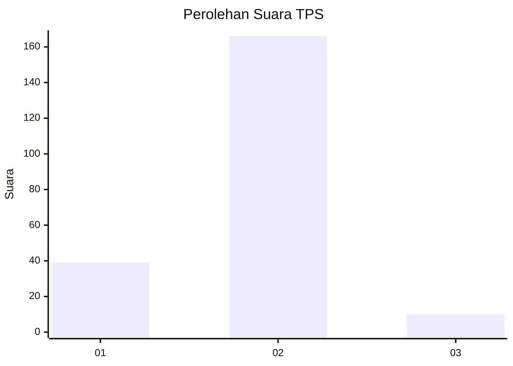
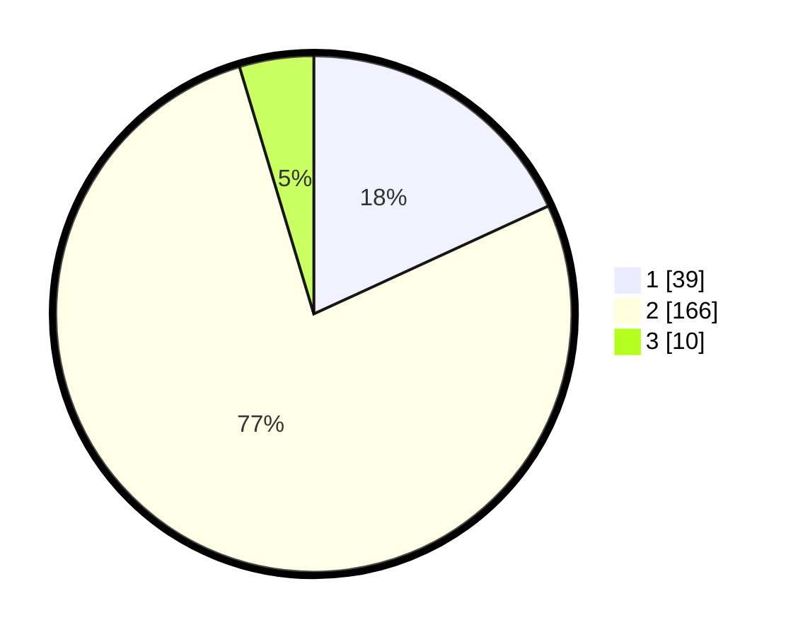

# Hasil

## Grafik

## Tabel

| No. | Nama Paslon    | Suara | Suara (raw) | Persentase |
|:--- |:-------------- | -----:| -----------:| ----------:|
| 1   | ANIES MUHAIMIN | 39    | [39][p-1]   | 18,14      |
| 2   | PRABOWO GIBRAN | 166   | [166][p-2]  | 77,21      |
| 3   | GANJAR MAHFUD  | 10    | [10][p-3]   | 4,65       |

[p-1]: https://github.com/gigit-pemilu/pemilu-2024-32-jawa-barat/blob/main/pilpres/hitung-suara/sub/32-jawa-barat/sub/16-bekasi/sub/20-cikarang-pusat/sub/2001-cicau/sub/004-tps/sub/paslon-1.txt
[p-2]: https://github.com/gigit-pemilu/pemilu-2024-32-jawa-barat/blob/main/pilpres/hitung-suara/sub/32-jawa-barat/sub/16-bekasi/sub/20-cikarang-pusat/sub/2001-cicau/sub/004-tps/sub/paslon-2.txt
[p-3]: https://github.com/gigit-pemilu/pemilu-2024-32-jawa-barat/blob/main/pilpres/hitung-suara/sub/32-jawa-barat/sub/16-bekasi/sub/20-cikarang-pusat/sub/2001-cicau/sub/004-tps/sub/paslon-3.txt

## Foto C Plano

https://sirekap-obj-formc.kpu.go.id/3e81/pemilu/ppwp/32/16/20/20/01/3216202001004-20240214-155824--b72fb33c-7254-4ddd-a26c-1b63765992ff.jpg

https://sirekap-obj-formc.kpu.go.id/3e81/pemilu/ppwp/32/16/20/20/01/3216202001004-20240214-141050--0297823c-c81c-4304-b390-5316860aa053.jpg

https://sirekap-obj-formc.kpu.go.id/3e81/pemilu/ppwp/32/16/20/20/01/3216202001004-20240214-141041--23a8b6aa-e07e-42cc-95ca-eb14e87340db.jpg

## Metadata

| Key        | Value               |
| ---------- | ------------------- |
| Time Stamp | 2024-02-14 21:46:01 |

