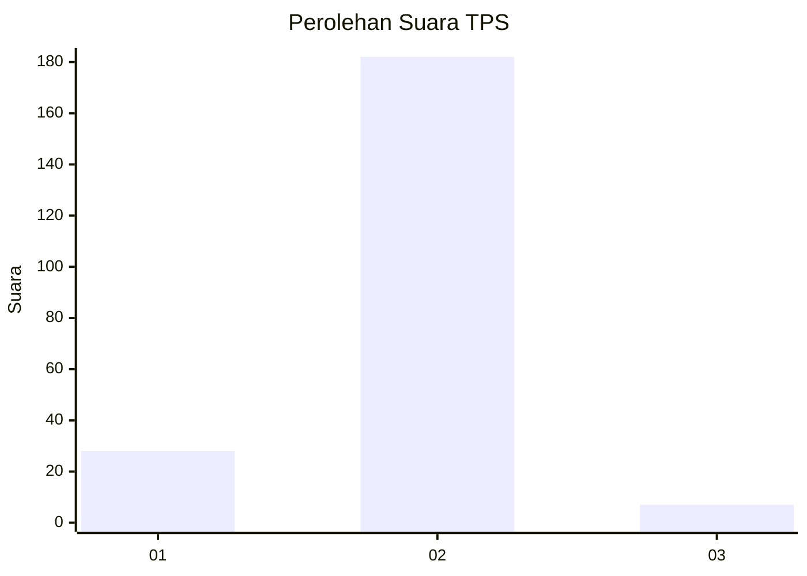
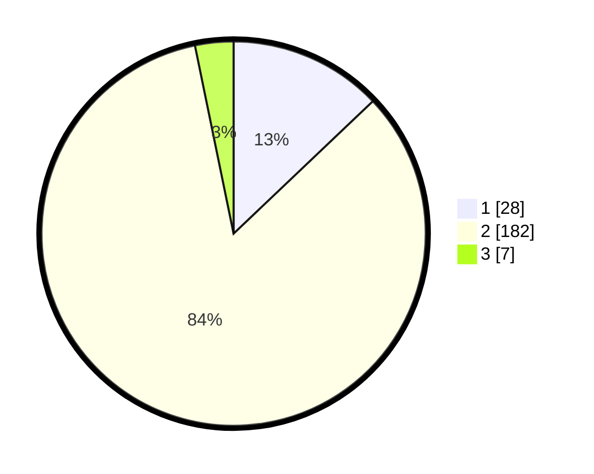

# Hasil

## Grafik

## Tabel

| No. | Nama Paslon    | Suara | Suara (raw) | Persentase |
|:--- |:-------------- | -----:| -----------:| ----------:|
| 1   | ANIES MUHAIMIN | 28    | [28][p-1]   | 12,90      |
| 2   | PRABOWO GIBRAN | 182   | [182][p-2]  | 83,87      |
| 3   | GANJAR MAHFUD  | 7     | [7][p-3]    | 3,23       |

[p-1]: https://github.com/gigit-pemilu/pemilu-2024/blob/main/pilpres/hitung-suara/sub/32-jawa-barat/sub/16-bekasi/sub/20-cikarang-pusat/sub/2001-cicau/sub/006-tps/sub/paslon-1.txt
[p-2]: https://github.com/gigit-pemilu/pemilu-2024/blob/main/pilpres/hitung-suara/sub/32-jawa-barat/sub/16-bekasi/sub/20-cikarang-pusat/sub/2001-cicau/sub/006-tps/sub/paslon-2.txt
[p-3]: https://github.com/gigit-pemilu/pemilu-2024/blob/main/pilpres/hitung-suara/sub/32-jawa-barat/sub/16-bekasi/sub/20-cikarang-pusat/sub/2001-cicau/sub/006-tps/sub/paslon-3.txt

## Foto C Plano

https://sirekap-obj-formc.kpu.go.id/e55a/pemilu/ppwp/32/16/20/20/01/3216202001006-20240214-231602--a771abcd-f05a-4c50-b143-3a68cd2251d6.jpg

https://sirekap-obj-formc.kpu.go.id/e55a/pemilu/ppwp/32/16/20/20/01/3216202001006-20240214-231720--983ad22b-910d-472a-81b2-0836b21b7931.jpg

https://sirekap-obj-formc.kpu.go.id/e55a/pemilu/ppwp/32/16/20/20/01/3216202001006-20240214-222452--5ea1f022-fbb9-4cdc-95ce-31a6d03467cd.jpg

## Metadata

| Key        | Value               |
| ---------- | ------------------- |
| Time Stamp | 2024-02-24 22:31:28 |

