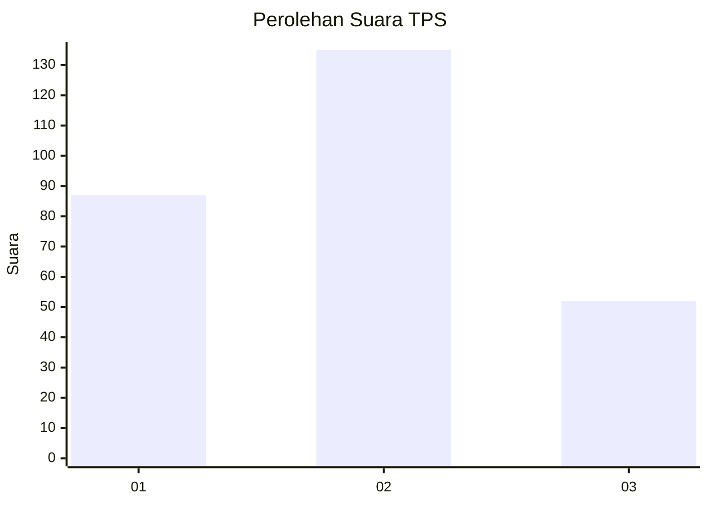
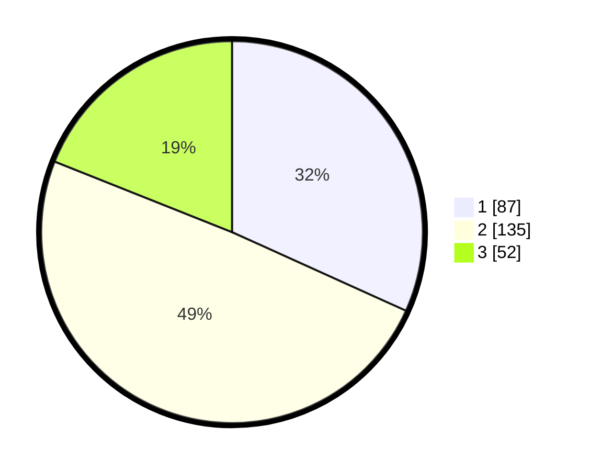

# Hasil

## Grafik

## Tabel

| No. | Nama Paslon    | Suara | Suara (raw) | Persentase |
|:--- |:-------------- | -----:| -----------:| ----------:|
| 1   | ANIES MUHAIMIN | 87    | [87][p-1]   | 31,75      |
| 2   | PRABOWO GIBRAN | 135   | [135][p-2]  | 49,27      |
| 3   | GANJAR MAHFUD  | 52    | [52][p-3]   | 18,98      |

[p-1]: https://github.com/gigit-pemilu/pemilu-2024-32-jawa-barat/blob/main/pilpres/hitung-suara/sub/32-jawa-barat/sub/16-bekasi/sub/20-cikarang-pusat/sub/2004-hegarmukti/sub/030-tps/sub/paslon-1.txt
[p-2]: https://github.com/gigit-pemilu/pemilu-2024-32-jawa-barat/blob/main/pilpres/hitung-suara/sub/32-jawa-barat/sub/16-bekasi/sub/20-cikarang-pusat/sub/2004-hegarmukti/sub/030-tps/sub/paslon-2.txt
[p-3]: https://github.com/gigit-pemilu/pemilu-2024-32-jawa-barat/blob/main/pilpres/hitung-suara/sub/32-jawa-barat/sub/16-bekasi/sub/20-cikarang-pusat/sub/2004-hegarmukti/sub/030-tps/sub/paslon-3.txt

## Foto C Plano

https://sirekap-obj-formc.kpu.go.id/8490/pemilu/ppwp/32/16/20/20/04/3216202004030-20240216-224559--2ad8d8f6-6d34-455e-b8b9-62d02a9a947a.jpg

https://sirekap-obj-formc.kpu.go.id/8490/pemilu/ppwp/32/16/20/20/04/3216202004030-20240214-232004--8a203c13-ba0a-49ca-99a7-39e224bbc3a1.jpg

https://sirekap-obj-formc.kpu.go.id/8490/pemilu/ppwp/32/16/20/20/04/3216202004030-20240216-224412--6b50e4d5-8e4d-475d-8285-6705384d0016.jpg

## Metadata

| Key        | Value               |
| ---------- | ------------------- |
| Time Stamp | 2024-02-25 12:00:00 |

