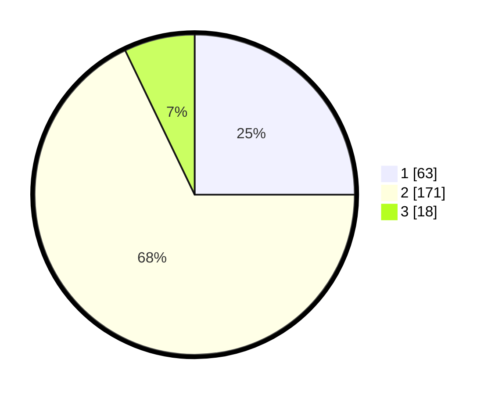

# Hasil

## Grafik

## Tabel

| No. | Nama Paslon    | Suara | Suara (raw) | Persentase |
|:--- |:-------------- | -----:| -----------:| ----------:|
| 1   | ANIES MUHAIMIN | 63    | [63][p-1]   | 25,00      |
| 2   | PRABOWO GIBRAN | 171   | [171][p-2]  | 67,86      |
| 3   | GANJAR MAHFUD  | 18    | [18][p-3]   | 7,14       |

[p-1]: https://github.com/gigit-pemilu/pemilu-2024-32-jawa-barat/blob/main/pilpres/hitung-suara/sub/32-jawa-barat/sub/16-bekasi/sub/21-serang-baru/sub/2001-sukaragam/sub/003-tps/sub/paslon-1.txt
[p-2]: https://github.com/gigit-pemilu/pemilu-2024-32-jawa-barat/blob/main/pilpres/hitung-suara/sub/32-jawa-barat/sub/16-bekasi/sub/21-serang-baru/sub/2001-sukaragam/sub/003-tps/sub/paslon-2.txt
[p-3]: https://github.com/gigit-pemilu/pemilu-2024-32-jawa-barat/blob/main/pilpres/hitung-suara/sub/32-jawa-barat/sub/16-bekasi/sub/21-serang-baru/sub/2001-sukaragam/sub/003-tps/sub/paslon-3.txt

## Foto C Plano

https://sirekap-obj-formc.kpu.go.id/5ae8/pemilu/ppwp/32/16/21/20/01/3216212001003-20240215-003813--be968150-e43f-4422-9a8c-e6fc35f487ce.jpg

https://sirekap-obj-formc.kpu.go.id/5ae8/pemilu/ppwp/32/16/21/20/01/3216212001003-20240215-003820--403d3724-5cfc-4fce-b683-945f1271c6e3.jpg

https://sirekap-obj-formc.kpu.go.id/5ae8/pemilu/ppwp/32/16/21/20/01/3216212001003-20240215-003827--3a14ff92-c4fd-4d95-a5d2-8449855677a9.jpg

## Metadata

| Key        | Value               |
| ---------- | ------------------- |
| Time Stamp | 2024-02-25 15:00:00 |

