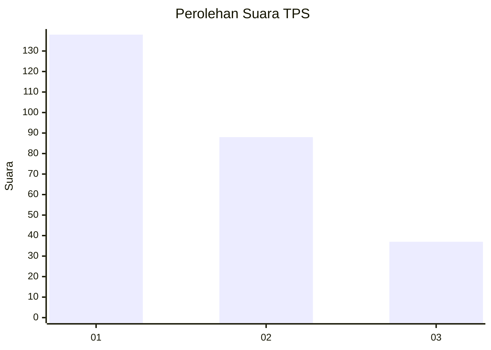
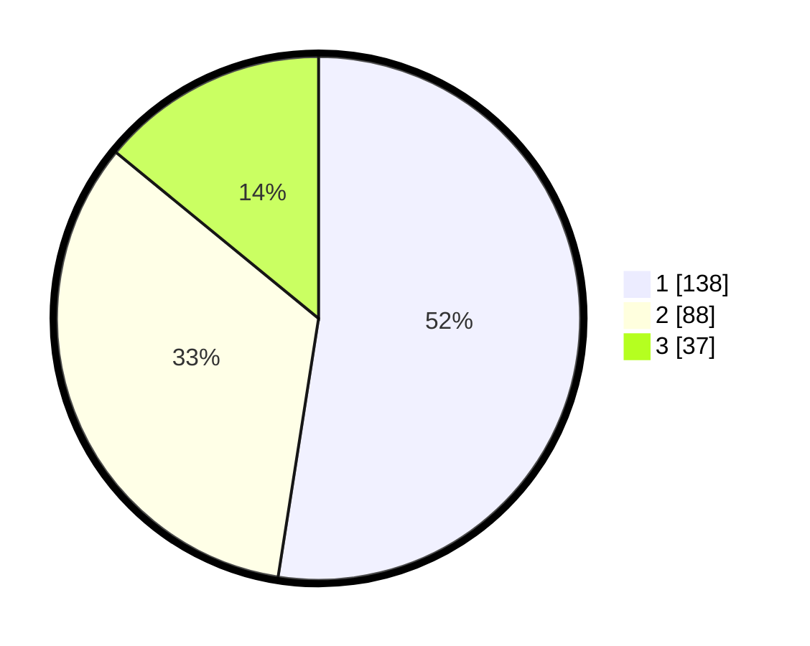

# Hasil

## Grafik

## Tabel

| No. | Nama Paslon    | Suara | Suara (raw) | Persentase |
|:--- |:-------------- | -----:| -----------:| ----------:|
| 1   | ANIES MUHAIMIN | 138   | [138][p-1]  | 52,47      |
| 2   | PRABOWO GIBRAN | 88    | [88][p-2]   | 33,46      |
| 3   | GANJAR MAHFUD  | 37    | [37][p-3]   | 14,07      |

[p-1]: https://github.com/gigit-pemilu/pemilu-2024-32-jawa-barat/blob/main/pilpres/hitung-suara/sub/32-jawa-barat/sub/16-bekasi/sub/21-serang-baru/sub/2001-sukaragam/sub/008-tps/sub/paslon-1.txt
[p-2]: https://github.com/gigit-pemilu/pemilu-2024-32-jawa-barat/blob/main/pilpres/hitung-suara/sub/32-jawa-barat/sub/16-bekasi/sub/21-serang-baru/sub/2001-sukaragam/sub/008-tps/sub/paslon-2.txt
[p-3]: https://github.com/gigit-pemilu/pemilu-2024-32-jawa-barat/blob/main/pilpres/hitung-suara/sub/32-jawa-barat/sub/16-bekasi/sub/21-serang-baru/sub/2001-sukaragam/sub/008-tps/sub/paslon-3.txt

## Foto C Plano

https://sirekap-obj-formc.kpu.go.id/3be8/pemilu/ppwp/32/16/21/20/01/3216212001008-20240215-221023--46c3086f-1b78-4bef-97ca-213446e55469.jpg

https://sirekap-obj-formc.kpu.go.id/3be8/pemilu/ppwp/32/16/21/20/01/3216212001008-20240215-002044--6263ed8b-b7d3-4113-b3e5-8ad8117145f4.jpg

https://sirekap-obj-formc.kpu.go.id/3be8/pemilu/ppwp/32/16/21/20/01/3216212001008-20240215-002059--d73c918a-b4fa-417a-a9f4-853218add06b.jpg

## Metadata

| Key        | Value               |
| ---------- | ------------------- |
| Time Stamp | 2024-02-15 22:30:27 |

