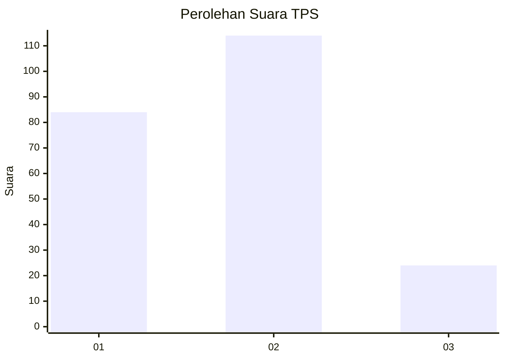
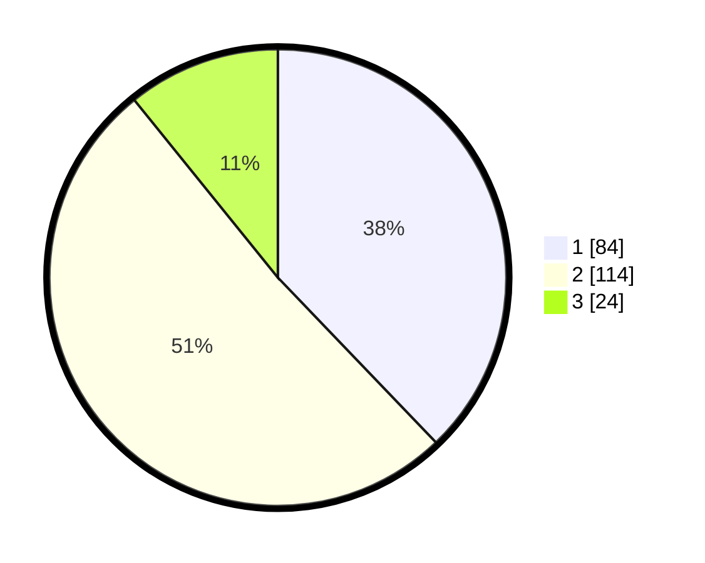

# Hasil

## Grafik

## Tabel

| No. | Nama Paslon    | Suara | Suara (raw) | Persentase |
|:--- |:-------------- | -----:| -----------:| ----------:|
| 1   | ANIES MUHAIMIN | 84    | [84][p-1]   | 37,84      |
| 2   | PRABOWO GIBRAN | 114   | [114][p-2]  | 51,35      |
| 3   | GANJAR MAHFUD  | 24    | [24][p-3]   | 10,81      |

[p-1]: https://github.com/gigit-pemilu/pemilu-2024/blob/main/pilpres/hitung-suara/sub/32-jawa-barat/sub/16-bekasi/sub/21-serang-baru/sub/2001-sukaragam/sub/009-tps/sub/paslon-1.txt
[p-2]: https://github.com/gigit-pemilu/pemilu-2024/blob/main/pilpres/hitung-suara/sub/32-jawa-barat/sub/16-bekasi/sub/21-serang-baru/sub/2001-sukaragam/sub/009-tps/sub/paslon-2.txt
[p-3]: https://github.com/gigit-pemilu/pemilu-2024/blob/main/pilpres/hitung-suara/sub/32-jawa-barat/sub/16-bekasi/sub/21-serang-baru/sub/2001-sukaragam/sub/009-tps/sub/paslon-3.txt

## Foto C Plano

https://sirekap-obj-formc.kpu.go.id/c518/pemilu/ppwp/32/16/21/20/01/3216212001009-20240214-185956--f1ede7a3-b240-48ed-b784-26d96bc98a3b.jpg

https://sirekap-obj-formc.kpu.go.id/c518/pemilu/ppwp/32/16/21/20/01/3216212001009-20240214-155054--f6c3a270-1dc1-4b50-95aa-8ac7b7e8d838.jpg

https://sirekap-obj-formc.kpu.go.id/c518/pemilu/ppwp/32/16/21/20/01/3216212001009-20240214-155058--f2318966-bafe-4fdf-9538-1bf78e44793d.jpg

## Metadata

| Key        | Value               |
| ---------- | ------------------- |
| Time Stamp | 2024-02-25 12:00:00 |

