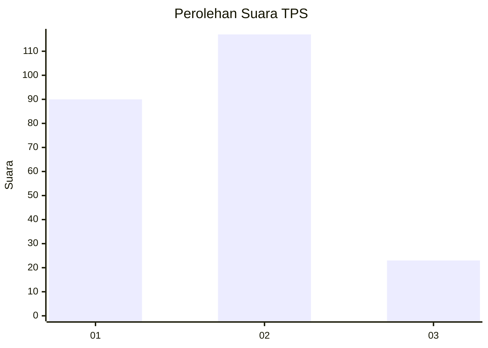
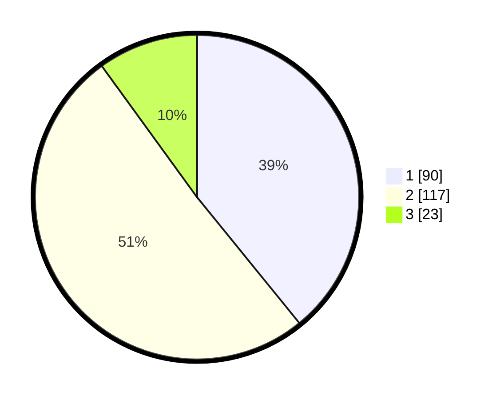

# Hasil

## Grafik

## Tabel

| No. | Nama Paslon    | Suara | Suara (raw) | Persentase |
|:--- |:-------------- | -----:| -----------:| ----------:|
| 1   | ANIES MUHAIMIN | 90    | [90][p-1]   | 39,13      |
| 2   | PRABOWO GIBRAN | 117   | [117][p-2]  | 50,87      |
| 3   | GANJAR MAHFUD  | 23    | [23][p-3]   | 10,00      |

[p-1]: https://github.com/gigit-pemilu/pemilu-2024/blob/main/pilpres/hitung-suara/sub/32-jawa-barat/sub/16-bekasi/sub/21-serang-baru/sub/2001-sukaragam/sub/010-tps/sub/paslon-1.txt
[p-2]: https://github.com/gigit-pemilu/pemilu-2024/blob/main/pilpres/hitung-suara/sub/32-jawa-barat/sub/16-bekasi/sub/21-serang-baru/sub/2001-sukaragam/sub/010-tps/sub/paslon-2.txt
[p-3]: https://github.com/gigit-pemilu/pemilu-2024/blob/main/pilpres/hitung-suara/sub/32-jawa-barat/sub/16-bekasi/sub/21-serang-baru/sub/2001-sukaragam/sub/010-tps/sub/paslon-3.txt

## Foto C Plano

https://sirekap-obj-formc.kpu.go.id/7d07/pemilu/ppwp/32/16/21/20/01/3216212001010-20240216-113555--b66540ee-9c13-49ae-82bb-0e655006d4ff.jpg

https://sirekap-obj-formc.kpu.go.id/7d07/pemilu/ppwp/32/16/21/20/01/3216212001010-20240216-113931--570af274-5298-44c2-b03b-84665bd64f90.jpg

https://sirekap-obj-formc.kpu.go.id/7d07/pemilu/ppwp/32/16/21/20/01/3216212001010-20240214-155834--24667cac-f209-47cf-b385-a7631ff4168a.jpg

## Metadata

| Key        | Value               |
| ---------- | ------------------- |
| Time Stamp | 2024-02-25 15:00:00 |

