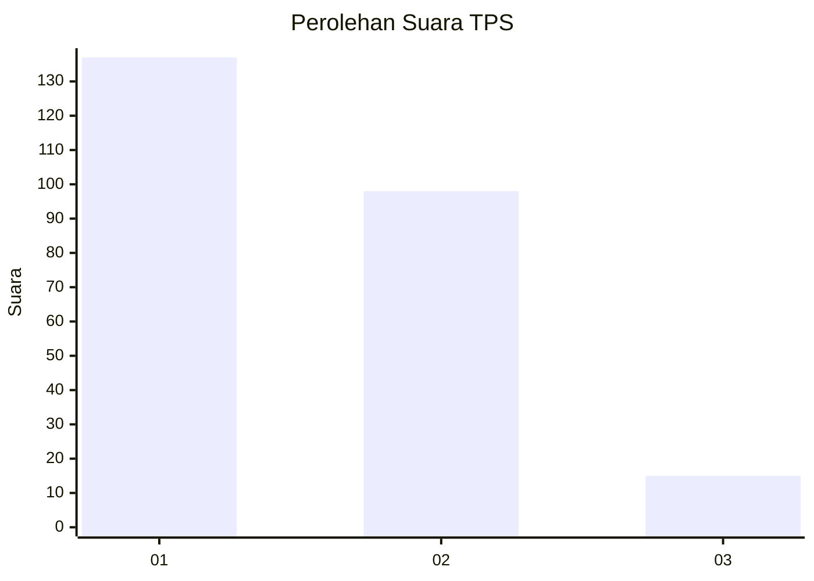
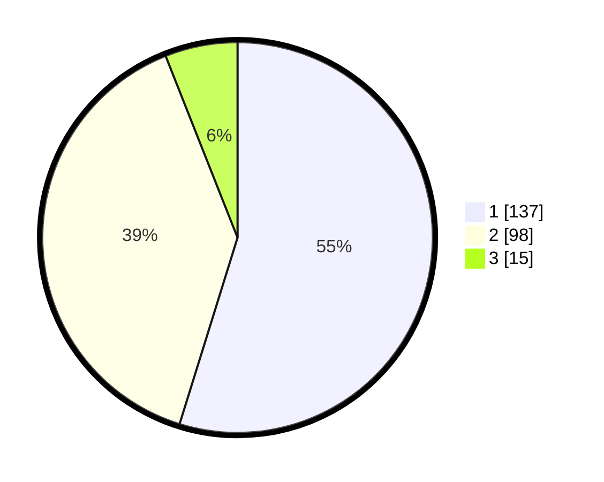

# Hasil

## Grafik

## Tabel

| No. | Nama Paslon    | Suara | Suara (raw) | Persentase |
|:--- |:-------------- | -----:| -----------:| ----------:|
| 1   | ANIES MUHAIMIN | 137   | [137][p-1]  | 54,80      |
| 2   | PRABOWO GIBRAN | 98    | [98][p-2]   | 39,20      |
| 3   | GANJAR MAHFUD  | 15    | [15][p-3]   | 6,00       |

[p-1]: https://github.com/gigit-pemilu/pemilu-2024/blob/main/pilpres/hitung-suara/sub/32-jawa-barat/sub/16-bekasi/sub/21-serang-baru/sub/2003-sukasari/sub/011-tps/sub/paslon-1.txt
[p-2]: https://github.com/gigit-pemilu/pemilu-2024/blob/main/pilpres/hitung-suara/sub/32-jawa-barat/sub/16-bekasi/sub/21-serang-baru/sub/2003-sukasari/sub/011-tps/sub/paslon-2.txt
[p-3]: https://github.com/gigit-pemilu/pemilu-2024/blob/main/pilpres/hitung-suara/sub/32-jawa-barat/sub/16-bekasi/sub/21-serang-baru/sub/2003-sukasari/sub/011-tps/sub/paslon-3.txt

## Foto C Plano

https://sirekap-obj-formc.kpu.go.id/5f59/pemilu/ppwp/32/16/21/20/03/3216212003011-20240214-202545--35e12a82-f7db-49b7-97f2-49c9e21089f0.jpg

https://sirekap-obj-formc.kpu.go.id/5f59/pemilu/ppwp/32/16/21/20/03/3216212003011-20240214-202708--15e61f04-8f66-479c-83ac-3ae592b5b4cd.jpg

https://sirekap-obj-formc.kpu.go.id/5f59/pemilu/ppwp/32/16/21/20/03/3216212003011-20240214-202807--c5d0935c-0291-4421-93ad-947bfc6ecd2e.jpg

## Metadata

| Key        | Value               |
| ---------- | ------------------- |
| Time Stamp | 2024-02-24 22:31:28 |

