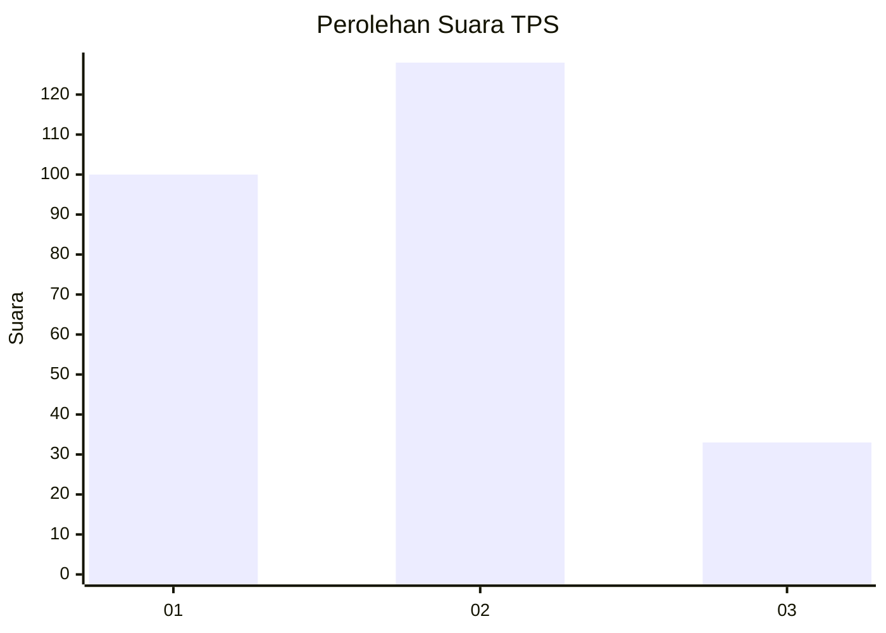
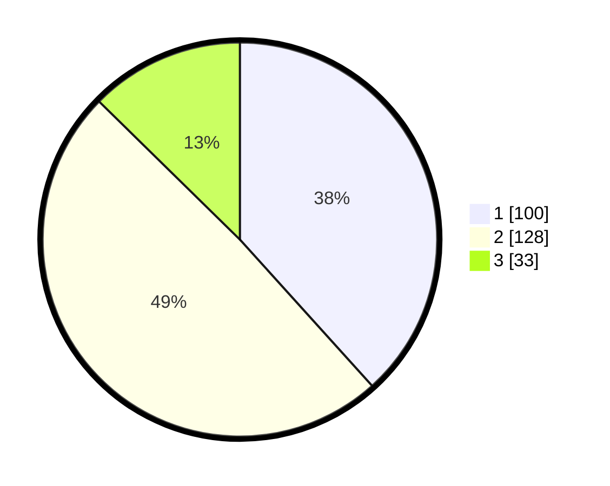

# Hasil

## Grafik

## Tabel

| No. | Nama Paslon    | Suara | Suara (raw) | Persentase |
|:--- |:-------------- | -----:| -----------:| ----------:|
| 1   | ANIES MUHAIMIN | 100   | [100][p-1]  | 38,31      |
| 2   | PRABOWO GIBRAN | 128   | [128][p-2]  | 49,04      |
| 3   | GANJAR MAHFUD  | 33    | [33][p-3]   | 12,64      |

[p-1]: https://github.com/gigit-pemilu/pemilu-2024-32-jawa-barat/blob/main/pilpres/hitung-suara/sub/32-jawa-barat/sub/16-bekasi/sub/21-serang-baru/sub/2003-sukasari/sub/024-tps/sub/paslon-1.txt
[p-2]: https://github.com/gigit-pemilu/pemilu-2024-32-jawa-barat/blob/main/pilpres/hitung-suara/sub/32-jawa-barat/sub/16-bekasi/sub/21-serang-baru/sub/2003-sukasari/sub/024-tps/sub/paslon-2.txt
[p-3]: https://github.com/gigit-pemilu/pemilu-2024-32-jawa-barat/blob/main/pilpres/hitung-suara/sub/32-jawa-barat/sub/16-bekasi/sub/21-serang-baru/sub/2003-sukasari/sub/024-tps/sub/paslon-3.txt

## Foto C Plano

https://sirekap-obj-formc.kpu.go.id/9298/pemilu/ppwp/32/16/21/20/03/3216212003024-20240215-150525--39ccd85b-731f-4966-8afc-33d36a9643bc.jpg

https://sirekap-obj-formc.kpu.go.id/9298/pemilu/ppwp/32/16/21/20/03/3216212003024-20240215-150720--b1834a52-8671-425b-b351-de916983ef97.jpg

https://sirekap-obj-formc.kpu.go.id/9298/pemilu/ppwp/32/16/21/20/03/3216212003024-20240215-150906--bbaeff68-8d35-4745-9ace-5d2aef81864e.jpg

## Metadata

| Key        | Value               |
| ---------- | ------------------- |
| Time Stamp | 2024-02-24 22:31:28 |

