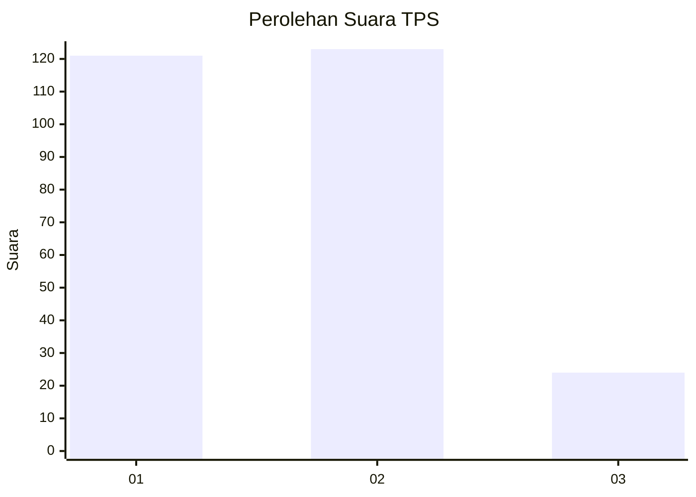
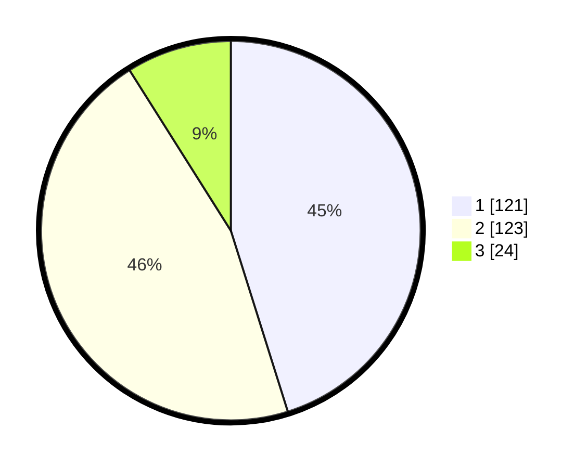

# Hasil

## Grafik

## Tabel

| No. | Nama Paslon    | Suara | Suara (raw) | Persentase |
|:--- |:-------------- | -----:| -----------:| ----------:|
| 1   | ANIES MUHAIMIN | 121   | [121][p-1]  | 45,15      |
| 2   | PRABOWO GIBRAN | 123   | [123][p-2]  | 45,90      |
| 3   | GANJAR MAHFUD  | 24    | [24][p-3]   | 8,96       |

[p-1]: https://github.com/gigit-pemilu/pemilu-2024/blob/main/pilpres/hitung-suara/sub/32-jawa-barat/sub/16-bekasi/sub/21-serang-baru/sub/2003-sukasari/sub/026-tps/sub/paslon-1.txt
[p-2]: https://github.com/gigit-pemilu/pemilu-2024/blob/main/pilpres/hitung-suara/sub/32-jawa-barat/sub/16-bekasi/sub/21-serang-baru/sub/2003-sukasari/sub/026-tps/sub/paslon-2.txt
[p-3]: https://github.com/gigit-pemilu/pemilu-2024/blob/main/pilpres/hitung-suara/sub/32-jawa-barat/sub/16-bekasi/sub/21-serang-baru/sub/2003-sukasari/sub/026-tps/sub/paslon-3.txt

## Foto C Plano

https://sirekap-obj-formc.kpu.go.id/d6ec/pemilu/ppwp/32/16/21/20/03/3216212003026-20240214-234551--2a86316a-521a-4ef5-b8e6-01427f8e7c05.jpg

https://sirekap-obj-formc.kpu.go.id/d6ec/pemilu/ppwp/32/16/21/20/03/3216212003026-20240214-234629--4eb3039f-bfeb-43d2-b481-5ba9cdcfea16.jpg

https://sirekap-obj-formc.kpu.go.id/d6ec/pemilu/ppwp/32/16/21/20/03/3216212003026-20240214-234828--a28e7c4c-d5d5-468d-b48b-26937ceeaf02.jpg

## Metadata

| Key        | Value               |
| ---------- | ------------------- |
| Time Stamp | 2024-02-24 22:31:28 |

