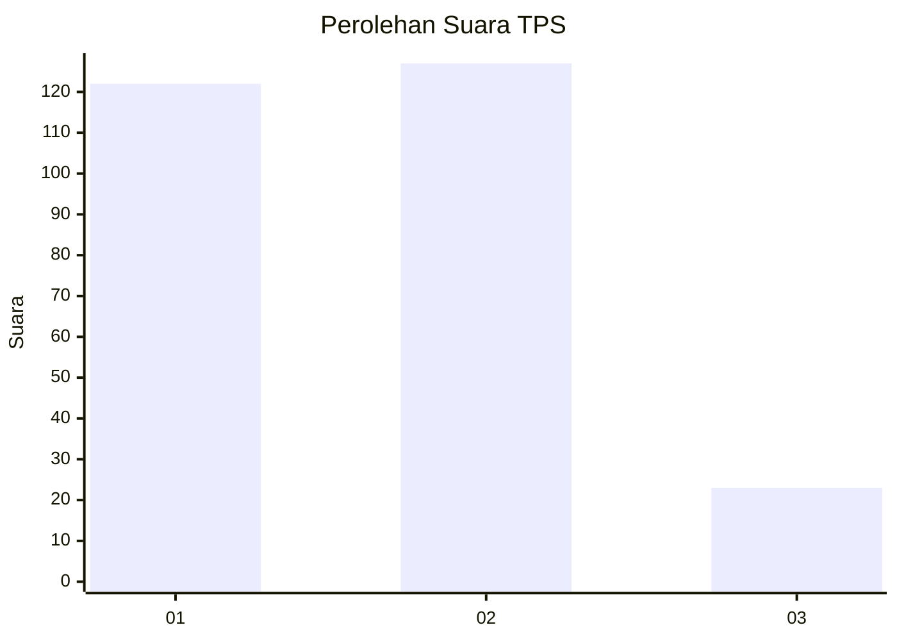
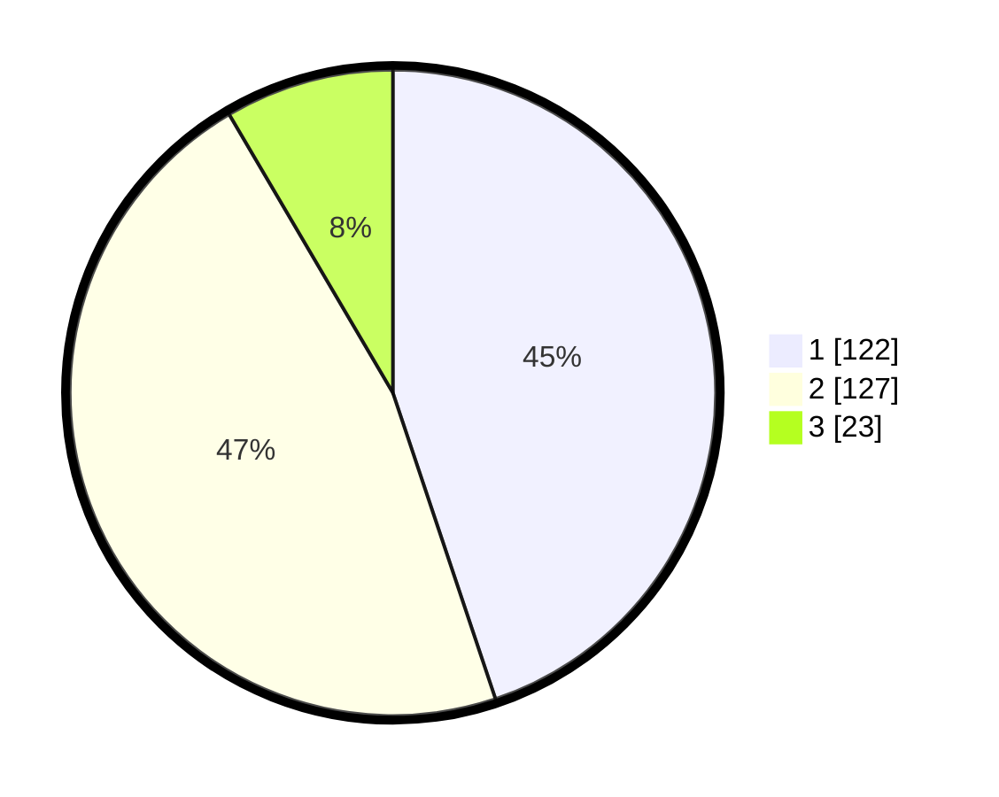

# Hasil

## Grafik

## Tabel

| No. | Nama Paslon    | Suara | Suara (raw) | Persentase |
|:--- |:-------------- | -----:| -----------:| ----------:|
| 1   | ANIES MUHAIMIN | 122   | [122][p-1]  | 44,85      |
| 2   | PRABOWO GIBRAN | 127   | [127][p-2]  | 46,69      |
| 3   | GANJAR MAHFUD  | 23    | [23][p-3]   | 8,46       |

[p-1]: https://github.com/gigit-pemilu/pemilu-2024-32-jawa-barat/blob/main/pilpres/hitung-suara/sub/32-jawa-barat/sub/16-bekasi/sub/21-serang-baru/sub/2003-sukasari/sub/031-tps/sub/paslon-1.txt
[p-2]: https://github.com/gigit-pemilu/pemilu-2024-32-jawa-barat/blob/main/pilpres/hitung-suara/sub/32-jawa-barat/sub/16-bekasi/sub/21-serang-baru/sub/2003-sukasari/sub/031-tps/sub/paslon-2.txt
[p-3]: https://github.com/gigit-pemilu/pemilu-2024-32-jawa-barat/blob/main/pilpres/hitung-suara/sub/32-jawa-barat/sub/16-bekasi/sub/21-serang-baru/sub/2003-sukasari/sub/031-tps/sub/paslon-3.txt

## Foto C Plano

https://sirekap-obj-formc.kpu.go.id/3518/pemilu/ppwp/32/16/21/20/03/3216212003031-20240215-011105--896e7a94-1148-4351-ac1c-574b7c20b91a.jpg

https://sirekap-obj-formc.kpu.go.id/3518/pemilu/ppwp/32/16/21/20/03/3216212003031-20240214-205434--9eb97550-9109-4193-856f-c2b37d7bb53a.jpg

https://sirekap-obj-formc.kpu.go.id/3518/pemilu/ppwp/32/16/21/20/03/3216212003031-20240214-205531--03b2b9da-22fd-4181-8732-322c4bfa4c11.jpg

## Metadata

| Key        | Value               |
| ---------- | ------------------- |
| Time Stamp | 2024-02-25 13:00:00 |

