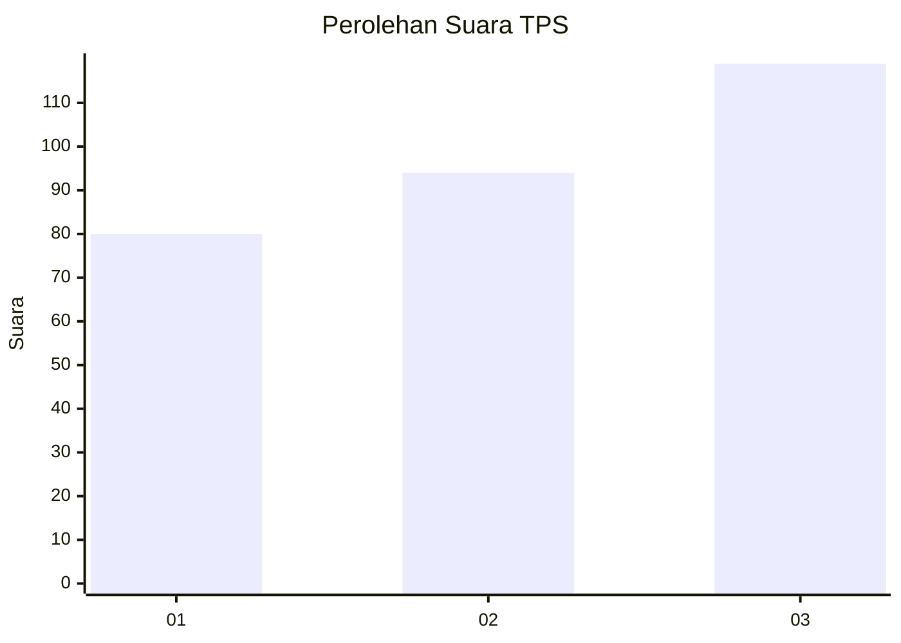
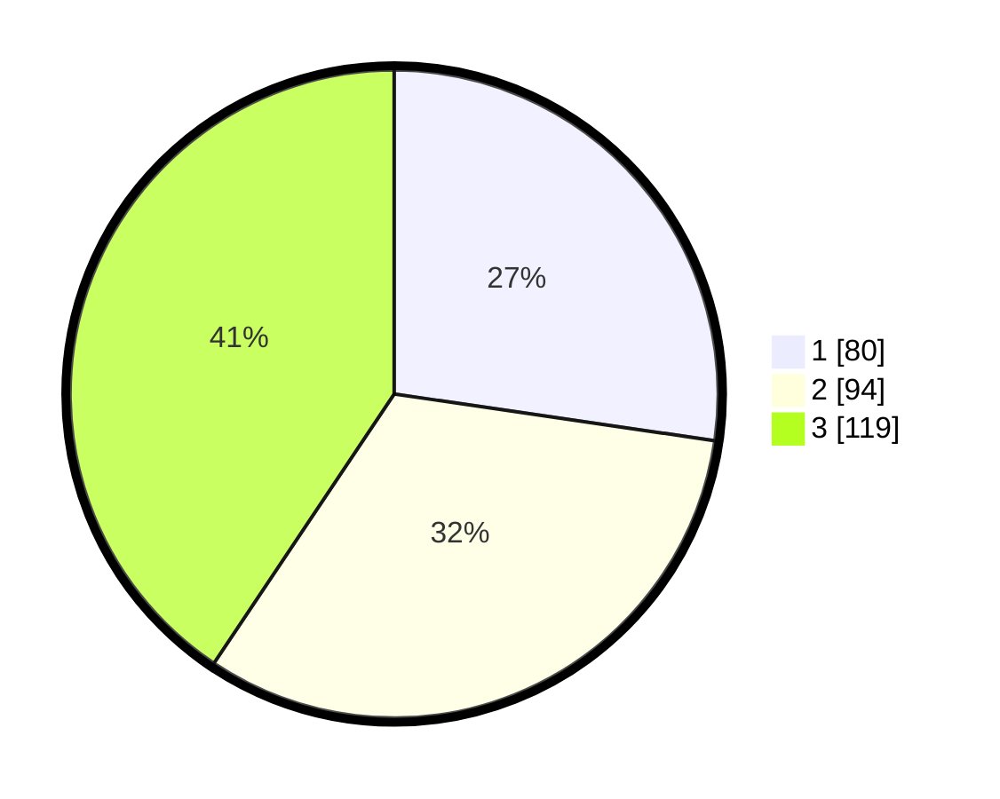

# Hasil

## Grafik

## Tabel

| No. | Nama Paslon    | Suara | Suara (raw) | Persentase |
|:--- |:-------------- | -----:| -----------:| ----------:|
| 1   | ANIES MUHAIMIN | 80    | [80][p-1]   | 27,30      |
| 2   | PRABOWO GIBRAN | 94    | [94][p-2]   | 32,08      |
| 3   | GANJAR MAHFUD  | 119   | [119][p-3]  | 40,61      |

[p-1]: https://github.com/gigit-pemilu/pemilu-2024-32-jawa-barat/blob/main/pilpres/hitung-suara/sub/32-jawa-barat/sub/16-bekasi/sub/21-serang-baru/sub/2003-sukasari/sub/048-tps/sub/paslon-1.txt
[p-2]: https://github.com/gigit-pemilu/pemilu-2024-32-jawa-barat/blob/main/pilpres/hitung-suara/sub/32-jawa-barat/sub/16-bekasi/sub/21-serang-baru/sub/2003-sukasari/sub/048-tps/sub/paslon-2.txt
[p-3]: https://github.com/gigit-pemilu/pemilu-2024-32-jawa-barat/blob/main/pilpres/hitung-suara/sub/32-jawa-barat/sub/16-bekasi/sub/21-serang-baru/sub/2003-sukasari/sub/048-tps/sub/paslon-3.txt

## Foto C Plano

https://sirekap-obj-formc.kpu.go.id/6e39/pemilu/ppwp/32/16/21/20/03/3216212003048-20240220-151709--0f80a946-ba50-4f1f-aa07-c9fb57947d30.jpg

https://sirekap-obj-formc.kpu.go.id/6e39/pemilu/ppwp/32/16/21/20/03/3216212003048-20240214-233027--8a4a5bd9-15d3-4b60-a72a-613299b90ebd.jpg

https://sirekap-obj-formc.kpu.go.id/6e39/pemilu/ppwp/32/16/21/20/03/3216212003048-20240214-233510--14ab8d2a-737d-414f-924f-bf9d3cfad223.jpg

## Metadata

| Key        | Value               |
| ---------- | ------------------- |
| Time Stamp | 2024-02-24 22:31:28 |

