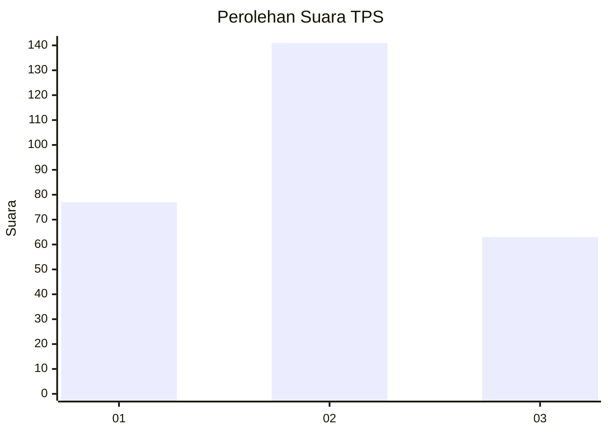
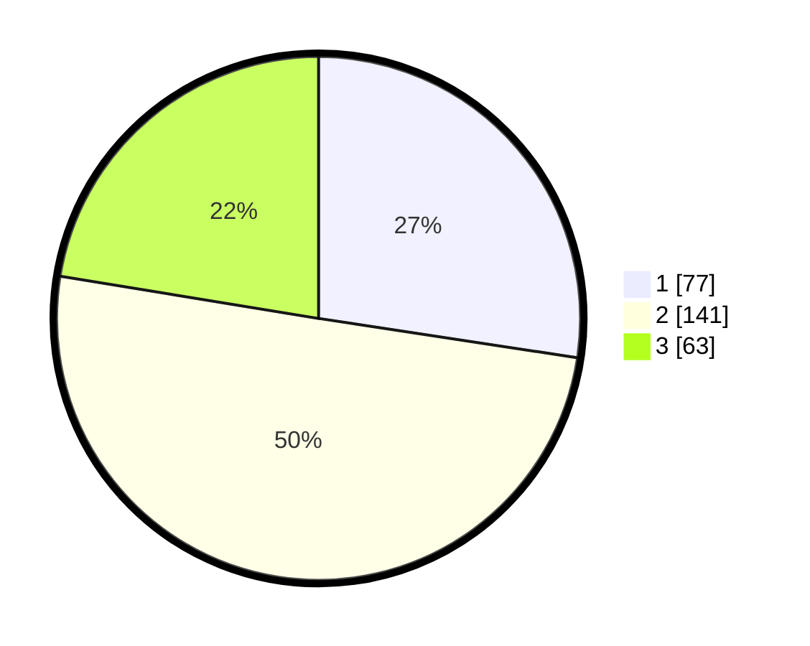

# Hasil

## Grafik

## Tabel

| No. | Nama Paslon    | Suara | Suara (raw) | Persentase |
|:--- |:-------------- | -----:| -----------:| ----------:|
| 1   | ANIES MUHAIMIN | 77    | [77][p-1]   | 27,40      |
| 2   | PRABOWO GIBRAN | 141   | [141][p-2]  | 50,18      |
| 3   | GANJAR MAHFUD  | 63    | [63][p-3]   | 22,42      |

[p-1]: https://github.com/gigit-pemilu/pemilu-2024/blob/main/pilpres/hitung-suara/sub/32-jawa-barat/sub/16-bekasi/sub/21-serang-baru/sub/2003-sukasari/sub/053-tps/sub/paslon-1.txt
[p-2]: https://github.com/gigit-pemilu/pemilu-2024/blob/main/pilpres/hitung-suara/sub/32-jawa-barat/sub/16-bekasi/sub/21-serang-baru/sub/2003-sukasari/sub/053-tps/sub/paslon-2.txt
[p-3]: https://github.com/gigit-pemilu/pemilu-2024/blob/main/pilpres/hitung-suara/sub/32-jawa-barat/sub/16-bekasi/sub/21-serang-baru/sub/2003-sukasari/sub/053-tps/sub/paslon-3.txt

## Foto C Plano

https://sirekap-obj-formc.kpu.go.id/0841/pemilu/ppwp/32/16/21/20/03/3216212003053-20240214-230918--e38234c7-8bf9-4a4d-a465-b82a1aec1b71.jpg

https://sirekap-obj-formc.kpu.go.id/0841/pemilu/ppwp/32/16/21/20/03/3216212003053-20240214-231014--256a764b-cb19-4737-8d45-45442429db23.jpg

https://sirekap-obj-formc.kpu.go.id/0841/pemilu/ppwp/32/16/21/20/03/3216212003053-20240214-231140--242d3176-12ba-40e6-93b6-c623e880af86.jpg

## Metadata

| Key        | Value               |
| ---------- | ------------------- |
| Time Stamp | 2024-02-15 16:30:25 |

