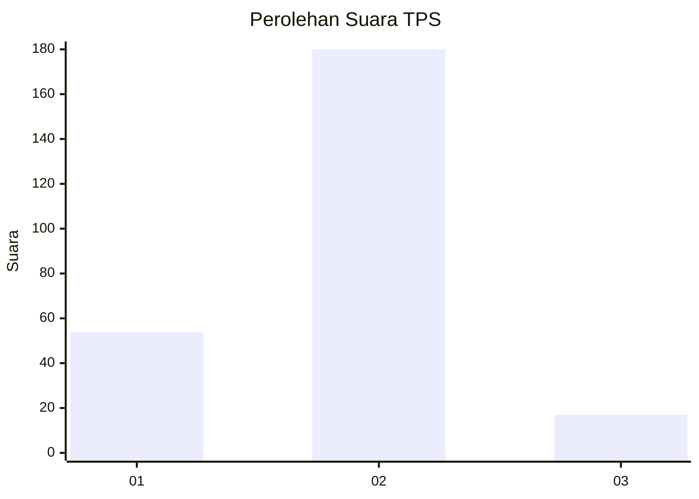

# Hasil

## Grafik

## Tabel

| No. | Nama Paslon    | Suara | Suara (raw) | Persentase |
|:--- |:-------------- | -----:| -----------:| ----------:|
| 1   | ANIES MUHAIMIN | 54    | [54][p-1]   | 21,51      |
| 2   | PRABOWO GIBRAN | 180   | [180][p-2]  | 71,71      |
| 3   | GANJAR MAHFUD  | 17    | [17][p-3]   | 6,77       |

[p-1]: https://github.com/gigit-pemilu/pemilu-2024/blob/main/pilpres/hitung-suara/sub/32-jawa-barat/sub/16-bekasi/sub/21-serang-baru/sub/2008-jayasampurna/sub/006-tps/sub/paslon-1.txt
[p-2]: https://github.com/gigit-pemilu/pemilu-2024/blob/main/pilpres/hitung-suara/sub/32-jawa-barat/sub/16-bekasi/sub/21-serang-baru/sub/2008-jayasampurna/sub/006-tps/sub/paslon-2.txt
[p-3]: https://github.com/gigit-pemilu/pemilu-2024/blob/main/pilpres/hitung-suara/sub/32-jawa-barat/sub/16-bekasi/sub/21-serang-baru/sub/2008-jayasampurna/sub/006-tps/sub/paslon-3.txt

## Foto C Plano

https://sirekap-obj-formc.kpu.go.id/8ef2/pemilu/ppwp/32/16/21/20/08/3216212008006-20240214-233150--5a68789f-9701-4e31-ae0c-1fca261d75f8.jpg

https://sirekap-obj-formc.kpu.go.id/8ef2/pemilu/ppwp/32/16/21/20/08/3216212008006-20240214-233238--cdd94ef8-7912-462c-b3c9-fd1348245258.jpg

https://sirekap-obj-formc.kpu.go.id/8ef2/pemilu/ppwp/32/16/21/20/08/3216212008006-20240214-233257--373897a8-76d3-455c-a218-cd389c2c53b4.jpg

## Metadata

| Key        | Value               |
| ---------- | ------------------- |
| Time Stamp | 2024-02-25 14:00:00 |

