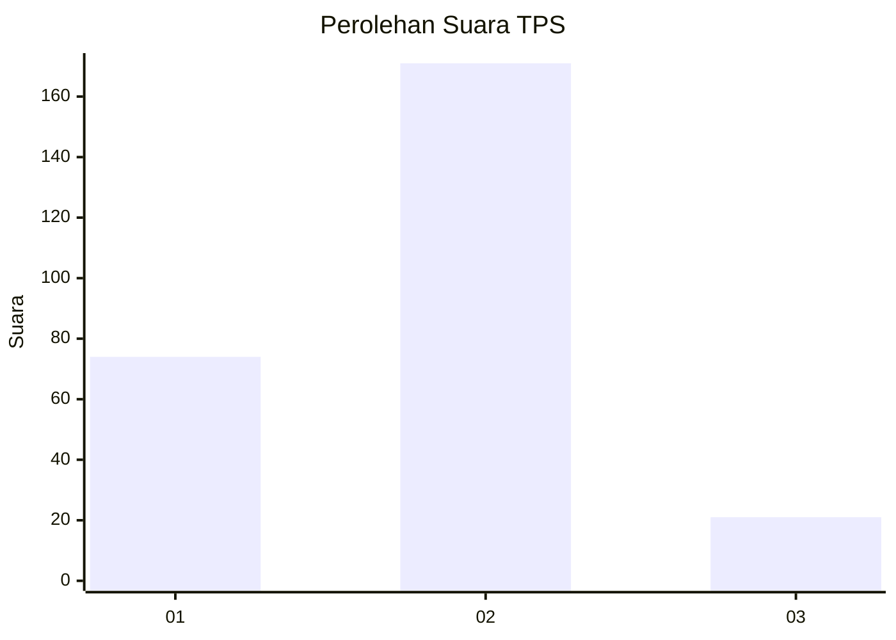
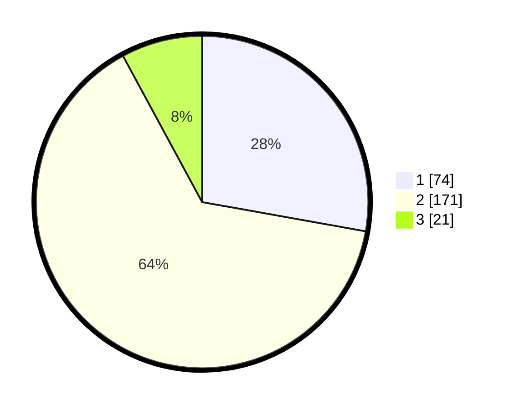

# Hasil

## Grafik

## Tabel

| No. | Nama Paslon    | Suara | Suara (raw) | Persentase |
|:--- |:-------------- | -----:| -----------:| ----------:|
| 1   | ANIES MUHAIMIN | 74    | [74][p-1]   | 27,82      |
| 2   | PRABOWO GIBRAN | 171   | [171][p-2]  | 64,29      |
| 3   | GANJAR MAHFUD  | 21    | [21][p-3]   | 7,89       |

[p-1]: https://github.com/gigit-pemilu/pemilu-2024-32-jawa-barat/blob/main/pilpres/hitung-suara/sub/32-jawa-barat/sub/16-bekasi/sub/21-serang-baru/sub/2008-jayasampurna/sub/012-tps/sub/paslon-1.txt
[p-2]: https://github.com/gigit-pemilu/pemilu-2024-32-jawa-barat/blob/main/pilpres/hitung-suara/sub/32-jawa-barat/sub/16-bekasi/sub/21-serang-baru/sub/2008-jayasampurna/sub/012-tps/sub/paslon-2.txt
[p-3]: https://github.com/gigit-pemilu/pemilu-2024-32-jawa-barat/blob/main/pilpres/hitung-suara/sub/32-jawa-barat/sub/16-bekasi/sub/21-serang-baru/sub/2008-jayasampurna/sub/012-tps/sub/paslon-3.txt

## Foto C Plano

https://sirekap-obj-formc.kpu.go.id/5389/pemilu/ppwp/32/16/21/20/08/3216212008012-20240214-190654--dc27a003-315f-4272-9be4-1e832056eb21.jpg

https://sirekap-obj-formc.kpu.go.id/5389/pemilu/ppwp/32/16/21/20/08/3216212008012-20240214-190630--a977a8e2-5e04-4131-a645-c62479dea301.jpg

https://sirekap-obj-formc.kpu.go.id/5389/pemilu/ppwp/32/16/21/20/08/3216212008012-20240214-213843--accec2f1-4810-4cc3-9ba6-8d6846c23aa5.jpg

## Metadata

| Key        | Value               |
| ---------- | ------------------- |
| Time Stamp | 2024-02-15 00:41:44 |

