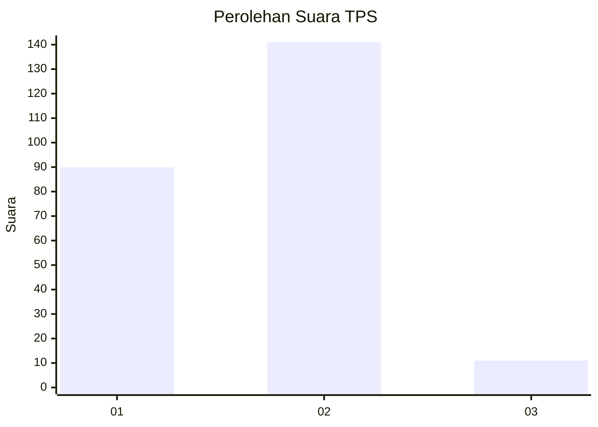
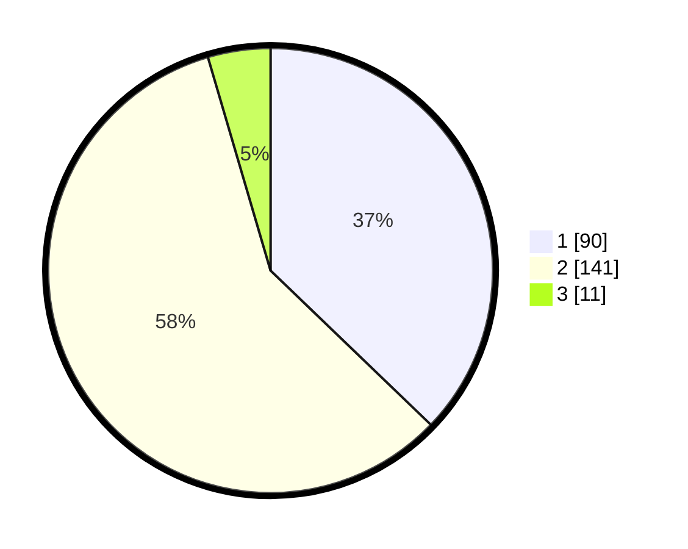

# Hasil

## Grafik

## Tabel

| No. | Nama Paslon    | Suara | Suara (raw) | Persentase |
|:--- |:-------------- | -----:| -----------:| ----------:|
| 1   | ANIES MUHAIMIN | 90    | [90][p-1]   | 37,19      |
| 2   | PRABOWO GIBRAN | 141   | [141][p-2]  | 58,26      |
| 3   | GANJAR MAHFUD  | 11    | [11][p-3]   | 4,55       |

[p-1]: https://github.com/gigit-pemilu/pemilu-2024-32-jawa-barat/blob/main/pilpres/hitung-suara/sub/32-jawa-barat/sub/16-bekasi/sub/22-cibarusah/sub/2001-sirnajati/sub/004-tps/sub/paslon-1.txt
[p-2]: https://github.com/gigit-pemilu/pemilu-2024-32-jawa-barat/blob/main/pilpres/hitung-suara/sub/32-jawa-barat/sub/16-bekasi/sub/22-cibarusah/sub/2001-sirnajati/sub/004-tps/sub/paslon-2.txt
[p-3]: https://github.com/gigit-pemilu/pemilu-2024-32-jawa-barat/blob/main/pilpres/hitung-suara/sub/32-jawa-barat/sub/16-bekasi/sub/22-cibarusah/sub/2001-sirnajati/sub/004-tps/sub/paslon-3.txt

## Foto C Plano

https://sirekap-obj-formc.kpu.go.id/7a80/pemilu/ppwp/32/16/22/20/01/3216222001004-20240215-041222--d58eed9c-0cba-4660-805e-5ff09d71cfb8.jpg

https://sirekap-obj-formc.kpu.go.id/7a80/pemilu/ppwp/32/16/22/20/01/3216222001004-20240215-041119--07f3fd41-3a08-4d62-81f1-a1f910aa27ca.jpg

https://sirekap-obj-formc.kpu.go.id/7a80/pemilu/ppwp/32/16/22/20/01/3216222001004-20240215-041142--4dfe2dfb-a264-4afa-8dc5-b49e0dcead8d.jpg

## Metadata

| Key        | Value               |
| ---------- | ------------------- |
| Time Stamp | 2024-02-25 13:00:00 |

