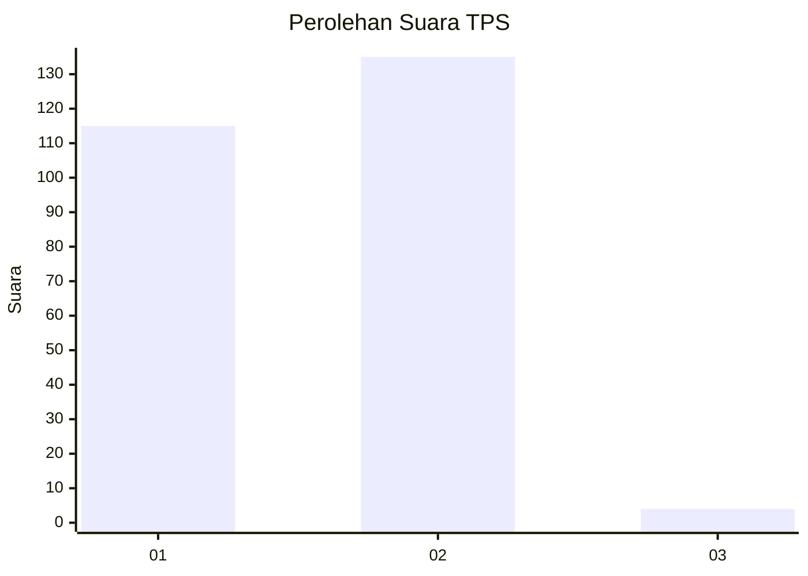
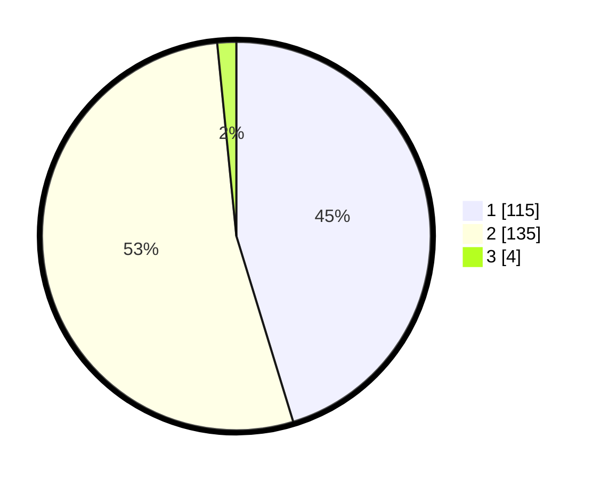

# Hasil

## Grafik

## Tabel

| No. | Nama Paslon    | Suara | Suara (raw) | Persentase |
|:--- |:-------------- | -----:| -----------:| ----------:|
| 1   | ANIES MUHAIMIN | 115   | [115][p-1]  | 45,28      |
| 2   | PRABOWO GIBRAN | 135   | [135][p-2]  | 53,15      |
| 3   | GANJAR MAHFUD  | 4     | [4][p-3]    | 1,57       |

[p-1]: https://github.com/gigit-pemilu/pemilu-2024-32-jawa-barat/blob/main/pilpres/hitung-suara/sub/32-jawa-barat/sub/16-bekasi/sub/22-cibarusah/sub/2001-sirnajati/sub/009-tps/sub/paslon-1.txt
[p-2]: https://github.com/gigit-pemilu/pemilu-2024-32-jawa-barat/blob/main/pilpres/hitung-suara/sub/32-jawa-barat/sub/16-bekasi/sub/22-cibarusah/sub/2001-sirnajati/sub/009-tps/sub/paslon-2.txt
[p-3]: https://github.com/gigit-pemilu/pemilu-2024-32-jawa-barat/blob/main/pilpres/hitung-suara/sub/32-jawa-barat/sub/16-bekasi/sub/22-cibarusah/sub/2001-sirnajati/sub/009-tps/sub/paslon-3.txt

## Foto C Plano

https://sirekap-obj-formc.kpu.go.id/70a4/pemilu/ppwp/32/16/22/20/01/3216222001009-20240215-030735--e8e4e732-f0b7-4836-a19b-6d328e3278c7.jpg

https://sirekap-obj-formc.kpu.go.id/70a4/pemilu/ppwp/32/16/22/20/01/3216222001009-20240215-001246--8ce8ff57-db8d-4419-9e63-df46114007a8.jpg

https://sirekap-obj-formc.kpu.go.id/70a4/pemilu/ppwp/32/16/22/20/01/3216222001009-20240215-001452--fd1df742-2205-4e38-913b-fd618a0e972f.jpg

## Metadata

| Key        | Value               |
| ---------- | ------------------- |
| Time Stamp | 2024-02-25 15:00:00 |

