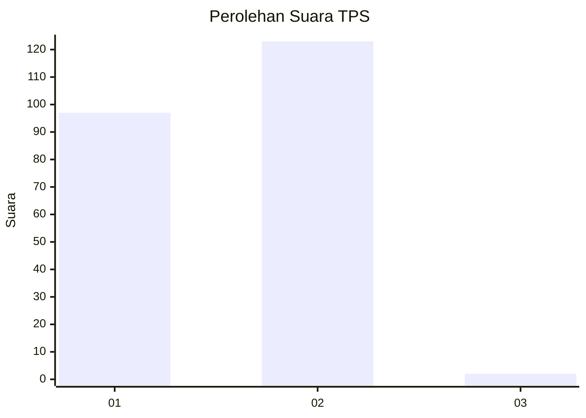
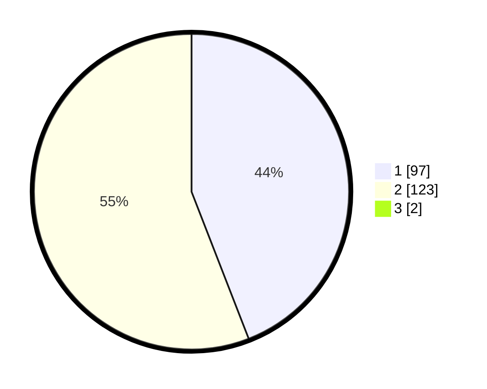

# Hasil

## Grafik

## Tabel

| No. | Nama Paslon    | Suara | Suara (raw) | Persentase |
|:--- |:-------------- | -----:| -----------:| ----------:|
| 1   | ANIES MUHAIMIN | 97    | [97][p-1]   | 43,69      |
| 2   | PRABOWO GIBRAN | 123   | [123][p-2]  | 55,41      |
| 3   | GANJAR MAHFUD  | 2     | [2][p-3]    | 0,90       |

[p-1]: https://github.com/gigit-pemilu/pemilu-2024-32-jawa-barat/blob/main/pilpres/hitung-suara/sub/32-jawa-barat/sub/16-bekasi/sub/22-cibarusah/sub/2001-sirnajati/sub/011-tps/sub/paslon-1.txt
[p-2]: https://github.com/gigit-pemilu/pemilu-2024-32-jawa-barat/blob/main/pilpres/hitung-suara/sub/32-jawa-barat/sub/16-bekasi/sub/22-cibarusah/sub/2001-sirnajati/sub/011-tps/sub/paslon-2.txt
[p-3]: https://github.com/gigit-pemilu/pemilu-2024-32-jawa-barat/blob/main/pilpres/hitung-suara/sub/32-jawa-barat/sub/16-bekasi/sub/22-cibarusah/sub/2001-sirnajati/sub/011-tps/sub/paslon-3.txt

## Foto C Plano

https://sirekap-obj-formc.kpu.go.id/e413/pemilu/ppwp/32/16/22/20/01/3216222001011-20240214-215136--490e5ade-9bbb-4d09-ad20-dff512992f88.jpg

https://sirekap-obj-formc.kpu.go.id/e413/pemilu/ppwp/32/16/22/20/01/3216222001011-20240214-215142--ff60bbe9-f9d8-4a55-8ba6-ed00f6d9870b.jpg

https://sirekap-obj-formc.kpu.go.id/e413/pemilu/ppwp/32/16/22/20/01/3216222001011-20240214-215147--438c3e08-8b09-442c-b624-0702ab3fa6f4.jpg

## Metadata

| Key        | Value               |
| ---------- | ------------------- |
| Time Stamp | 2024-02-25 11:00:00 |

