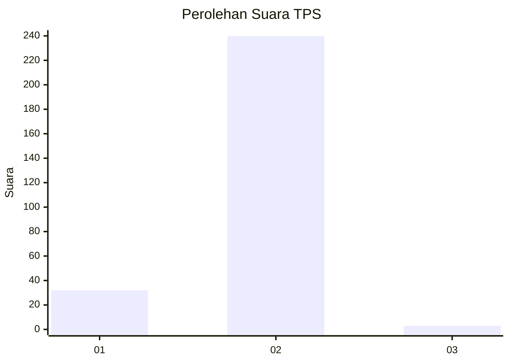
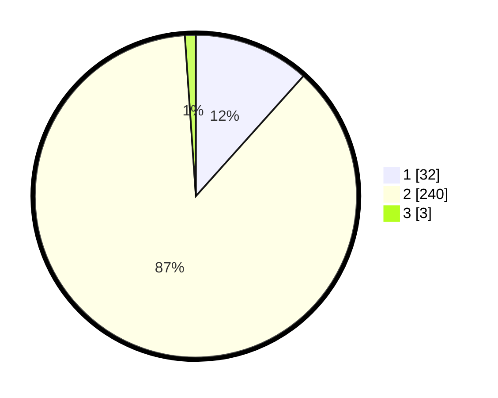

# Hasil

## Grafik

## Tabel

| No. | Nama Paslon    | Suara | Suara (raw) | Persentase |
|:--- |:-------------- | -----:| -----------:| ----------:|
| 1   | ANIES MUHAIMIN | 32    | [32][p-1]   | 11,64      |
| 2   | PRABOWO GIBRAN | 240   | [240][p-2]  | 87,27      |
| 3   | GANJAR MAHFUD  | 3     | [3][p-3]    | 1,09       |

[p-1]: https://github.com/gigit-pemilu/pemilu-2024/blob/main/pilpres/hitung-suara/sub/32-jawa-barat/sub/16-bekasi/sub/22-cibarusah/sub/2003-ridomanah/sub/006-tps/sub/paslon-1.txt
[p-2]: https://github.com/gigit-pemilu/pemilu-2024/blob/main/pilpres/hitung-suara/sub/32-jawa-barat/sub/16-bekasi/sub/22-cibarusah/sub/2003-ridomanah/sub/006-tps/sub/paslon-2.txt
[p-3]: https://github.com/gigit-pemilu/pemilu-2024/blob/main/pilpres/hitung-suara/sub/32-jawa-barat/sub/16-bekasi/sub/22-cibarusah/sub/2003-ridomanah/sub/006-tps/sub/paslon-3.txt

## Foto C Plano

https://sirekap-obj-formc.kpu.go.id/9143/pemilu/ppwp/32/16/22/20/03/3216222003006-20240215-110455--b1f4efc0-3e82-400c-8f55-20ce82934559.jpg

https://sirekap-obj-formc.kpu.go.id/9143/pemilu/ppwp/32/16/22/20/03/3216222003006-20240215-105843--5cce0019-95d7-4dec-8b2a-fdb6026db2e3.jpg

https://sirekap-obj-formc.kpu.go.id/9143/pemilu/ppwp/32/16/22/20/03/3216222003006-20240215-105944--23f325f5-7d23-4859-9506-d2fb7e3985bf.jpg

## Metadata

| Key        | Value               |
| ---------- | ------------------- |
| Time Stamp | 2024-02-24 22:31:28 |

