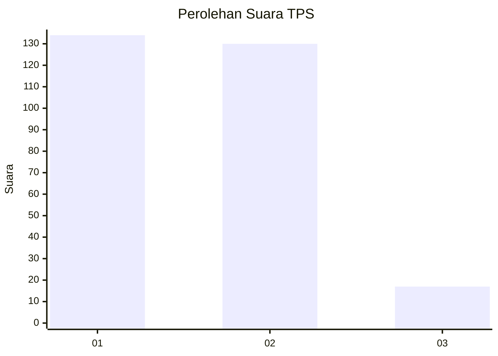
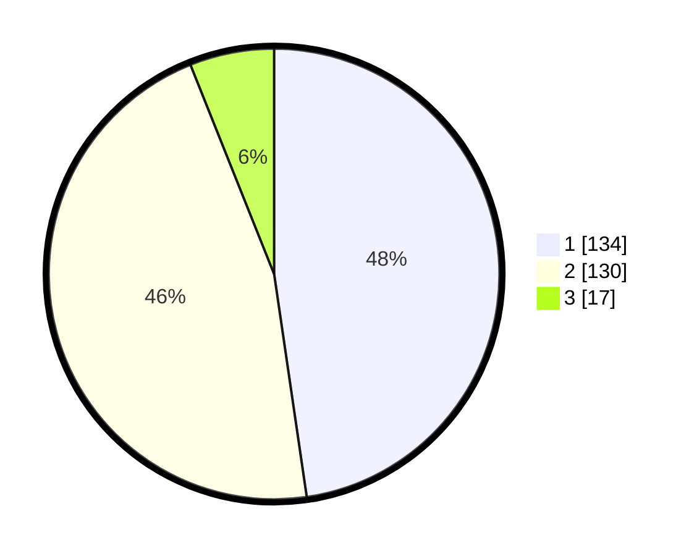

# Hasil

## Grafik

## Tabel

| No. | Nama Paslon    | Suara | Suara (raw) | Persentase |
|:--- |:-------------- | -----:| -----------:| ----------:|
| 1   | ANIES MUHAIMIN | 134   | [134][p-1]  | 47,69      |
| 2   | PRABOWO GIBRAN | 130   | [130][p-2]  | 46,26      |
| 3   | GANJAR MAHFUD  | 17    | [17][p-3]   | 6,05       |

[p-1]: https://github.com/gigit-pemilu/pemilu-2024/blob/main/pilpres/hitung-suara/sub/32-jawa-barat/sub/16-bekasi/sub/22-cibarusah/sub/2006-cibarusah-jaya/sub/036-tps/sub/paslon-1.txt
[p-2]: https://github.com/gigit-pemilu/pemilu-2024/blob/main/pilpres/hitung-suara/sub/32-jawa-barat/sub/16-bekasi/sub/22-cibarusah/sub/2006-cibarusah-jaya/sub/036-tps/sub/paslon-2.txt
[p-3]: https://github.com/gigit-pemilu/pemilu-2024/blob/main/pilpres/hitung-suara/sub/32-jawa-barat/sub/16-bekasi/sub/22-cibarusah/sub/2006-cibarusah-jaya/sub/036-tps/sub/paslon-3.txt

## Foto C Plano

https://sirekap-obj-formc.kpu.go.id/0d87/pemilu/ppwp/32/16/22/20/06/3216222006036-20240214-214139--cacaa8f2-1051-4289-a2f7-b2b35329bdf8.jpg

https://sirekap-obj-formc.kpu.go.id/0d87/pemilu/ppwp/32/16/22/20/06/3216222006036-20240214-214258--2e039fa0-caab-43f1-94ef-6c0ec883f40b.jpg

https://sirekap-obj-formc.kpu.go.id/0d87/pemilu/ppwp/32/16/22/20/06/3216222006036-20240214-214405--4c809c95-41aa-49d2-88a4-56e472d6cf3a.jpg

## Metadata

| Key        | Value               |
| ---------- | ------------------- |
| Time Stamp | 2024-02-24 22:31:28 |

