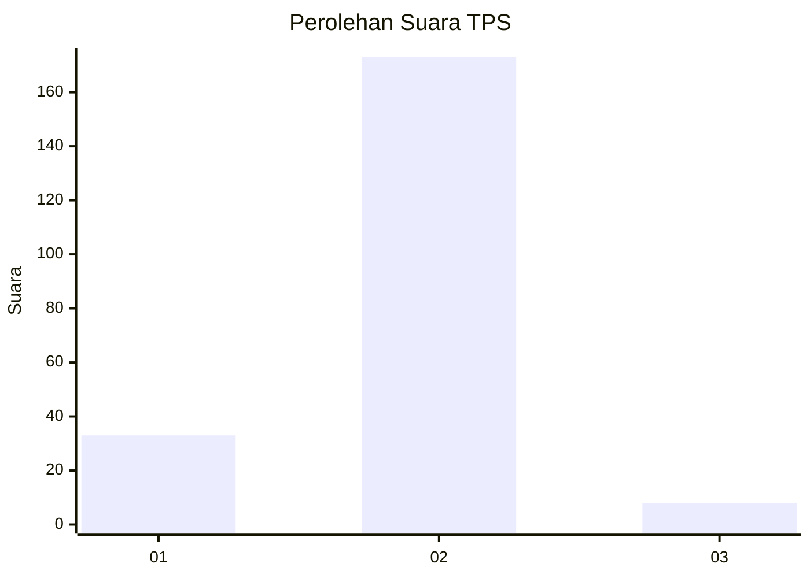
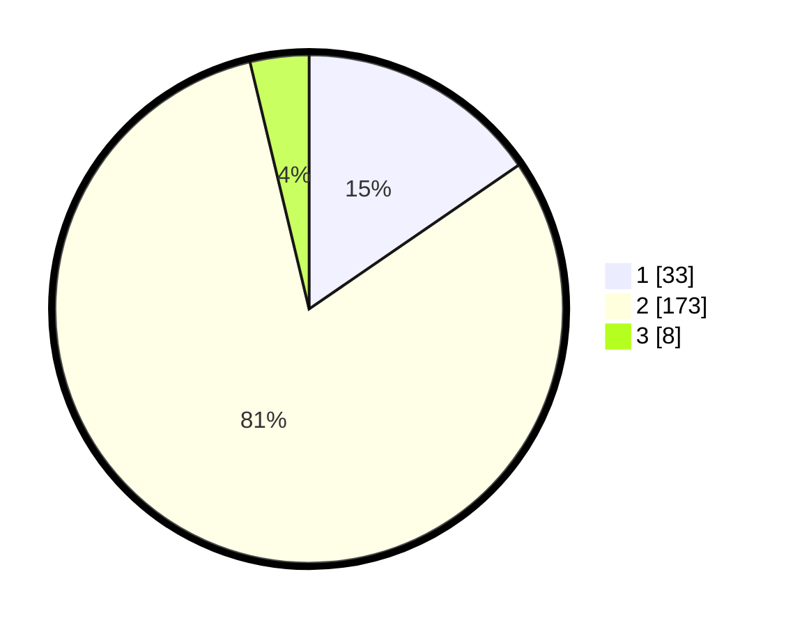

# Hasil

## Grafik

## Tabel

| No. | Nama Paslon    | Suara | Suara (raw) | Persentase |
|:--- |:-------------- | -----:| -----------:| ----------:|
| 1   | ANIES MUHAIMIN | 33    | [33][p-1]   | 15,42      |
| 2   | PRABOWO GIBRAN | 173   | [173][p-2]  | 80,84      |
| 3   | GANJAR MAHFUD  | 8     | [8][p-3]    | 3,74       |

[p-1]: https://github.com/gigit-pemilu/pemilu-2024/blob/main/pilpres/hitung-suara/sub/32-jawa-barat/sub/16-bekasi/sub/23-bojongmangu/sub/2001-karangmulya/sub/003-tps/sub/paslon-1.txt
[p-2]: https://github.com/gigit-pemilu/pemilu-2024/blob/main/pilpres/hitung-suara/sub/32-jawa-barat/sub/16-bekasi/sub/23-bojongmangu/sub/2001-karangmulya/sub/003-tps/sub/paslon-2.txt
[p-3]: https://github.com/gigit-pemilu/pemilu-2024/blob/main/pilpres/hitung-suara/sub/32-jawa-barat/sub/16-bekasi/sub/23-bojongmangu/sub/2001-karangmulya/sub/003-tps/sub/paslon-3.txt

## Foto C Plano

https://sirekap-obj-formc.kpu.go.id/0dfd/pemilu/ppwp/32/16/23/20/01/3216232001003-20240214-231657--9023a554-ea75-423e-b261-86de7d8f4427.jpg

https://sirekap-obj-formc.kpu.go.id/0dfd/pemilu/ppwp/32/16/23/20/01/3216232001003-20240214-231836--eb3c619f-412a-4adb-87b6-7c22ea2c57b0.jpg

https://sirekap-obj-formc.kpu.go.id/0dfd/pemilu/ppwp/32/16/23/20/01/3216232001003-20240214-231937--57872afc-b18e-444d-b0d4-23dc25e3cda0.jpg

## Metadata

| Key        | Value               |
| ---------- | ------------------- |
| Time Stamp | 2024-02-24 22:31:28 |

